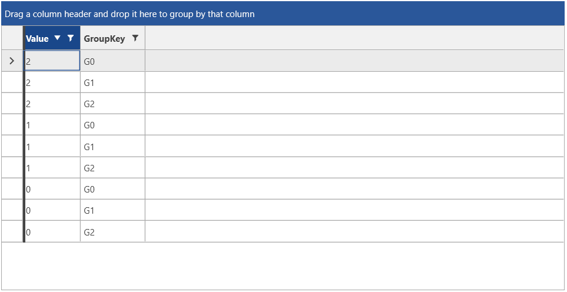
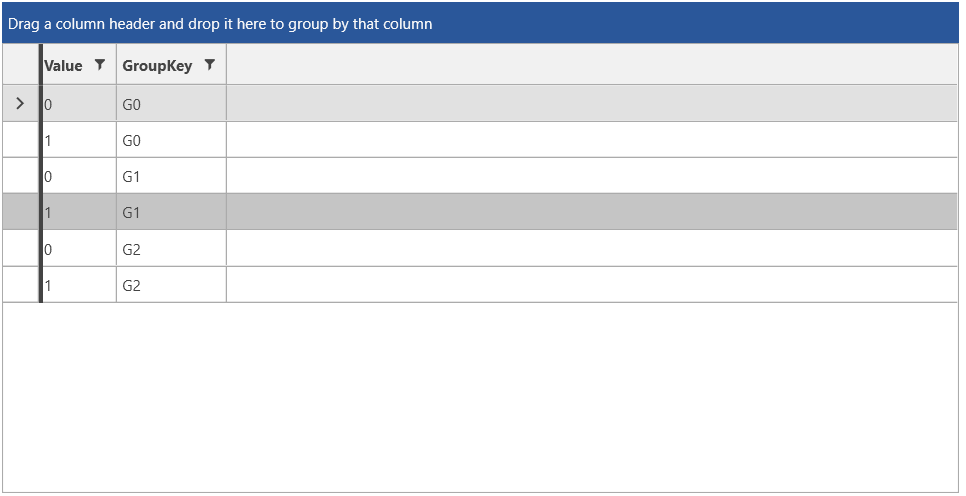
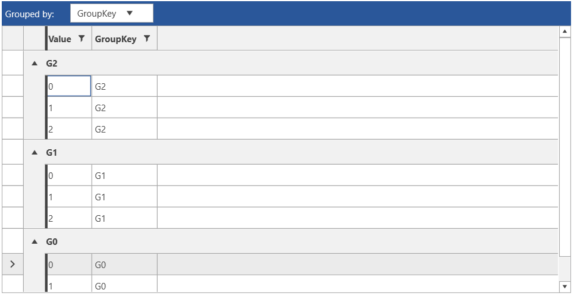
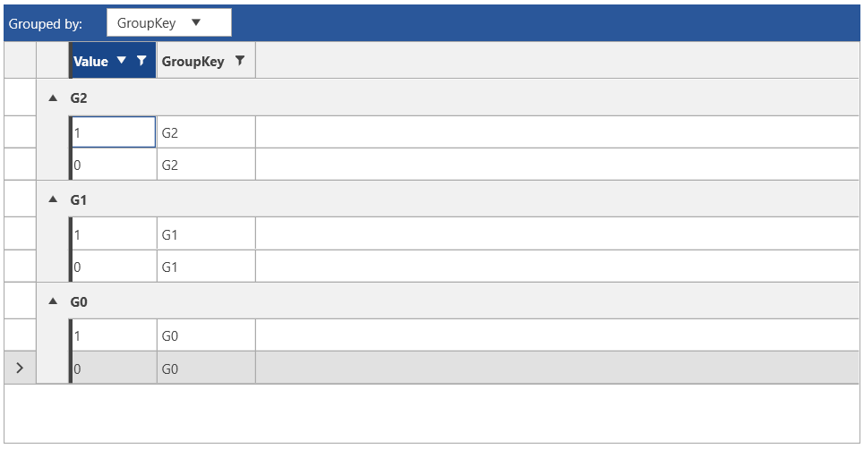

# QueryableCollectionView

QueryableCollectionView enables а collection to have the functionalities of sorting, filtering and grouping. 

This article descibes the features and provides examples on the __QueryableCollectionView__ (QCV) usage.

The QCV requires an IEnumerable source for the data and it works with three major properties to enable sorting, filtering and grouping. The __GroupDescriptors__, __FilterDescriptors__ and __SortDescriptors__.

## Defining and Using QueryableCollectionView

The following example shows a basic QueryableCollectionView definintion without any sorting, filtering or grouping applied.

#### __[C#] Example 1: Defining a collection item model__
{{region consuming-data-queryablecollectionview-0}}
	public class DataInfo
    {
        public int Value { get; set; }
        public string GroupKey { get; set; }
    }
{{endregion}}  

#### __[C#] Example 2: Defining QueryableCollectionView and populating it with data__
{{region consuming-data-queryablecollectionview-1}}
	public MainWindow()
	{	  
		InitializeComponent();
		var source = new ObservableCollection<DataInfo>();
		for (int i = 0; i < 3; i++)
		{
			for (int k = 0; k < 3; k++)
			{
				source.Add(new DataInfo() { Value = k, GroupKey = "G" + i });
			}
		}
		var qcv = new QueryableCollectionView(source);
		this.DataContext = qcv;
	}
{{endregion}}  

#### __[XAML] Example 3: Defining RadGridView and consuming the collection view__
{{region consuming-data-queryablecollectionview-2}}
	<telerik:RadGridView ItemsSource="{Binding}"/>
{{endregion}}  

#### Figure 1: RadGridView populate with QueryableCollectionView

## Sorting

The __SortDescriptors__ collection of the view allows you to define a set of [SortDescriptor](https://docs.telerik.com/devtools/wpf/api/telerik.windows.data.sortdescriptor) objects. The SortDescriptor class provides __Member__ and __SortDirection__ properties that are used to define the property name being used as the sorting criteria and the sort direction (ascending or descending).

#### __[C#] Example 4: Defining a SortDescriptor__
{{region consuming-data-queryablecollectionview-3}}
	var qcv = new QueryableCollectionView(source);
	qcv.SortDescriptors.Add(new SortDescriptor() { Member = "Value", SortDirection = ListSortDirection.Descending });            
{{endregion}}  

#### Figure 2: RadGridView sorted with QueryableCollectionView SortDescriptors

Generic sorting is supported too, using the `SortDescriptor<TElement, TKey>` class. 

#### __[C#] Example 5: Using generic sort descriptor__
{{region consuming-data-queryablecollectionview-4}}
	var qcv = new QueryableCollectionView(source);
	qcv.SortDescriptors.Add(new SortDescriptor<DataInfo, int>() 
	{
		SortingExpression = info => info.Value,
		SortDirection = ListSortDirection.Descending 
	});
{{endregion}}

## Filtering

The __FilterDescriptors__ collection of the view allows you to define a set of [FilterDescriptor](https://docs.telerik.com/devtools/wpf/api/telerik.windows.data.filterdescriptor) objects. The FilterDescriptor class provides __Member__, __Operator__ and __Value__ properties that are used to define the filtering criteria.

#### __[C#] Example 6: Defining a FilterDescriptor__
{{region consuming-data-queryablecollectionview-5}}
	var qcv = new QueryableCollectionView(source);
	qcv.FilterDescriptors.Add(new FilterDescriptor()
	{
		Member = "Value",
		Operator = FilterOperator.IsLessThanOrEqualTo,
		Value = 1
	});
{{endregion}}  

#### Figure 3: RadGridView filtered with QueryableCollectionView FilterDescriptors

Generic filtering is supported too, using the `FilterDescriptor<Element>` class. 

#### __[C#] Example 7: Using generic filter descriptor__
{{region consuming-data-queryablecollectionview-6}}
	var qcv = new QueryableCollectionView(source);
	qcv.FilterDescriptors.Add(new FilterDescriptor<DataInfo>()
	{
		FilteringExpression = info => info.Value <= 1
	});
{{endregion}}  

## Grouping  

The __GroupDescriptors__ collection of the view allows you to define a set of [GroupDescriptor](https://docs.telerik.com/devtools/wpf/api/telerik.windows.data.groupdescriptor) objects. The GroupDescriptor class provides __Member__ and __SortDirection__ properties that are used to define the property name being used as the grouping criteria and the sort direction of the groups (ascending or descending).

#### __[C#] Example 8: Defining a GroupDescriptor__
{{region consuming-data-queryablecollectionview-7}}
	var qcv = new QueryableCollectionView(source);
	qcv.GroupDescriptors.Add(new GroupDescriptor()
	{
		Member = "GroupKey",
		SortDirection = ListSortDirection.Descending
	});
{{endregion}}  

#### Figure 4: RadGridView grouped with QueryableCollectionView GroupDescriptors

Generic grouping is supported too, using the `GroupDescriptor<TElement, TKey, TSortingKey>` class. 

#### __[C#] Example 9: Using generic group descriptor__
{{region consuming-data-queryablecollectionview-8}}
	var qcv = new QueryableCollectionView(source);
	qcv.GroupDescriptors.Add(new GroupDescriptor<DataInfo, string, string>()
	{
		GroupingExpression = info => info.GroupKey,
		SortDirection = ListSortDirection.Descending
	});
{{endregion}}  
  
## Using QueryableCollectionView in XAML 

__QueryableCollectionViewSource__ is an abstraction of QueryableCollectionView that internally uses it. It allows you to take advantage of QueryableCollectionView and its features in XAML.

QueryableCollectionViewSource can be defined as a resource in XAML and allows you to provide it with a collection using its __Source__ property. If the Source is an object of type QueryableCollectionView, the QueryableCollectionViewSource sync its descriptors directly with it. If the Source is another collection type, it is wrapped into a QueryableCollectionView which is used by the view source internally.

QueryableCollectionViewSource provides the same descriptor collections like QueryableCollectionView - __GroupDescriptors__, __SortDescriptors__ and __FilterDescriptors__. To access the underlying QueryableCollectionView object use the __View__ property of the view source.

The following example shows how to setup basic view model and use QueryableCollectionViewSource with RadGridView.

#### __[C#] Example 10: Defining the view model__
{{region consuming-data-queryablecollectionview-9}}
	public class MainViewModel
    {
        public ObservableCollection<DataInfo> Items { get; set; }
        public MainViewModel()
        {
            Items = new ObservableCollection<DataInfo>();
            for (int i = 0; i < 3; i++)
            {
                for (int k = 0; k < 3; k++)
                {
                    Items.Add(new DataInfo() { Value = k, GroupKey = "G" + i  });
                }
            }
        }
    }
{{endregion}}  

See __Example 1__ from the beginning of this article for the definition of the __DataInfo__ class.

#### __[XAML] Example 11: Defining QueryableCollectionViewSource in XAML__
{{region consuming-data-queryablecollectionview-10}}
	<Window.Resources>
        <local:MainViewModel x:Key="viewModel" />
        <telerik:QueryableCollectionViewSource x:Key="qcvSource" Source="{Binding Source={StaticResource viewModel}, Path=Items}"/>
    </Window.Resources>
{{endregion}}  

#### __[XAML] Example 12: Consuming the QueryableCollectionViewSource's view in XAML__
{{region consuming-data-queryablecollectionview-11}}
	<telerik:RadGridView ItemsSource="{Binding Source={StaticResource qcvSource}, Path=View}" />
{{endregion}}  

To use grouping, sorting and filtering set the corresponding descriptors of the view source object.

#### __[XAML] Example 13: Adding descriptors in XAML__
{{region consuming-data-queryablecollectionview-12}}
	<Window.Resources>
        <local:MainViewModel x:Key="viewModel" />
        <telerik:QueryableCollectionViewSource x:Key="qcvSource" Source="{Binding Source={StaticResource viewModel}, Path=Items}">
            <telerik:QueryableCollectionViewSource.SortDescriptors>
                <telerik:SortDescriptor Member="Value" SortDirection="Descending" />
            </telerik:QueryableCollectionViewSource.SortDescriptors>
            <telerik:QueryableCollectionViewSource.GroupDescriptors>
                <telerik:GroupDescriptor Member="GroupKey" SortDirection="Descending" />
            </telerik:QueryableCollectionViewSource.GroupDescriptors>
            <telerik:QueryableCollectionViewSource.FilterDescriptors>
                <telerik:FilterDescriptor Member="Value" Operator="IsLessThanOrEqualTo" Value="1"/>
            </telerik:QueryableCollectionViewSource.FilterDescriptors>
        </telerik:QueryableCollectionViewSource>
    </Window.Resources>
{{endregion}} 

#### Figure 5: RadGridView populated using QueryableCollectionViewSource

## See Also
* [Consuming Data Overview]()
* [In-Memory Data]()