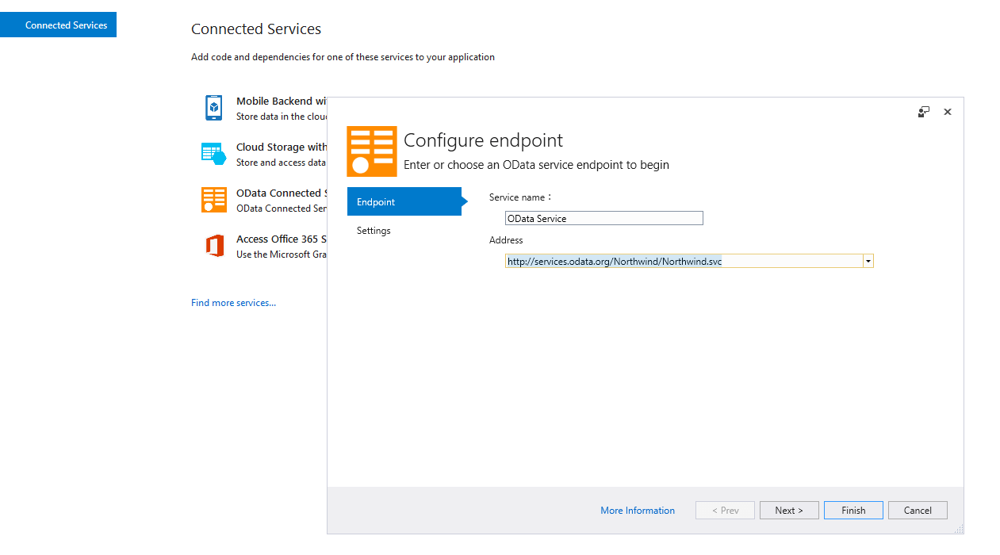

# Consuming WCF Service

The purpose of this tutorial is to show you how to make a call to a WCF Service in the context of a WPF application. The following common tasks will be examined:

* Adding a reference.

* Creating a new instance of the service.

* Making asynchronous call to the service.

* Consuming the service result.

* Making call to the service.

>The process of developing a WCF Service is beyond the scope of this tutorial. For more information read [here](http://msdn.microsoft.com/en-us/library/bb332338.aspx).

>This tutorial will use the __Northwind__ database, which can be downloaded from [here](http://www.microsoft.com/downloads/details.aspx?FamilyID=06616212-0356-46A0-8DA2-EEBC53A68034&displaylang=en).

For the purpose of this tutorial will be used a service that exposes the following method:

* __LoadCategories__ - load all categories from the __Categories__ table in the Northwind database. 

## Adding Reference

The first step is to add a new service reference to your application. In order to do that you need to perform the following steps:

* Select the "__References__" folder, right click with your mouse button and choose "__Add Service Reference...__"

*  A popup window appears; hit the __Discover__ button to find the web service or enter the service location. Press OK to add it. 

>You have the ability to choose the type of the collections that the service returns. In order to do that you need to open the __Service Reference Settings__ dialog from the __Advanced__ button.

When a service reference is added to a project, any types defined in the service are generated in the local project. In many cases, this creates duplicate types when a service uses common .NET Framework types or when types are defined in a shared library. To avoid this problem, types in referenced assemblies are shared by default. If you want to disable type sharing for one or more assemblies, you can do so in the __Service Reference Settings__ dialog.

Once the WCF service is added all needed assemblies and configuration files will be automatically included in your project. 

## Creating New Instance of the Service

Creating new instance of the service is a pretty simple process.

#### __C#__

{{region consuming-data-wcf-service_0}}
	WcfService.SampleWcfServiceClient serviceClient = new WcfService.SampleWcfServiceClient();
	{{endregion}}

#### __VB.NET__

{{region consuming-data-wcf-service_1}}
	Dim serviceClient As New WcfService.SampleWcfServiceClient()
	{{endregion}}

>tipDon't forget to give a meaningful name for your WCF Service namespace. In the previous example the namespace is "WcfService".

## Making Asynchronous Call to the Service

In Silverlight all service calls are performed asynchronously. In order to make an asynchronous call to your service you need to do the following steps:

* Attach to the event fired when the executed method completes.

* Execute the method asynchronously.

Here is a sample code showing how this can be achieved:

#### __C#__

{{region consuming-data-wcf-service_2}}
	serviceClient.LoadCategoriesCompleted += new EventHandler<LoadCategoriesCompletedEventArgs>( serviceClient_LoadCategoriesCompleted );
	serviceClient.LoadCategoriesAsync();
	{{endregion}}

#### __VB.NET__

{{region consuming-data-wcf-service_3}}
	AddHandler serviceClient.LoadCategoriesCompleted, AddressOf serviceClient_LoadCategoriesCompleted
	serviceClient.LoadCategoriesAsync()
	{{endregion}}



In order to make a call to your service, you just need to invoke the exposed by the service method:

#### __C#__

{{region consuming-data-wcf-service_4}}
	foreach( Categories c in serviceClient.LoadCategories() )
	{
	    this.Categories.Add( c );
	}
	{{endregion}}

#### __VB.NET__

{{region consuming-data-wcf-service_5}}
	For Each c As Categories In serviceClient.LoadCategories()
	    Me.Categories.Add(c)
	Next
	{{endregion}}



## See Also

 * [Consuming WCF Data Service]()

  
 * [Consuming Web (asmx) Service]()


  
 * [Consuming .NET RIA Service]()
 
