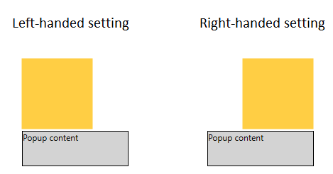
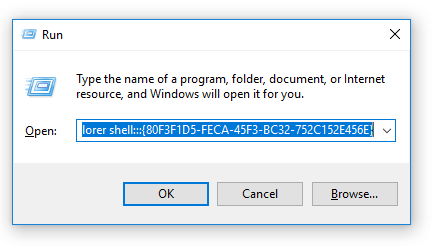
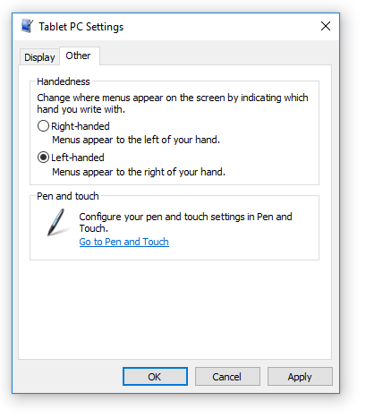

# Popup Content Position

This article describes how to resolve the wrong position of popup content when it is not aligned as expected.

The Popup control in WPF is affected by the Windows OS menu settings. This can be noticed in controls that display its content in a popup. For example, the minimized content of RadRibbonView or the items of the RadComboBox control. You can see the popup element aligned to its placement target differently on different machines.

You can get the same behavior also with a native WPF Border and a Popup attached to it.

The alignment of the popup is controlled via the Handedness setting of the Windows OS. To resolve the issue you can change the setting via the Windows settings or in code.

## Changing the Handedness via the Windows Tablet PC Settings

To change the Handedness via the Windows menu use the following steps:

1. Open the Windows Start menu and start the Run propmpt.	
2. Enter the following command in the Open input - *explorer shell:::{80F3F1D5-FECA-45F3-BC32-752C152E456E}*. This will open the Tablet PC Settings  

	
	
3. Click in the Other tab of the settings window and select the __Left-handed__ option. Then click okay.
	
	

## Changing the Handedness in code

To change the handedness in code you can use the SystemParameters static class and its _menuDropAlignment field. Keep in mind that the filed is private so you can set it only via reflection.

#### __[C#] Example 1: Setting the _menuDropAlignment field__
{{region troubleshooting-popup-content-position-0}}
	public static void SetAlignment()
	{
		var ifLeft = SystemParameters.MenuDropAlignment;
		if (ifLeft)
		{
			var t = typeof(SystemParameters);
			var field = t.GetField("_menuDropAlignment", BindingFlags.NonPublic | BindingFlags.Static);
			field.SetValue(null, false);
		}
	}
{{endregion}}
