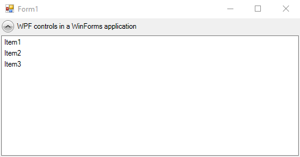

# Telerik UI for WPF Controls in WinForms Application

This article demonstrates how the Telerik UI for {{ site.framework_name }} controls can be integrated in a WinForms application.

## Creating the WPF Project

Let's start by creating the WPF Class Library.

1\. Launch Visual Studio, and open the **New Project** dialog box.

2\. In Visual C# and the Windows category, select the **WPF User Control Library** template.

3\. Name the new project **TelerikWPFControls**.

4\. For the location, specify a conveniently named top-level folder, such as WindowsFormsHostingWpfControl. Later, you will put the host application in this folder.

5\. Click OK to create the project. The default project contains a single control named **UserControl1**.

Your project should have references to the following system assemblies. If any of these dlls are not included by default, add them to your project.

* **PresentationCore**
* **PresentationFramework**
* **System**
* **WindowsBase**

In addition, add a reference to the **Telerik.Windows.Controls** assembly from your Telerik UI for WPF installation or use the respective NuGet package.

Lastly, define the following XAML in the generated **UserControl1.xaml** file:

#### __[XAML] Example 1: The XAML layout in UserControl1.xaml__
{{region xaml-wpf-controls-wf-app_0}}
    <telerik:RadExpander Header="WPF controls in a WinForms application" IsExpanded="True">
        <telerik:RadListBox>
            <telerik:RadListBoxItem>Item1</telerik:RadListBoxItem>
            <telerik:RadListBoxItem>Item2</telerik:RadListBoxItem>
            <telerik:RadListBoxItem>Item3</telerik:RadListBoxItem>
        </telerik:RadListBox>
    </telerik:RadExpander>
{{endregion}}

## Create the WinForms Application

To create the hosting WinForms application:

1\. Launch Visual Studio, and open the **New Project** dialog box.

2\. In Visual C# and the Windows category, select the **Windows Forms Application** template.

3\. Name the new project **WFHost**.

4\. For the location, specify the same top-level folder that contains the **TelerikWPFControls** project.

5\. Click OK to create the project.

You also need to add references to the DLL that contains UserControl1 and other assemblies.

1\. Right-click the project name in **Solution Explorer**, and select **Add Reference**.

2\. Add a project reference to the **TelerikWPFControls** project.

Add references to the following assemblies:

* **PresentationCore**
* **PresentationFramework**
* **System.Xaml**
* **WindowsBase**
* **WindowsFormsIntegration**
* **Telerik.Windows.Controls** (or add the NuGet package)

## Include the WPF Controls in the WinForms Application

1\. Open **Form1** in the **Windows Form Designer**.

2\. In the upper-right corner of the form, add a **System.Windows.Forms.Panel** control to hold the WPF composite control and dock it in the form.

You generally implement the hosting code in the form's **Load** event handler. The following code shows the Load event handler, a handler for the WPF composite control's Loaded event, and declarations for several global variables that are used later.

In the Windows Forms Designer, double-click the form to create a Load event handler. At the top of Form1.cs, add the following using statements.

#### __[C#] Example 2: Using statements__
{{region cs-wpf-controls-wf-app_1}}
	using System.Windows;
	using System.Windows.Forms.Integration;
	using System.Windows.Media;
{{endregion}}

Then, replace the contents of the existing Form1 class with the following code.

#### __[C#] Example 3: The Form class__
{{region cs-wpf-controls-wf-app_2}}
    public partial class Form1 : Form
    {
        private ElementHost ctrlHost;
        private TelerikWPFControls.UserControl1 wpfAddressCtrl;

        public Form1()
        {
            InitializeComponent();
        }

        private void Form1_Load(object sender, EventArgs e)
        {
            ctrlHost = new ElementHost();
            ctrlHost.Dock = DockStyle.Fill;
            panel1.Controls.Add(ctrlHost);
            wpfAddressCtrl = new TelerikWPFControls.UserControl1();
            wpfAddressCtrl.InitializeComponent();
            ctrlHost.Child = wpfAddressCtrl;
        }
    }
{{endregion}}

The **Form1_Load** method in the preceding code shows the general procedure for hosting a WPF control:

1\. Create a new **ElementHost** object.

2\. Set the control's Dock property to **DockStyle.Fill**.

3\. Add the **ElementHost** control to the Panel control's Controls collection.

4\. Create an instance of the WPF control.

5\. Host the composite control on the form by assigning the control to the ElementHost control's **Child** property.

If you now run the application you should observe a result similar to that in Figure 1.

#### Figure 1: Telerik UI for WPF controls hosted in a WinForms application

## Using Implicit Styles

If you're using the [implicit styles]() theming approach with the [NoXaml binaries](), you need to ensure that the theme's resource dictionaries are merged correctly.

As there is no App.xaml file in which to do this (as would be the case in a standard WPF application), you can handle this programmatically by invoking the following method before instantiating the user control:

#### __[C#] Example 3: Merging the theme's resource dictionaries programmatically__
{{region cs-wpf-controls-wf-app_3}}
	private void Form1_Load(object sender, EventArgs e)
	{
		ctrlHost = new ElementHost();
		ctrlHost.Dock = DockStyle.Fill;
		panel1.Controls.Add(ctrlHost);

		MergeThemeResourceDictionaries();
		wpfAddressCtrl = new TelerikWPFControls.UserControl1();
		wpfAddressCtrl.InitializeComponent();
		ctrlHost.Child = wpfAddressCtrl;
	}

	public static void MergeThemeResourceDictionaries()
	{
		if (System.Windows.Application.Current == null)
		{
			// create the Application object
			new System.Windows.Application();

			// merge the theme's resources
			System.Windows.Application.Current.Resources.MergedDictionaries.Add(
				System.Windows.Application.LoadComponent(
					new Uri("/Telerik.Windows.Themes.Office_Black;component/Themes/System.Windows.xaml",
					UriKind.Relative)) as ResourceDictionary);
			System.Windows.Application.Current.Resources.MergedDictionaries.Add(
				System.Windows.Application.LoadComponent(
					new Uri("/Telerik.Windows.Themes.Office_Black;component/Themes/Telerik.Windows.Controls.xaml",
					UriKind.Relative)) as ResourceDictionary);
		}
	}
{{endregion}}

Please note that you also need to reference the theme dll in both the WPF class library and the WinForms application projects.

## See Also
* [Telerik UI for WinForms Controls in WPF Application]()