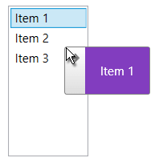

# Customizing the DragVisual

This article demonstrates how to create a custom drag visual element for the [DragDropBehavior]() by implementing the __IDragVisualProvider__ interface.

The interface exposes the following members.

* __UseDefaultCursors__: A property that determines whether the drag/drop effects will change the mouse cursor or not.
* __CreateDragVisual__: A method that receives information about the dragged items and returns a FrameworkElement used as the drag visual.
* __GetDragVisualOffset__: A method that receives information about the dragged items and returns the drag visual offset relative to the mouse position, as a Point structure.

## Implementing IDragVisualProvider

This section shows how to create a custom drag visual provider that allows you to define a custom DataTemplate and use it with any DragDropBehavior implementation.

#### __[C#] Example 1: Creating a custom drag visual provider__
{{region dragdropmanager-behaviors-customizingdragvisual_0}}
	public class CustomDragVisualProvider : DependencyObject, IDragVisualProvider
    {        
        public static readonly DependencyProperty DraggedItemTemplateProperty =
        DependencyProperty.Register(
            "DraggedItemTemplate", 
            typeof(DataTemplate), 
            typeof(CustomDragVisualProvider),
            new PropertyMetadata(null));
        
        public DataTemplate DraggedItemTemplate
        {
            get { return (DataTemplate)GetValue(DraggedItemTemplateProperty); }
            set { SetValue(DraggedItemTemplateProperty, value); }
        }
        
        public FrameworkElement CreateDragVisual(DragVisualProviderState state)
        {
            var visual = new DragVisual();
            visual.Content = state.DraggedItems.OfType<object>().FirstOrDefault();
            visual.ContentTemplate = this.DraggedItemTemplate;
            return visual;
        }

        public Point GetDragVisualOffset(DragVisualProviderState state)
        {
            return state.RelativeStartPoint;
        }

        public bool UseDefaultCursors { get; set; }
    }
{{endregion}}

>important This approach is applicable for all controls that use a DragDropBehavior. For example, ScheduleViewDragDropBehavior, or a custom implementation of the DragDropBehavior class.

## Using the Custom Drag Visual Provider

This section shows how to setup a ListBoxDragDropBehavior that will use the custom drag visual provider implemented in the previous section.

#### __[XAML] Example 2: Using the custom drag visual provider__
{{region dragdropmanager-behaviors-customizingdragvisual_1}}
	<ListBox ItemsSource="{Binding MyItems}" DisplayMemberPath="Name">
		<ListBox.ItemContainerStyle>
			
		</ListBox.ItemContainerStyle>
		<telerik:ListBoxDragDrop.Behavior>
			<telerik:ListBoxDragDropBehavior />
		</telerik:ListBoxDragDrop.Behavior>
		<telerik:ListBoxDragDrop.DragVisualProvider>
			<local:CustomDragVisualProvider>
				<local:CustomDragVisualProvider.DraggedItemTemplate>
					<DataTemplate>
						<TextBlock Text="{Binding Name}" Background="#823DBF" Padding="15" Foreground="White"/>
					</DataTemplate>
				</local:CustomDragVisualProvider.DraggedItemTemplate>
			</local:CustomDragVisualProvider>
		</telerik:ListBoxDragDrop.DragVisualProvider>
	</ListBox>
{{endregion}}

#### Figure 1: Custom drag visual provider 

