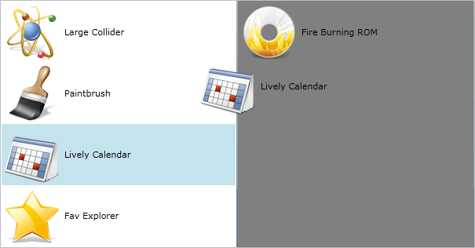

# Overview

__DragDropManager__ offers intuitive API similar to the WPF native drag and drop behavior. The APi allows you to enable drag-drop in multiple scenarios.





## Features:

* __Rich event handling__: The drag-drop framework provides a wide set of events that can be used to handle the actions executed upon a drag and drop operation. Using the events you can adjust the drag and drop actions to your very custom application’s logic, thus providing a great flexibility to the end user. Read more about this in the [Events]() article.

* __Drag visual__: The manager uses a drag visual element to follow the mouse while the user performs drag and drop operations. The drag visual appears always on the top of the other UI elements. This feature gives visual feedback about what is dragged and where it will be dropped. It helps the users while reordering elements on the pages. The drag visual could be easily customized to meet the design of your application. Read more about this in the [Set Drag Visual]() article.

* __Drag threshold__: You can choose the minimum vertical and horizontal distance which the user needs to move the mouse to start a drag operation. This can be used to avoid accidental and unwanted dragging.

* __Integrations between applications__: DragDropManager has built-in support for dragging from and to external programs, allowing easy interaction between applications.

>tip Get started with the control with its [Getting Started]() help article that shows how to use it in a basic scenario.

> Check out the control's demos at [demos.telerik.com](https://demos.telerik.com/silverlight/#DragAndDrop)[demos.telerik.com](https://demos.telerik.com/wpf/). Additionally, you can download more runnable projects from our [online SDK repository](https://github.com/telerik/xaml-sdk/tree/master/DragDrop).

## See Also
 * [Developer Focused Examples]()
 * [DragDropPayloadManager]()
