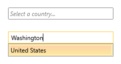
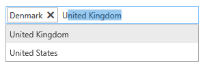

# Getting Started

This tutorial will walk you through the creation of a sample application that contains __RadAutoCompleteBox__.

* [Assembly References](#assembly-references)
* [Add RadAutoCompleteBox to the Project](#add-radautocompletebox-to-the-project)
* [Populate with Data](#populate-with-data)
* [Customize the Control](#customize-the-control)
* [Setting a Theme](#set-a-theme)

## Assembly References

>In order to use __RadAutoCompleteBox__ in your project you have to add a reference to the following assemblies:
>	* __Telerik.Windows.Controls__
>	* __Telerik.Windows.Controls.Input__

## Add RadAutoCompleteBox to the Project

You can include the control in your projects by either dragging it from the toolbox in Visual Studio and Blend or by manually creating the control.

The following examples show how to create a __RadAutoCompleteBox__ control in the code-behind and in XAML:

#### __[C#] Example 1: Creating a RadAutoCompleteBox in code-behind__

{{region cs-radautocompletebox-getting-started-0}}
	RadAutoCompleteBox autoCompleteBox = new RadAutoCompleteBox();
{{endregion}}

#### __[VB] Example 1: Creating a RadAutoCompleteBox in code-behind__

{{region vb-radautocompletebox-getting-started-0}}
	Dim autoCompleteBox As New RadAutoCompleteBox()
{{endregion}}

#### __[XAML] Example 1: Creating a RadAutoCompleteBox in XAML__

{{region xaml-radautocompletebox-getting-started-0}}
	<UserControl xmlns:telerik="http://schemas.telerik.com/2008/xaml/presentation">
	    <Grid x:Name="LayoutRoot" Background="White">
	        <telerik:RadAutoCompleteBox x:Name="radAutoCompleteBox"/>
	    </Grid>
	</UserControl>
{{endregion}}

## Populate with Data

In order to populate the RadAutoCompleteBox with data, you can set its **ItemsSource** property to any **IEnumerable** collection of items.

#### __[C#] Example 2: Set RadAutoCompleteBox's ItemsSource__

{{region cs-radautocompletebox-getting-started-1}}
    public MainWindow()
    {
        InitializeComponent();
        var countries = new ObservableCollection<Country>()
        {
            new Country() { Name = "Australia", Capital = "Canberra" },
            new Country() { Name = "Bulgaria", Capital = "Sofia" },
            new Country() { Name = "Canada", Capital = "Ottawa" },
            new Country() { Name = "Denmark", Capital = "Copenhagen" },
            new Country() { Name = "France", Capital = "Paris" },
            new Country() { Name = "Germany", Capital = "Berlin" },
            new Country() { Name = "India", Capital = "New Delhi" },
            new Country() { Name = "Italy", Capital = "Rome" },
            new Country() { Name = "Norway", Capital = "Oslo" },
            new Country() { Name = "Russia", Capital = "Moscow" },
            new Country() { Name = "Spain ", Capital = "Madrid" },
            new Country() { Name = "United Kingdom", Capital = "London" },
            new Country() { Name = "United States", Capital = "Washington, D.C." },
        };

        this.AutoComplete.ItemsSource = countries;
    }
{{endregion}}

## Customize the Control

To actually display results when using the ObservableCollection from **Example 2** you have to specify the **DisplayMemberPath** which specifies the name or path of the property that is displayed for each data item.

You can then set the control's [abundance of properties]() to customize it per your needs.

#### __[C#] Example 3: Customize the RadAutoCompleteBox__

{{region cs-radautocompletebox-getting-started-2}}
    <telerik:RadAutoCompleteBox x:Name="autoComplete" 
                                    AutoCompleteMode="Suggest" 
                                    DisplayMemberPath="Name"
                                    TextSearchPath="Capital"
                                    TextSearchMode="Contains"
                                    WatermarkContent="Select a country..." />
{{endregion}}

**Figure 1** illustrates the result from the code in **Example 3**.

#### __Figure 1: Customized RadAutoCompleteBox__

## Set a Theme

The controls from our suite support different themes. You can see how to apply a theme different than the default one in the [Setting a Theme]() help article.

>important Changing the theme using implicit styles will affect all controls that have styles defined in the merged resource dictionaries. This is applicable only for the controls in the scope in which the resources are merged. 

To change the theme, you can follow the steps below:
* Choose between the themes and add reference to the corresponding theme assembly (ex: **Telerik.Windows.Themes.Office2016.dll**). You can see the different themes applied in the **Theming** examples from our [WPF Controls Examples](https://demos.telerik.com/wpf/)[Silverlight Controls Examples](https://demos.telerik.com/silverlight/#AutoCompleteBox/Theming) application.

* Merge the ResourceDictionaries with the namespace required for the controls that you are using from the theme assembly. For the __RadAutoCompleteBox__, you will need to merge the following resources:

	* __Telerik.Windows.Controls__
	* __Telerik.Windows.Controls.Input__

__Example 4__ demonstrates how to merge the ResourceDictionaries so that they are applied globally for the entire application.

#### __[XAML] Example 4: Merge the ResourceDictionaries__  
{{region xaml-radautocompletebox-getting-started_3}}
	<Application.Resources>
		<ResourceDictionary>
			<ResourceDictionary.MergedDictionaries>
				<ResourceDictionary Source="/Telerik.Windows.Themes.Office2016;component/Themes/System.Windows.xaml"/>
				<ResourceDictionary Source="/Telerik.Windows.Themes.Office2016;component/Themes/Telerik.Windows.Controls.xaml"/>
				<ResourceDictionary Source="/Telerik.Windows.Themes.Office2016;component/Themes/Telerik.Windows.Controls.Input.xaml"/>
			</ResourceDictionary.MergedDictionaries>
		</ResourceDictionary>
	</Application.Resources>
{{endregion}}

>Alternatively, you can use the theme of the control via the [StyleManager](https://docs.telerik.com/devtools/wpf/styling-and-appearance/stylemanager/common-styling-apperance-setting-theme-wpf)[StyleManager](https://docs.telerik.com/devtools/silverlight/styling-and-appearance/stylemanager/common-styling-apperance-setting-theme).

__Figure 2__ shows a __RadAutoCompleteBox__ with the **Office2016** theme applied.
	
#### __Figure 2: RadAutoCompleteBox with the Office2016 theme__

## See Also

 * [Overview]()
 * [Key Properties]()
 * [AutoComplete]()
 * [Events]()
