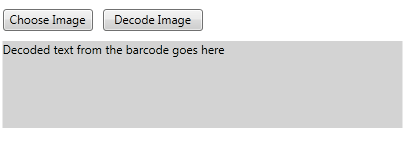

# RadBarcodeReader 

RadBarcodeReader is the newest addition to the Barcode suite. The aim of the control is to decode image representations of one of the supported barcode symbologies.

Currently, all of the 1D barcodes, offered by Telerik are supported. The list is available [here]().        

When decoding a barcode image, the control will either display the type and text encoded in the image, or a warning specifying that no known symbology has been detected. A typical layout for the barcode reader is shown below:  

And here is the XAML that produces the result:        

#### __[XAML] Example 1: Barcode reader definition__  
{{region xaml-radbarcodereader-overview-0}}
	<!--The values below are the default ones, so you do not need to specify them-->
	<telerik:RadBarcodeReader OpenButtonText="Choose Image" DecodeButtonText="Decode Image"/>
{{endregion}}

The Choose Image button lets the user choose an image path, to the image which will be decoded. The Decode Image triggers the decoding algorithm. The underlying text area is updated with the result of the decoding process.        

The RadBarcodeReader exposes the following properties:
* __OpenButtonText__: Gets or sets the string of the open image button            

* __DecodeButtonText__: Gets or sets the string of the decode image button            

* __ResultText__: Gets the decoded from the image string.

## BarcodeDecoder

If you do not wish to use the default UI provided by the RadBarcodeReader, you can create your own UI and use the **BarcodeDecoder** class to decode the provided image.

For the purpose, you need to create a new instance of the class, set its **ImageSource** property (of type **BitmapSource**) and call its **StartDecoding** method.

The class also exposes a **DecodingComplete** event which is fired once the decoding is completed. Its arguments are of type **DecodingEventArgs** and expose the following properties:

* **CodeType**: The type of the code recognized in the image, such as **Code128**, **UPCA** or **QR**. Its value is of the **BarcodeType** enumeration type.
* **Result**: A **string** representing the decoded text.
* **ErrorMessage**: A **string** representing the error message, which is populated if decoding fails.

**Example 2** demonstrates how you can use the BarcodeDecoder class.

#### __[C#] Example 2: Decoding an image with the BarcodeDecoder__

{{region cs-radbarcodereader-overview-1}}
	private void Button_Click(object sender, RoutedEventArgs e)
	{
		var imageUri = new Uri("../../barcode.jpg", UriKind.Relative);
		var imageSource = new BitmapImage(imageUri);
		BarcodeDecoder decoder = new BarcodeDecoder();
		decoder.ImageSource = imageSource;
		decoder.DecodingComplete += new EventHandler<DecodingEventArgs>(this.OnDecodingComplete);
		decoder.StartDecoding();           
	}

	private void OnDecodingComplete(object sender, DecodingEventArgs e)
	{
		string decodeResult;

		if (string.IsNullOrEmpty(e.ErrorMessage))
		{
			decodeResult = string.Format("Code Type: {0}\nResult: {1}", e.CodeType, e.Result);
		}
		else
		{
			decodeResult = e.ErrorMessage;
		}
	}
{{endregion}}

#### __[VB.NET] Example 2: Decoding an image with the BarcodeDecoder__

{{region vb-radbarcodereader-overview-2}}
	Private Sub Button_Click(ByVal sender As Object, ByVal e As RoutedEventArgs)
		Dim imageUri = New Uri("../../barcode.jpg", UriKind.Relative)
		Dim imageSource = New BitmapImage(imageUri)
		Dim decoder As New BarcodeDecoder()
		decoder.ImageSource = imageSource
		AddHandler decoder.DecodingComplete, AddressOf OnDecodingComplete
		decoder.StartDecoding()
	End Sub

	Private Sub OnDecodingComplete(ByVal sender As Object, ByVal e As DecodingEventArgs)
		Dim decodeResult As String

		If String.IsNullOrEmpty(e.ErrorMessage) Then
			decodeResult = String.Format("Code Type: {0}" & ControlChars.Lf & "Result: {1}", e.CodeType, e.Result)
		Else
			decodeResult = e.ErrorMessage
		End If
	End Sub
{{endregion}}

## Decoded Types

In some scenarios, to improve performance, you may want to specify the types of barcodes the reader will try to decode rather than have it iterate over all the available types.

This can also be useful to avoid conflicts between symbologies whose symbols may overlap, for example, **Code39** and **Code39Extended**.

For the purpose, you can use the **DecodeTypes** property of the RadBarcodeReader. It is a flags enumeration which holds the following types:

* **Code11** 
* **Code128** 
* **Code25Interleaved** 
* **Code25Standard** 
* **Code39** 
* **Code39Extended** 
* **Code93** 
* **Code93Extended** 
* **Codebar** 
* **CodeMSI** 
* **EAN13** 
* **EAN128** 
* **EAN8** 
* **Postnet** 
* **Planet** 
* **IntelligentMail** 
* **UPCA** 
* **UPCE** 
* **UPCSupplement2** 
* **UPCSupplement5** 
* **QR** 
* **PDF417** 
* **DataMatrix**

In addition, the following values can also be set:

* **All**: Decode all barcode types. This is the **default value**.
* **OneDimensional**: All 1D barcodes.
* **WidthModulated1D**: All width-modulated 1D barcodes (39/93 Extended included).
* **HeightModulated1D**: All height-modulated 1D barcodes.
* **TwoDimensional**: All 2D barcodes.

#### __[XAML] Example 3: Specify DecodeTypes of RadBarcodeReader__  
{{region xaml-radbarcodereader-overview-3}}
	<telerik:RadBarcodeReader DecodeTypes="Code11,Code39Extended,Codebar" />
{{endregion}}

If you're using the **BarcodeDecoder** class to decode the barcode, similarly, you can use its **DecodeTypes** property to predefine the barcode types to be decoded.

#### __[C#] Example 4: Specify DecodeTypes of BarcodeDecoder__  
{{region cs-radbarcodereader-overview-4}}
	BarcodeDecoder decoder = new BarcodeDecoder();
	decoder.DecodeTypes = BarcodeType.HeightModulated1D | BarcodeType.TwoDimensional;
{{endregion}}

#### __[VB.NET] Example 4: Specify DecodeTypes of BarcodeDecoder__  
{{region vb-radbarcodereader-overview-4}}	
	Dim decoder As New BarcodeDecoder()
	decoder.DecodeTypes = BarcodeType.HeightModulated1D Or BarcodeType.TwoDimensional
{{endregion}}

## See Also

* [Supported Types]()