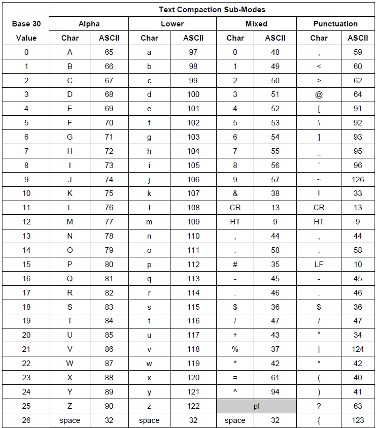

# Properties

## Most important properties

>important This is the documentation of the old version of the RadBarcode component, which is currently deprecated. Check out the new version [here]().

__Text__ – this string property allows the user to enter the textual representation of the data, which is to be encoded by the barcode. Depending on the mode and error correction levels, any invalid characters, entered by the user, as well as any characters, which surpass the maximum number of symbols, which can be accommodated, will be discarded.        

__EncodingMode__ – this is an enumeration, which determines the types of symbols, which will be accepted by the barcode, as well as the algorithm by which they will be encoded internally. 
The enumeration has the following values:        

* __Auto__ – this specifies no particular encoding mode. This means that the barcode control will determine internally how to encode each particular symbol, according to the ISO specification.        

* __Byte__ - The Byte Compaction mode enables a sequence of 8-bit bytes to be encoded into a sequence of codewords. It is accomplished by a Base 256 to Base 900 conversion, which achieves a compaction ratio of six bytes to five codewords. Characters with ascii codes from 0 to 255 are acceptable. The table below lists all the characters and their values.
	

* __Numeric__ – the numeric mode allows encoding of numeric symbols only [0-9]. Any other characters are discarded.         

* __Text__ – The text mode allows encoding of text characters – upper and lowercase letters, as well as digits, punctuation and some additional characters. The complete character table is listed below:  
    

__ErrorCorrectionLevel__ – this is an integer value from 0 to 8. This value determines how many error correction clusters will be added to the rendered data. 
The table below lists the values for each level of error correction:

## The Rows and Columns properties

Internally, code PDF417 renders in columns and rows. These rows and columns create a grid, which in turn accommodates all the modules of encoded data. The maximum number of columns in the code is 30, whereas the maximum number of rows is 90. Depending on the scenario, this internal behavior may influence the readability of the control.  To address this, two properties are exposed - __Rows__ and __Columns__. These two properties will allow you to pre-determine the number of rows and columns in the rendered PDF417 code. For example, when you have limited width, you can increase the number of rows. The code sample below demonstrates one possible usage:        

#### __[XAML] Example 1: PDF417 barcode definition__  
{{region xaml-radbarcodereader-pdf417-properties-0}}
	<telerik:RadBarcodePDF417 Text="Encoded data which will influence the rendered PDF417" Rows="10"/>
{{endregion}}

One thing to keep in mind is that these properties are related to the data, which needs to be encoded. If there is too much data, more rows/columns will be added. If there is insufficient data, not all rows/columns will be used.        

## See Also
 * [PDF417 Visual Stucture]()