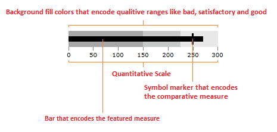

# Getting Started

This tutorial will walk you through the creation of a RadBulletGraph.

## Assembly References
 
In order to use RadBulletGraph in your project you have to add a reference to the following assemblies:
* __Telerik.Windows.Controls__
* __Telerik.Windows.Controls.DataVisualization__ 
* __Telerik.Windows.Data__

You can find the required assemblies for each control from the suite in the [Controls Dependencies]()[Controls Dependencies]() help article.

## BulletGraph Types

The RadBulletGraph suite provides two controls - one horizontally arranged and one vertically.

* __RadHorizontalBulletGraph__

* __RadVerticalBulletGraph__

## Visual Structure

The following image describes the main elements of the RadBulletGraph control.

#### __Figure 1: BulletGraph visual elements__

## Defining the RadBulletGraph

The following examples show how to define a simple horizontal and vertical bullet graphs.

#### __[XAML] Example 1: Defining horizontal bullet graph control__
{{region radbulletgraph-getting-started-0}}
	<telerik:RadHorizontalBulletGraph FeaturedMeasure="60"
									  ComparativeMeasure="65" 
									  ProjectedValue="75"
									  Maximum="100">
		<telerik:RadHorizontalBulletGraph.QualitativeRanges>
			<telerik:QualitativeRange Brush="#A8A8A8" Value="150" />
			<telerik:QualitativeRange Brush="#C6C8C8" Value="225" />
			<telerik:QualitativeRange Brush="#E8E8E8" />
		</telerik:RadHorizontalBulletGraph.QualitativeRanges>
	</telerik:RadHorizontalBulletGraph>
{{endregion}}

#### __Figure 2: RadHorizontalBulletGraph__

#### __[XAML] Example 2: Defining vertical bullet graph control__
{{region radbulletgraph-getting-started-1}}
	<telerik:RadVerticalBulletGraph FeaturedMeasure="60" 
									ComparativeMeasure="65" 
									ProjectedValue="75"
									Maximum="100">
		<telerik:RadVerticalBulletGraph.QualitativeRanges>
			<telerik:QualitativeRange Brush="#A8A8A8" Value="150" />
			<telerik:QualitativeRange Brush="#C6C8C8" Value="225" />
			<telerik:QualitativeRange Brush="#E8E8E8" />
		</telerik:RadVerticalBulletGraph.QualitativeRanges>
	</telerik:RadVerticalBulletGraph>
{{endregion}}

#### __Figure 3: RadVerticalBulletGraph__

## See Also
* [Overview]()
* [Qualitative Ranges]()
* [Measures]()
* [Creating a BulletGraph Programmatically]()
