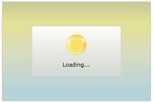

# Setting the OverlayStyle

>tipBefore reading this topic, you might find it useful to get familiar with the [Template Structure of the RadBusyIndicator]() control.

The __RadBusyIndicator__ exposes a __OverlayStyle__ property which allows you to apply a style to the __Rectangle__ element overlaying the __RadBusyIndicator's__ content while the indicator is active. 

To do this, first you have to define your __RadBusyIndicator__ control:

#### __[XAML] Defining RadBusyIndicator__

{{region xaml-radbusyindicator-styles-and-templates-setting-the-overlay-style_0}}
	<Grid x:Name="LayoutRoot"
	      Background="White">
	    <telerik:RadBusyIndicator OverlayStyle="{StaticResource OverlayStyle}"
	                              IsBusy="True"/>
	</Grid>
{{endregion}}

In the __RadBusyIndicator's__ definition you have indicated the __OverlayStyle__, that's why you have to define this style in the resources of your __UserControl__. Here is an example:

#### __[XAML] OverlayStyle declaration__

{{region xaml-radbusyindicator-styles-and-templates-setting-the-overlay-style_1}}
	<UserControl.Resources>
	    
	</UserControl.Resources>
{{endregion}}

>Notice that in the __OverlayStyle__ the __Opacity__ property is also specified. As a result if the __RadBusyIndicator__ had any content, it would still be visible while the indicator was active.

>tipYou can remove the __RadBusyIndicator__ busy content's background by setting the control's __Background__ property to __Transparent__.

#### __[XAML] Remove the BusyContent's Background__

{{region xaml-radbusyindicator-styles-and-templates-setting-the-overlay-style_2}}
	<telerik:RadBusyIndicator Background="Transparent"/>
{{endregion}}

Here is the result:

## See Also

 * [Styles and Templates - Overview]()

 * [Template Structure]()

 * [Styling the RadBusyIndicator]()

 * [Styling the RadProgressBar]()
