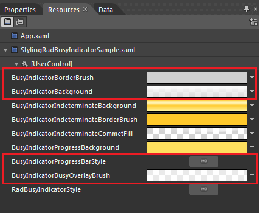
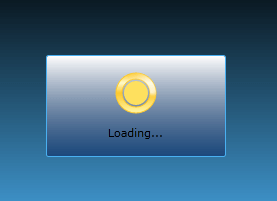

# Styling the RadBusyIndicator

>tipBefore reading this topic, you might find it useful to get familiar with the [Template Structure of the RadBusyIndicator]() control.

The __RadBusyIndicator__ exposes a __Style__ property which allows you to modify its appearance.

You have two options:

* To create an empty style and set it up on your own. 

* To copy the default style of the control and modify it.

This topic will show you how to perform the second one.

## Modifying the Default Style

To copy the default styles, load your project in Expression Blend and open the User Control that holds the __RadBusyIndicator__. In the 'Objects and Timeline' pane select the __RadBusyIndicator__ you want to style. From the menu choose *Object -> Edit Style -> Edit a Copy*. You will be prompted for the name of the style and where to be placed.

>tipIf you choose to define the style in Application, it would be available for the entire application. This allows you to define a style only once and then reuse it where needed.

After clicking 'OK', Expression Blend will generate the default style of the __RadBusyIndicator__ control in the __Resources__ section of your User Control. The properties available for the style will be loaded in the 'Properties' pane and you will be able to modify their default values. You can also edit the generated XAML in the XAML View or in Visual Studio.

Here are some of the generated resources:

* __BusyIndicatorBorderBrush__ -  represents the brush applied to the indicator's busy content border.

* __BusyIndicatorBackground__ - represents the brush applied to the indicator's content background.

* __BusyIndicatorProgressBarStyle__ - represents the default style applied to the __RadProgressBar__ control.

* __BusyIndicatorBusyOverlayBrush__ - represents the brush overlaying the __RadBusyIndicator's__ content while the indicator is active.

Here is an example of the above resources modified:

Here is the result:

## See Also

 * [Styles and Templates - Overview]()

 * [Template Structure]()

 * [Styling the RadProgressBar]()

 * [Setting the OverlayStyle]()
