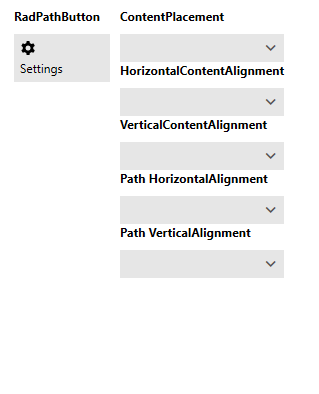

# PathButton

With our __Q3 2014__ official release we introduced the RadPathButton control. It derives from the __RadButton__. This means it inherits all the features of the standard button. Additionally it adds a __Path__ control to its default template. This allows you to easily add custom geometry to your button. You can instantiate this control in both XAML and code behind (see __Example 1 and 2__).

#### __[XAML] Example 1: Defining a button in XAML__
{{region xaml-radbuttons-features-path-button-0}}
	     
	<telerik:RadPathButton>
	    <telerik:RadPathButton.PathGeometry>
	        <EllipseGeometry RadiusX="10" RadiusY="10"></EllipseGeometry>
	    </telerik:RadPathButton.PathGeometry>
	</telerik:RadPathButton>
{{endregion}}

#### __[C#] Example 2: Defining a button in code__
{{region cs-radbuttons-features-path-button-1}}
	RadPathButton pathButton = new RadPathButton() { PathGeometry = new EllipseGeometry() { RadiusX = 10, RadiusY = 10 } };
{{endregion}}

#### __[VB.NET] Example 2: Defining a button in code__
{{region vb-radbuttons-features-path-button-2}}
	Dim pathButton As New RadPathButton() With { _
	    .PathGeometry = New EllipseGeometry() With { _
	        .RadiusX = 10, _
	        .RadiusY = 10 _
	    } _
	}
{{endregion}}

#### __Figure 1: The created path button__

Note that in XAML you can directly use string format [Path Markup Syntax](https://docs.microsoft.com/en-us/dotnet/framework/wpf/graphics-multimedia/path-markup-syntax)

#### __[XAML] Example 3: Setting the path geometry in XAML__
{{region xaml-radbuttons-features-path-button-4}}
	<telerik:RadPathButton PathGeometry="M3,7L9,7L9,4L13,8L9,12L9,9L3,9z" />
{{endregion}}

To achieve the same results through code you can use our __GeometryParser__

#### __[C#] Example 3: Setting the path geometry in code__
{{region cs-radbuttons-features-path-button-5}}
	RadPathButton pathButton = new RadPathButton() { PathGeometry = GeometryParser.GetGeometry("M3,7L9,7L9,4L13,8L9,12L9,9L3,9z") };
{{endregion}}

#### __[VB.NET] Example 3: Setting the path geometry in code__
{{region vb-radbuttons-features-path-button-6}}
	Dim pathButton As New RadPathButton() With { _
	    .PathGeometry = GeometryParser.GetGeometry("M3,7L9,7L9,4L13,8L9,12L9,9L3,9z") _
	}
{{endregion}}

#### __Figure 2: RadPathButton with PathGeometry__

# Customizing the RadPathButton

The __RadPathButton__ exposes the __ContentPlacement__ property. It is of type __Dock__ and gets or sets this position of the content relative to the Path element. This property accepts __Left__, __Top__, __Right__ and __Bottom__ values. The default is __Bottom__.
        
#### __[XAML] Example 4: Setting the content position in XAML__
{{region xaml-radbuttons-features-path-button-7}}
	<telerik:RadPathButton Content="Path Button" ContentPlacement="Right" />
{{endregion}}

#### __[C#] Example 5: Setting the content position in code__
{{region cs-radbuttons-features-path-button-8}}
	RadPathButton pathButton = new RadPathButton() { Content = "Path button", ContentPlacement = Dock.Right };
{{endregion}}

#### __[VB.NET] Example 5: Setting the content position in code__
{{region vb-radbuttons-features-path-button-9}}
	Dim pathButton As New RadPathButton() With { _
	    .Content = "Path button", _
	    .ContentPlacement = Dock.Right _
	}
{{endregion}}

#### __Figure 3: RadPathButton with ContentPlacement set to Right__

In addition to all customizing options that are inherited from the __RadButton__ the __PathButton__ has a __PathStyle__ property. This property gets or sets the style of the __Path__ element in the template.

#### __[XAML] Example 5: Setting the content position in XAML__
{{region xaml-radbuttons-features-path-button-10}}
	<telerik:RadPathButton.PathStyle>
			
		</telerik:RadPathButton.PathStyle>
{{endregion}}

#### __Figure 4: RadPathButton with custom PathStyle__

Also the __RadPathButton__ exposes the __ContentMargin__ property. It is of type __Thickness__ and determines the margin around its content. This allows users to adjust size of the Path that the button hosts. For adjusting the position of the Path itself users can use the __RadPathButton.Padding__ property.

## Aligning the Path

By default, the **Stretch** property of the **Path** element is set to **Fill**. As a result, when the **ContentPlacement** of the button is set to **Top** or **Bottom**, only the **HorizontalContentAlignment** takes effect. Respectively, when the **ContentPlacement** is **Left** or **Right**, only the **VerticalContentAlignment** takes effect.

With the **R1 2021 SP** release you can now more intuitively place the path element of the button relatively to its content. For the purpose, you need to set the **Stretch** property of the **Path** to **None** and set the desired horizontal and vertical alignments.

#### __[XAML] Example 6: Setting the path alignment in XAML__
{{region xaml-radbuttons-features-path-button-12}}
	<telerik:RadPathButton.PathStyle>
			
		</telerik:RadPathButton.PathStyle>
{{endregion}}

#### __Figure 4: RadPathButton with different alignments__

As seen in the image above you may also want to set appropriate values for the **HorizontalContentAlignment** and **VerticalContentAlignment** of the RadPathButton to align the content in the available space.


## RadPathButton and RadGlyph

The RadPathButton can also be used with [RadGlyphs]().

#### __[XAML] Example 7: Set RadGlyph as PathGeometry__
{{region xaml-radbuttons-features-path-button-11}}
	<telerik:RadPathButton Width="50" Height="50" Padding="10"
							PathGeometry="{telerik:RadGlyph Glyph={StaticResource GlyphGlobe}}" />
{{endregion}}

#### __Figure 6: RadPathButton with RadGlyph__



## See Also
 * [Button]()
 * [DropDown Button]()
 * [Split Button]()
 * [Commands]()
 * [Appearance]()