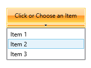

# Split Button

__RadSplitButton__ is a UI combination of RadButton and RadDropDownButton.

A RadButton element represents the ButtonPart, while the RadDropDownButton represents the DropDownPart. See the different parts of RadSplitButton in the [Visual Structure](#radsplitbutton) article. 

> RadSplitButton looks very similar to RadDropDownButton. The main difference is that RadSplitButton has two separate parts - a clickable button and a button that opens the drop down. On the other hand, RadDropDownButton combines those two actions into a single button.

The split button control implements the __ICommandSource__ interface, which allows you to attach commands to the button part, that will be executed when the button is clicked. Read more about this in the [Commands]() article.

## Instantiating RadSplitButton

> In order to use the RadSplitButton class, you will need to add а reference to __Telerik.Windows.Controls.dll__.

You can instantiate __RadSplitButton__ both in XAML and code.

#### __[XAML] Example 1: Defining a button in XAML__
{{region xaml-radbuttons-features-split-button_0}}
	<telerik:RadSplitButton Content="Click Me!" />
{{endregion}}

#### __[C#] Example 2: Defining a button in code__
{{region cs-radbuttons-features-split-button_1}}
	RadSplitButton radSplitButton = new RadSplitButton() { Content = "Click Me!" };
{{endregion}}

#### __[VB.NET] Example 2: Defining a button in code__
{{region vb-radbuttons-features-split-button_2}}
	Dim radSplitButton As New RadSplitButton() With { _
	    .Content = "Click Me!" _
	}
{{endregion}}

#### __Figure 1: RadSplitButton__

## Adding DropDown Content

In order to add content to the drop-down area of RadSplitButton, use its __DropDownContent__ property.

#### __[XAML] Example 3: Adding ListBox as a drop down content__
{{region xaml-radbuttons-features-split-button_3}}
	<telerik:RadSplitButton AutoOpenDelay="0:0:0.0" Content="Click or Choose an Item">
	    <telerik:RadSplitButton.DropDownContent>
	        <ListBox>
	            <ListBoxItem Content="Item 1" />
	            <ListBoxItem Content="Item 2" />
	            <ListBoxItem Content="Item 3" />
	        </ListBox>
	    </telerik:RadSplitButton.DropDownContent>
	</telerik:RadSplitButton>
{{endregion}}

>tip Additionally, the control provides __DropDownContentTemplate__ and __DropDownContentTemplateSelector__ properties, that can be used to customize the drop down content in a data binding scenario. Read more about data templates in the [Data Templating Overview](https://msdn.microsoft.com/en-us/library/ms742521(v=vs.100).aspx) MSDN article.

#### __Figure 2: RadSplitButton with dropdown content__

## Toggling the RadSplitButton

The Button part of the split button can behave as a toggle button. To enable this, set the __IsToggle__ property of RadSplitButton to True.

#### __[XAML] Example 4: Enable toggle mode__
{{region xaml-radbuttons-features-split-button_4}}
	<telerik:RadSplitButton IsToggle="True" />
{{endregion}}

#### __Figure 3: RadSplitButton as a toggle button__

## Auto Opening

You can allow the RadSplitButton to automatically display its DropDownContent, when you __mouse over the button__. This behaviour is controlled via the __AutoOpenDelay__ property of RadSplitButton. The property specifies the time, after which the drop down content is displayed. 

To disable the auto-opening feature of the control, set the __AutoOpenDelay__ to __"0"__.

#### __[XAML] Example 5: Setting the AutoOpenDelay property__
{{region xaml-radbuttons-features-split-button_5}}
	<telerik:RadSplitButton AutoOpenDelay="0:0:0.5" />
{{endregion}}

## Customizing the RadSplitButton

You can easily customize RadSplitButton by using the following properties:		

* __IsOpen__: Specifies whether the DropDownContent of the button is opened.

* __IsChecked__: Specifies the checked state of the button when its ButtonPart behaves like a toggle button.

* __CloseOnEscape__: Specifies whether the drop-down should be closed when the __Esc__ key gets pressed. The default value is True.

* __ButtonPartStyle__: Allows you to define a Style for the button part of the RadSplitButton. The TargetType expected by the Style is RadButton.

* __TogglePartStyle__: Allows you to define a Style for the ButtonPart of RadSplitButton when it is in toggle button mode. The TargetType expected by the Style is RadToggleButton.

* __CornerRadius__: Specifies the corner radius of RadSplitButton.

* __ToggleCornerRadius_ _: Specifies the corner radius of the ButtonPart, when it behaves like a toggle button.

* __IsBackgroundVisible__: Controls the visibility of the background and the border of the RadSplitButton control in normal state.

* __IsButtonPartVisible__: Specifies whether the ButtonPart is visible.

* __DropDownButtonPosition__: Specifies the position of the drop down arrow. The possible values are __Bottom__, __Left__, __Right__ (default), __Top__.

* __DropDownIndicatorVisibility__: Specifies whether the drop-down arrow should be visible. The default value is __Visible__.

* __DropDownPlacement__: Specifies where the drop down area should be placed - __Absolute__, __Bottom__, __Center__, __Left__, __Right__, __Top__.

* __DropDownWidth__: Specifies the width of the drop-down area.

* __DropDownHeight__: Specifies the height of the drop-down area.

* __DropDownMaxHeight__: Specifies the maximal height of the drop-down area.

* __DropDownMaxWidth__: Specifies the maximal width of the drop-down area.

#### __[XAML] Example 6: Customizing RadSplitButton__
{{region xaml-radbuttons-features-split-button_6}}
	<telerik:RadSplitButton DropDownButtonPosition="Bottom" 
							Content="Click or Choose an Item" 
							DropDownWidth="{Binding ActualWidth, RelativeSource={RelativeSource Self}}">
		<telerik:RadSplitButton.DropDownContent>
			<ListBox>
				<ListBoxItem Content="Item 1" />
				<ListBoxItem Content="Item 2" />
				<ListBoxItem Content="Item 3" />
			</ListBox>
		</telerik:RadSplitButton.DropDownContent>
	</telerik:RadSplitButton>
{{endregion}}

#### __Figure 4: Customized RadSplitButton__

## See Also
 * [RadSplitButton API Reference](http://www.telerik.com/help/wpf/installation-installing-controls-dependencies-wpf.html)[RadSplitButton API Reference](http://www.telerik.com/help/silverlight/installation-installing-controls-dependencies.html)
 * [Button]()
 * [DropDown Button]()
 * [Commands]()
 * [Appearance]()
