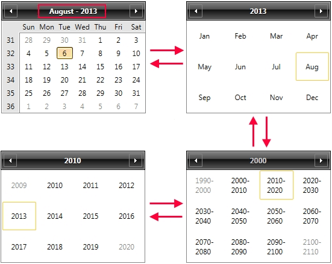

# Calendar Basics

RadCalendar is a control that displays a calendar representation from which the user can select a single date or a range of dates (single, multiple and extended selection) with full keyboard support.

## Display Modes

There are four __Calendar modes__ that specify what is visible in the Calendar views : a __month__, a __year__, a __decade__ or a __century__. The calendar modes can be switched by clicking the calendar header button. Or setting the __DisplayMode__ property: 

#### __XAML__

{{region xaml-radcalendar-basics_0}}
	<telerik:RadCalendar DisplayMode="YearView" x:Name="calendar"/>
{{endregion}}

>The navigation between different __DisplayModes__ depends on the currently set __DisplayDate__. If, for example in the MonthView, the currently shown Month is August, but the SelectedDate is in September, clicking on the header button will navigate to YearView and will highlight August button.

## Selection

The __SelectedDate__ property holds the selected date, __null__ means that __no date is selected__. The following code will select tomorrow's date in a calendar:

#### __C#__

{{region cs-radcalendar-basics_1}}
	calendar.SelectedDate = DateTime.Today.AddDays(1);
{{endregion}}

The __SelectedDates__ property is a collection of all the selected dates in the Calendar. Note that it is read-only and cannot be bound in XAML - you can only add Dates to it with code.

If you add dates in the Selected dates collection, they should be valid with regard to the constraints of the calendar: selectable and display dates range. See the [Constraining Selection and Visible Days]() topic for more information on the managing the constraints.

The following example selects all the work days (Monday to Friday) of the current month:

#### __C#__

{{region cs-radcalendar-basics_2}}
	//Make sure that more than one date can be selected:
	calendar.SelectionMode = SelectionMode.Extended;
	//Which month is it today?
	int thisMonthIndex = DateTime.Today.Month;
	DateTime dayOfMonth = new DateTime(DateTime.Today.Year, thisMonthIndex, 1);
	while (thisMonthIndex == dayOfMonth.Month)
	{
	    //Add the date if is a Mon - Fri week day:
	    if (dayOfMonth.DayOfWeek != DayOfWeek.Sunday && dayOfMonth.DayOfWeek != DayOfWeek.Saturday)
	    {
	        calendar.SelectedDates.Add(dayOfMonth);
	    }
	    dayOfMonth = dayOfMonth.AddDays(1);
	}
{{endregion}}

## Week Settings

You can use the following properties to configure the weeks inside __RadCalendar__:

 * __FirstDayOfWeek__ - sets the first day of the week, if not set, depends on the default thread Culture.
 
 * __CalendarWeekRule__  - sets the rule which determines the first calendar week of the year. It can receive the following values: FirstDay, FirstFourDayWeek, FirstFullWeek.

 >tip For more details on the CalendarWeekRule settings see [CalendarWeekRule Enumeration](https://msdn.microsoft.com/en-us/library/system.globalization.calendarweekrule%28v=vs.110%29.aspx) MSDN topic.

## DatePicker

If you need a calendar that takes less space, use the [RadDateTimePicker]() control which in its essence is a DropDown with a calendar and date parser.

## See Also

* [Selection Modes]()
 
* [Constraining Selection and Visible Days]()