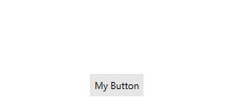

# Animations

When the __RadCallout__ is placed inside a Popup element, you can add animations. Through the __CalloutPopupSettings__ class, you can animate the showing and/or closing effect of the Popup. You can choose from a variety of built-in animations or create your custom animation effect so that you can add an additional look to the RadCallout. To add animation to the Popup, you just need to set the __ShowAnimationType__ and /or __CloseAnimationType__ property of the settings class.

The complete customization of the RadCallout animation is done from the __CalloutPopupSettings__ class. Several properties can be used for this purpose.

* __ShowAnimationDuration__: A property of type __double__ that gets or sets a duration of the animation when shown, in seconds.
* __CloseAnimationDuration__: A property of type __double__ that gets or sets a duration of the animation when closed, in seconds.

* __ShowAnimationEasing__: A property of type __IEasingFunction__ that gets or sets the easing function of the shown animation.
* __CloseAnimationEasing__: A property of type __IEasingFunction__ that gets or sets the easing function of the close animation.

* __ShowAnimationDelay__: A property of type __double__ that gets or sets a delay of the animation when shown, in seconds.
* __CloseAnimationDelay__: A property of type __double__ that gets or sets a delay of the animation when closed, in seconds.

For this tutorial, we are going to show the RadCallout inside a Popup on a button click and animate its opening and closing state. First, we need to define our RadButton control and subscribe to its __Click__ event.

#### __[XAML] Example 1: Defining RadButton__
{{region xaml-radcallout-features-animations-0}}
    <Grid>        
		<telerik:RadButton Content="My Button" VerticalAlignment="Center" HorizontalAlignment="Center" Click="RadButton_Click" />
	</Grid>
{{endregion}}

In the click event handler, we can declare our RadCallout control. To show the control, we need to use the CalloutPopupService.Show() static method. The third parameter (not required) of this method accepts CalloutPopupSettings object. You can use these settings, for example, to change the position of the __Popup__, add animation, etc.

#### __[C#] Example 2: Setting RadCallout in code behind__
{{region csharp-radcallout-features-animations-1}}
    private void RadButton_Click(object sender, RoutedEventArgs e)
	{
		RadCallout callout = new RadCallout() { Background = Brushes.DeepSkyBlue, Content = "My Callout" };

		CalloutPopupSettings settings = new CalloutPopupSettings()
		{
			Placement = System.Windows.Controls.Primitives.PlacementMode.Top,
			ShowAnimationType = CalloutAnimation.Move,
			CloseAnimationType = CalloutAnimation.Scale,
		};

		CalloutPopupService.Show(callout, sender as FrameworkElement, settings);
	}
{{endregion}}

#### __Figure 1: Popup animation__

## Animation Types

Several different built-in animations can be used to animate RadCallout placed inside Popup. You can customize the duration, delay and easing function of each animation. The easing functions make the animation much more realistic and smoother. There is a set of predefined easing functions in WPF, and you are allowed to create custom ones, too.

>To learn more about the easing functions you can take a look at this [MSDN help article](
https://msdn.microsoft.com/en-us/library/ee308751%28v=VS.100%29.aspx?f=255&MSPPError=-2147217396).

#### __[C#] Example 3: Show and Close Animation with Easing functions applied__
{{region csharp-radcallout-features-animations-4}}
	private void RadButton_Click(object sender, RoutedEventArgs e)
	{
		RadCallout callout = new RadCallout() { Background = Brushes.DeepSkyBlue, Content = "My Callout" };

		CalloutPopupSettings settings = new CalloutPopupSettings()
		{
			Placement = System.Windows.Controls.Primitives.PlacementMode.Top,                
			ShowAnimationDuration = 0.55d,
			ShowAnimationEasing =  new BounceEase() { EasingMode =  EasingMode.EaseOut, Bounces = 20, Bounciness = 5 },
			CloseAnimationEasing = new CircleEase() { EasingMode = EasingMode.EaseOut, },
			CloseAnimationDuration = 0.3d,
			ShowAnimationType = CalloutAnimation.Move,
			CloseAnimationType = CalloutAnimation.Scale,
		};

		CalloutPopupService.Show(callout, sender as FrameworkElement, settings);
	}
{{endregion}}

#### __Figure 2: Animated Popup with Easing functions__

### Fade Animation

The __CalloutAnimation.Fade__ animation fades the Popup control opening/closing effect. 

#### __[C#] Example 4: Setting Fade Animation__
{{region csharp-radcallout-features-animations-5}}
    private void RadButton_Click(object sender, RoutedEventArgs e)
	{
		RadCallout callout = new RadCallout() { Background = Brushes.DeepSkyBlue, Content = "My Callout", CalloutType= CalloutType.Cloud };
			 
		CalloutPopupSettings settings = new CalloutPopupSettings()
		{
			Placement = System.Windows.Controls.Primitives.PlacementMode.Top,
			ShowAnimationDuration = 0.55d,
			ShowAnimationEasing = new BounceEase() { EasingMode = EasingMode.EaseOut, Bounces = 20, Bounciness = 5 },
			CloseAnimationEasing = new CircleEase() { EasingMode = EasingMode.EaseOut, },
			CloseAnimationDuration = 0.3d,
			ShowAnimationType = CalloutAnimation.Fade,
			CloseAnimationType = CalloutAnimation.Fade,
		};

		CalloutPopupService.Show(callout, sender as FrameworkElement, settings);
	}
{{endregion}}

#### __Figure 3: Fade animation for opening and closing state__

### Move Animation

The __CalloutAnimation.Move__ animation adds a moving effect to the opening/closing state of the Popup. 

#### __[C#] Example 5: Setting Move Animation__
{{region csharp-radcallout-features-animations-6}}
    private void RadButton_Click(object sender, RoutedEventArgs e)
	{
		RadCallout callout = new RadCallout() { Background = Brushes.DeepSkyBlue, Content = "My Callout", CalloutType= CalloutType.Ellipse };
			 
		CalloutPopupSettings settings = new CalloutPopupSettings()
		{
			Placement = System.Windows.Controls.Primitives.PlacementMode.Top,
			ShowAnimationDuration = 0.55d,
			ShowAnimationEasing = new BounceEase() { EasingMode = EasingMode.EaseOut, Bounces = 20, Bounciness = 5 },
			CloseAnimationEasing = new CircleEase() { EasingMode = EasingMode.EaseOut, },
			CloseAnimationDuration = 0.3d,
			ShowAnimationType = CalloutAnimation.Move,
			CloseAnimationType = CalloutAnimation.Move,
		};

		CalloutPopupService.Show(callout, sender as FrameworkElement, settings);
	}
{{endregion}}

#### __Figure 4: Move animation for opening and closing state__

### FadeAndMove Animation

The __CalloutAnimation.FadeAndMove__ animation is represented by a combination of __Fade__ and __Move__ animations.

#### __[C#] Example 6: Setting FadeAndMove Animation__
{{region csharp-radcallout-features-animations-7}}
    private void RadButton_Click(object sender, RoutedEventArgs e)
	{
		RadCallout callout = new RadCallout() { Background = Brushes.DeepSkyBlue, Content = "My Callout", CalloutType= CalloutType.Kaboom };
			 
		CalloutPopupSettings settings = new CalloutPopupSettings()
		{
			Placement = System.Windows.Controls.Primitives.PlacementMode.Top,
			ShowAnimationDuration = 0.55d,
			ShowAnimationEasing = new BounceEase() { EasingMode = EasingMode.EaseOut, Bounces = 20, Bounciness = 5 },
			CloseAnimationEasing = new CircleEase() { EasingMode = EasingMode.EaseOut, },
			CloseAnimationDuration = 0.3d,
			ShowAnimationType = CalloutAnimation.FadeAndMove,
			CloseAnimationType = CalloutAnimation.FadeAndMove,
		};

		CalloutPopupService.Show(callout, sender as FrameworkElement, settings);
	}
{{endregion}}

#### __Figure 5: FadeAndMove animation for opening and closing state__

### Reveal Animation

The __CalloutAnimation.Reveal__ animation animates the clipping effect to the control.

#### __[C#] Example 7: Setting Reveal Animation__
{{region csharp-radcallout-features-animations-8}}
    private void RadButton_Click(object sender, RoutedEventArgs e)
	{
		RadCallout callout = new RadCallout() { Background = Brushes.DeepSkyBlue, Content = "My Callout", CalloutType= CalloutType.Rectangle };
			 
		CalloutPopupSettings settings = new CalloutPopupSettings()
		{
			Placement = System.Windows.Controls.Primitives.PlacementMode.Top,
			ShowAnimationDuration = 0.55d,
			ShowAnimationEasing = new BounceEase() { EasingMode = EasingMode.EaseOut, Bounces = 20, Bounciness = 5 },
			CloseAnimationEasing = new CircleEase() { EasingMode = EasingMode.EaseOut, },
			CloseAnimationDuration = 0.3d,
			ShowAnimationType = CalloutAnimation.Reveal,
			CloseAnimationType = CalloutAnimation.Reveal,
		};

		CalloutPopupService.Show(callout, sender as FrameworkElement, settings);
	}
{{endregion}}

#### __Figure 6: Reveal animation for opening and closing state__

### FadeAndReveal Animation

The __CalloutAnimation.FadeAndReveal__ animation is represented by a combination of __Fade__ and __Reveal__ animations.

#### __[C#] Example 8: Setting FadeAndReveal Animation__
{{region csharp-radcallout-features-animations-9}}
    private void RadButton_Click(object sender, RoutedEventArgs e)
	{
		RadCallout callout = new RadCallout() { Background = Brushes.DeepSkyBlue, Content = "My Callout", CalloutType= CalloutType.RoundedRectangle };
			 
		CalloutPopupSettings settings = new CalloutPopupSettings()
		{
			Placement = System.Windows.Controls.Primitives.PlacementMode.Top,
			ShowAnimationDuration = 0.55d,
			ShowAnimationEasing = new BounceEase() { EasingMode = EasingMode.EaseOut, Bounces = 20, Bounciness = 5 },
			CloseAnimationEasing = new CircleEase() { EasingMode = EasingMode.EaseOut, },
			CloseAnimationDuration = 0.3d,
			ShowAnimationType = CalloutAnimation.FadeAndReveal,
			CloseAnimationType = CalloutAnimation.FadeAndReveal,
		};

		CalloutPopupService.Show(callout, sender as FrameworkElement, settings);
	}
{{endregion}}

#### __Figure 7: FadeAndReveal animation for opening and closing state__

### Scale Animation

The __CalloutAnimation.Scale__ animation controls the scale of the object. This animation uses the center point of the control for scaling.

#### __[C#] Example 9: Setting Scale Animation__
{{region csharp-radcallout-features-animations-10}}
    private void RadButton_Click(object sender, RoutedEventArgs e)
	{
		RadCallout callout = new RadCallout() { Background = Brushes.DeepSkyBlue, Content = "My Callout", CalloutType= CalloutType.Cloud };
			 
		CalloutPopupSettings settings = new CalloutPopupSettings()
		{
			Placement = System.Windows.Controls.Primitives.PlacementMode.Top,
			ShowAnimationDuration = 0.55d,
			ShowAnimationEasing = new BounceEase() { EasingMode = EasingMode.EaseOut, Bounces = 20, Bounciness = 5 },
			CloseAnimationEasing = new CircleEase() { EasingMode = EasingMode.EaseOut, },
			CloseAnimationDuration = 0.3d,
			ShowAnimationType = CalloutAnimation.Scale,
			CloseAnimationType = CalloutAnimation.Scale,
		};

		CalloutPopupService.Show(callout, sender as FrameworkElement, settings);
	}
{{endregion}}

#### __Figure 8: Scale animation for opening and closing state__

### FadeAndScale Animation

The __CalloutAnimation.FadeAndScale__ animation is represented by a combination of __Fade__ and __Scale__ animations.

#### __[C#] Example 10: Setting FadeAndScale Animation__
{{region csharp-radcallout-features-animations_11}}
    private void RadButton_Click(object sender, RoutedEventArgs e)
	{
		RadCallout callout = new RadCallout() { Background = Brushes.DeepSkyBlue, Content = "My Callout", CalloutType= CalloutType.Ellipse };
			 
		CalloutPopupSettings settings = new CalloutPopupSettings()
		{
			Placement = System.Windows.Controls.Primitives.PlacementMode.Top,
			ShowAnimationDuration = 0.55d,
			ShowAnimationEasing = new BounceEase() { EasingMode = EasingMode.EaseOut, Bounces = 20, Bounciness = 5 },
			CloseAnimationEasing = new CircleEase() { EasingMode = EasingMode.EaseOut, },
			CloseAnimationDuration = 0.3d,
			ShowAnimationType = CalloutAnimation.FadeAndScale,
			CloseAnimationType = CalloutAnimation.FadeAndScale,
		};

		CalloutPopupService.Show(callout, sender as FrameworkElement, settings);
	}
{{endregion}}

#### __Figure 9: FadeAndScale animation for opening and closing state__

## Disable Animation

To globally disable the animation for all Popups elements holding RadCallout controls, CalloutPopupService.IsAnimationEnabled static property can be set to false.

#### __[C#] Example 11: Disable Animation__
{{region csharp-radcallout-features-animations-12}}
	public MainWindow()
	{           
		InitializeComponent();
		CalloutPopupService.IsAnimationEnabled = false;
	}
{{endregion}}

## See Also

* [Getting Started]()
* [CalloutPopupService]()
