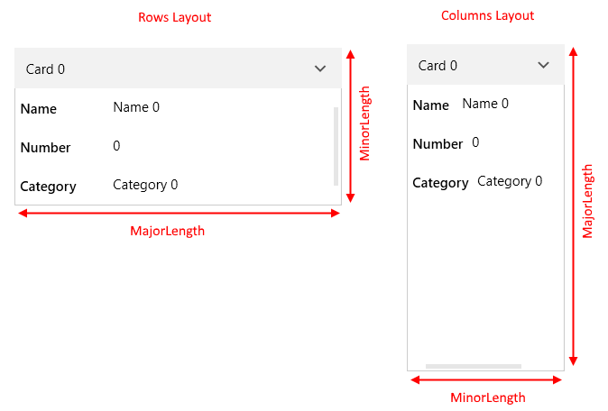
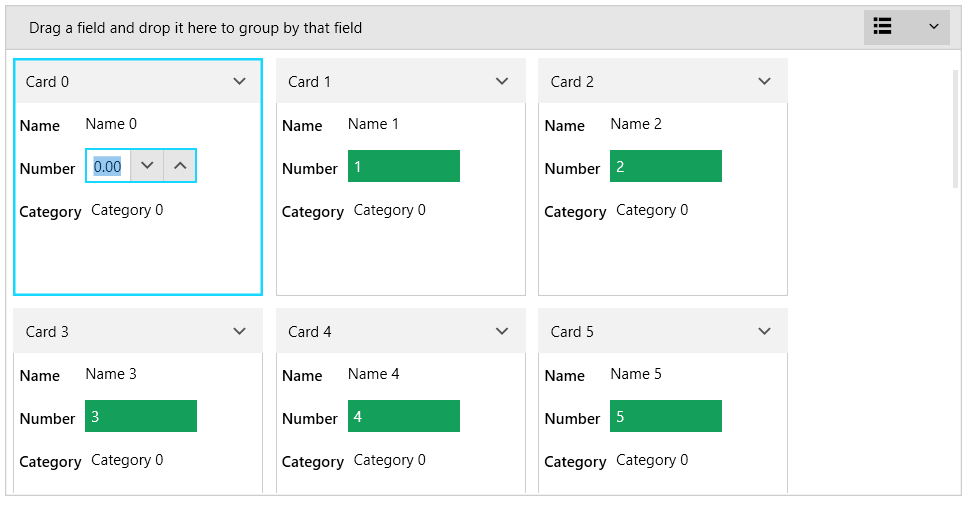

# Customizing Cards

RadCardView cards can be customized in order to match the expected design or functionality.

## Card Size

The cards size is determined by the __MajorLength__ and __MinorLength__ properties of RadCardView. Each property relates to a different dimension (width or height) based on the applied [layout]() (rows or columns).

When the __CardLayout__ property is set to __Rows__ the __MajorLength__ is applied to the card's __width__ and the __MinorLength__ to the card's __height__. 
When the __CardLayout__ is __Columns__ the __MajorLength__ is applied to the card's __height__ and the __MinorLength__ to the card's __width__. 

#### Figure 1: MajorLength and MinorLength examples

Additionally, you can set the __CollapsedLength__ property in order to change the size of the cards while in collapsed state.

#### __[XAML] Example 1: Setting cards sizes__
{{region radcardview-appearance-customizing-cards-0}}
    <telerik:RadCardView MinorLength="200"
                         MajorLength="210"
					     CollapsedLength="150"/>
{{endregion}}

## Card Header

The header content of a card is determined by the __CardHeaderBinding__ property. Read the [Data Binding]() article to see how to use this. Additionally, the header UI can be customized using the __CardHeaderTemplate__ property of RadCardView.

#### __[XAML] Example 2: Setting card header template__
{{region radcardview-appearance-customizing-cards-1}}
    <telerik:RadCardView CardHeaderBinding="{Binding MyHeaderProperty}">
		<telerik:RadCardView.CardHeaderTemplate>
			<DataTemplate>
				<TextBlock Text="{Binding}" Foreground="#CA5100" FontWeight="Bold"/>
			</DataTemplate>
		</telerik:RadCardView.CardHeaderTemplate>           
	</telerik:RadCardView>
{{endregion}}

#### Figure 2: Custom card header

>tip The data context in the __CardHeaderTemplate__ comes from the property bound to the __CardHeaderBinding__.

## Card Data Field

To toggle the visibility of a data field, set the __IsVisible__ property of the associated [CardDataFieldDescriptor]().

#### __[XAML] Example 3: Setting CardDataFieldDescriptor IsVisible property__
{{region radcardview-appearance-customizing-cards-2}}
   <telerik:RadCardView.DataFieldDescriptors>
		<telerik:CardDataFieldDescriptor DataMemberBinding="{Binding Name}" IsVisible="False"/>
	</telerik:RadCardView.DataFieldDescriptors>
{{endregion}}

To customize the field that shows the value, set the __EditorTemplate__ and __ReadOnlyTemplate__ of the CardDataFieldDescriptor. The __EditorTemplate__ property changes the editor element that is displayed when the data field enters edit mode. The __ReadOnlyTemplate__ changes the element that is displayed in the normal state of the data field.

#### __[XAML] Example 4: Setting EditorTemplate and ReadOnlyTemplate__
{{region radcardview-appearance-customizing-cards-3}}
	<telerik:RadCardView.DataFieldDescriptors>
		<telerik:CardDataFieldDescriptor DataMemberBinding="{Binding Number}">
			<telerik:CardDataFieldDescriptor.ReadOnlyTemplate>
				<DataTemplate>
					<Border Padding="5" Background="#149F5B">
						<TextBlock Text="{Binding Number}" Foreground="White"/>
					</Border>                            
				</DataTemplate>
			</telerik:CardDataFieldDescriptor.ReadOnlyTemplate>
			<telerik:CardDataFieldDescriptor.EditorTemplate>
				<DataTemplate>
					<telerik:RadNumericUpDown Value="{Binding Number, Mode=TwoWay}" />
				</DataTemplate>
			</telerik:CardDataFieldDescriptor.EditorTemplate>
		</telerik:CardDataFieldDescriptor>
	</telerik:RadCardView.DataFieldDescriptors>
{{endregion}}

#### Figure 3: Custom read only and editor templates for one of the data fields

## See Also  
* [Data Binding]()
* [Customizing Groups]() 
* [Customizing Filtering Control]() 