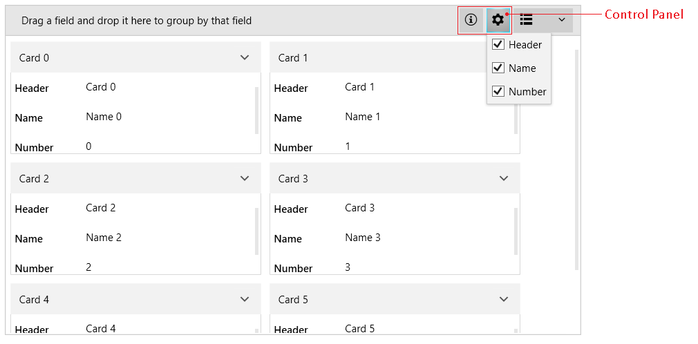
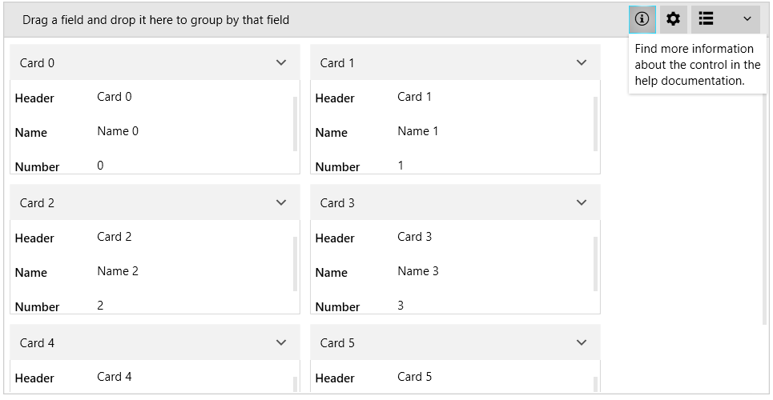

# Control Panel

The control panel of RadCardView allows you to include additional settings UI next to the [Data Field Descriptors Button]().

The feature is useful in case you want to include a custom settings panel and implement the corresponding actions.

To enable the control panel, use the __ControlPanelItems__ property of RadCardView. This allows you to define __CardViewControlPanelItem__ elements, which are proxies that hold information about the corresponding visual element that will be created.

The following example is an extended version of the sample from the [Getting Started]() article.

#### __[XAML] Example 1: Defining GridViewControlPanelItems__
{{region radcardview-features-control-panel-0}}
	<telerik:RadCardView x:Name="cardView"   
						 CardHeaderBinding="{Binding Header}" 
						 MinorLength="140">
		<telerik:RadCardView.ControlPanelItems>
			<telerik:CardViewControlPanelItem>
				<telerik:CardViewControlPanelItem.ButtonContent>
					<telerik:RadGlyph Glyph="&#xe401;" />
				</telerik:CardViewControlPanelItem.ButtonContent>
				<telerik:CardViewControlPanelItem.Content>
					<TextBlock Text="Find more information about the control in the help documentation."
							   MaxWidth="150" TextWrapping="Wrap" Padding="6" />
				</telerik:CardViewControlPanelItem.Content>
			</telerik:CardViewControlPanelItem>
			<telerik:CardViewControlPanelItem ButtonTooltip="Descriptor Settings">
				<telerik:CardViewControlPanelItem.ButtonContent>
					<telerik:RadGlyph Glyph="&#xe13a;" />
				</telerik:CardViewControlPanelItem.ButtonContent>
				<telerik:CardViewControlPanelItem.Content>
					<telerik:RadListBox ItemsSource="{Binding ElementName=cardView, Path=DataFieldDescriptors}">
						<telerik:RadListBox.ItemTemplate>
							<DataTemplate>
								<CheckBox Content="{Binding Header}" IsChecked="{Binding IsVisible, Mode=TwoWay}" />
							</DataTemplate>
						</telerik:RadListBox.ItemTemplate>
					</telerik:RadListBox>
				</telerik:CardViewControlPanelItem.Content>
			</telerik:CardViewControlPanelItem>               
		</telerik:RadCardView.ControlPanelItems>
	</telerik:RadCardView>
{{endregion}}

#### Figure 1: CardView Control Panel

The control panel item visual element is a [RadDropDownButton]().

To set a tooltip for the button, use the __ButtonTooltip__ property of CardViewControlPanelItem.

To set the content of the button, use the __ButtonContent__ property of CardViewControlPanelItem. 

To set the drop down content of the button, use the __Content__ property of CardViewControlPanelItem.

Both Content and ButtonContent are of type __object__ where you can use a business model or directly an UI element as in Example 1. In addition to those properties, you can set the corresponding __ContentTemplate__ and __ButtonContentTemplate__ properties of CardViewControlPanelItem.

## Using Data Templates

CardViewControlPanelItem allows you to provide objects to the __Content__ and __ButtonContent__ properties. Then, you can use the __ContentTemplate__ and __ButtonContentTemplate__ properties to define the corresponding UI.

The following example is an extended version of the sample from the [Getting Started]() article.

#### __[XAML] Example 2: Defining ButtonContentTemplate and ContentTemplate__
{{region radcardview-features-control-panel-1}}
	<Grid>
        <Grid.Resources>
            <telerik:StringToGlyphConverter x:Key="StringToGlyphConverter" />
            <DataTemplate x:Key="ControlPanelItemButtonContentTemplate">
                <telerik:RadGlyph Glyph="{Binding Converter={StaticResource StringToGlyphConverter}}" />
            </DataTemplate>
            <DataTemplate x:Key="ControlPanelItemContentTemplate">
                <TextBlock Text="{Binding}" MaxWidth="150"
                           TextWrapping="Wrap" Padding="6" />
            </DataTemplate>
        </Grid.Resources>
        <telerik:RadCardView x:Name="cardView"   
                     CardHeaderBinding="{Binding Header}" 
                     MinorLength="140">
            <telerik:RadCardView.ControlPanelItems>
                <telerik:CardViewControlPanelItem ButtonContent="&#xe401;" 
                                                  Content="Find more information about the control in the help documentation."
                                                  ButtonContentTemplate="{StaticResource ControlPanelItemButtonContentTemplate}"
                                                  ContentTemplate="{StaticResource ControlPanelItemContentTemplate}"/>
                <telerik:CardViewControlPanelItem ButtonContent="&#xe13a;" 
                                                  Content="Define some custom UI in the template."
                                                  ButtonContentTemplate="{StaticResource ControlPanelItemButtonContentTemplate}"
                                                  ContentTemplate="{StaticResource ControlPanelItemContentTemplate}"/>
            </telerik:RadCardView.ControlPanelItems>
        </telerik:RadCardView>
    </Grid>
{{endregion}}

#### Figure 2: CardView Control Panel with Data Templates

## See Also
* [Getting Started]()
* [Events]()
* [Visual Structure]()

