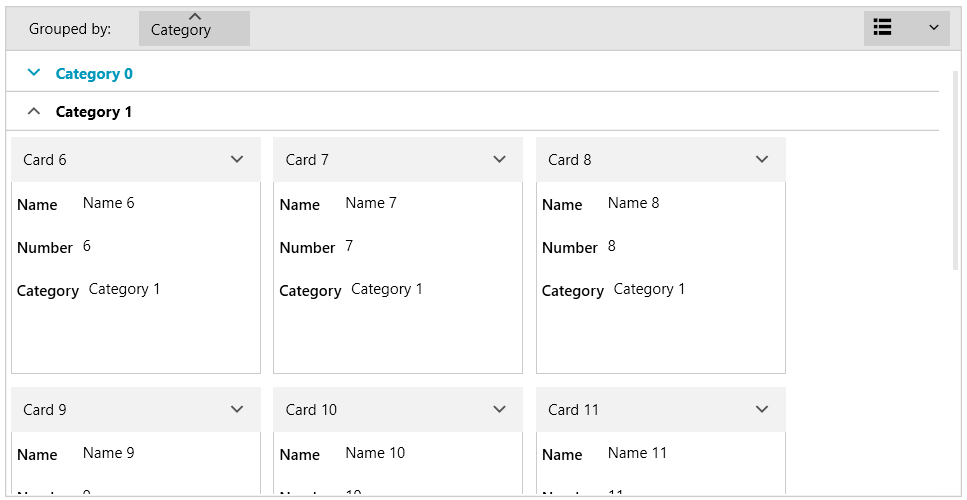

# Grouping

RadCardView supports grouping via the UI or in code, in case you are using ICollectionView as the ItemsSource.

#### Figure 1: RadCardView groups

The control internally works with a [QueryableCollectionView]() instance. When the ItemsSource is set, and if different type than QueryableCollectionView is used, then the original collection is wrapped in a QueryableCollectionView instance. This way grouping is supported even if you use a more basic IEnumerable implementation, like `List<T>` or `ObservableCollection<T>`.
 
## Grouping in the UI

The data items can be grouped by dragging a data field descriptor from the [data field descriptors list]() to the group panel area.

#### Figure 2: Dragging data field descriptor

#### Figure 3: Grouped RadCardView

The RadCardView groups support sorting by clicking onto the associated [group member button](). To disable this, set the __CanUserSortGroups__ property to __False__.

#### __[XAML] Example 1: Setting the CanUserSortGroups property__
{{region radcardview-features-grouping-0}}
	<telerik:RadCardView CanUserSortGroups="False" />
{{endregion}}

Additionally, the grouping can be disabled per [CardDataFieldDescriptor]() by setting its __AllowGrouping__ property.

## Programmatic Grouping

The following example shows how to setup RadCardView, populate it a [QueryableCollectionView]() and add GroupDescriptors in code.

#### __[C#] Example 2: Defining the model__
{{region radcardview-features-grouping-1}}
	public class CardInfo
    {
        public string Header { get; set; }
        public string Name { get; set; }
        public int Number { get; set; }
        public string Category { get; set; }
    }
	
	public class MainViewModel
    {
        public ObservableCollection<CardInfo> Items { get; private set; }
        public QueryableCollectionView CollectionView { get; private set; }

        public MainViewModel()
        {
            int counter = 0;
            Items = new ObservableCollection<CardInfo>();
            for (int g = 0; g < 3; g++)
            {
                for (int i = 0; i < 6; i++)
                {
                    Items.Add(new CardInfo()
                    {
                        Header = "Card " + counter,
                        Name = "Name " + counter,
                        Number = counter,
                        Category = "Category " + g
                    });
                    counter++;
                }
            }

            CollectionView = new QueryableCollectionView(Items);
            CollectionView.GroupDescriptors.Add(new GroupDescriptor() { Member = "Category" });
        }
    }
{{endregion}} 

>tip Read the [QueryableCollectionView](#grouping) to see how to use the GroupDescriptors collection of the QueryableCollectionView.

#### __[C#] Example 3: Setting the DataContext__
{{region radcardview-features-grouping-2}}
	public MainWindow()
	{
		InitializeComponent();
		this.DataContext = new MainViewModel();
	}
{{endregion}}

#### __[XAML] Example 4: Setting up the view__
{{region radcardview-features-grouping-3}}
	<telerik:RadCardView ItemsSource="{Binding CollectionView}" CardHeaderBinding="{Binding Header}" />
{{endregion}}

## Events

The grouping operations invoke several events that can be used to customize the grouping. Read more in the [Events](#grouping) article.

## Customizing Grouping UI

The [group panel area]() can be customized using several public properties. To hide the area, set the __ShowGroupPanel__ property to __False__. Read more in the [Customizing Groups]() article.

#### __[XAML] Example 5: Setting the ShowGroupPanel property__
{{region radcardview-features-grouping-4}}
	<telerik:RadCardView ShowGroupPanel="False" />
{{endregion}}

## See Also
* [Getting Started]()
* [Data Binding]()
* [Filtering]()
* [Sorting]()