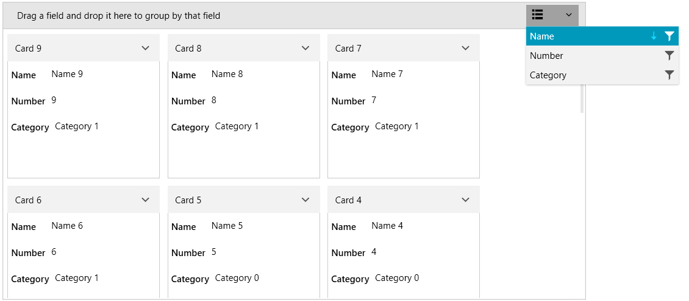

# Sorting

RadCardView supports sorting via the UI or in code, in case you are using ICollectionView as the ItemsSource.

The control internally works with a [QueryableCollectionView]() instance. When the ItemsSource is set, and if different type than QueryableCollectionView is used, then the original collection is wrapped in a QueryableCollectionView instance. This way sorting is supported even if you use a more basic IEnumerable implementation, like `List<T>` or `ObservableCollection<T>`.
 
## Sorting in the UI

The data items can be sorted by clicking on a data field descriptor from the [data field descriptors list]().

#### Figure 1: RadCardView sorting

To disable user sorting, set the __CanUserSortDescriptors__ property to __False__.

#### __[XAML] Example 1: Setting the CanUserSortDescriptors property__
{{region radcardview-features-sorting-0}}
	<telerik:RadCardView CanUserSortDescriptors="False" />
{{endregion}}

## Programmatic Sorting

The following example shows how to setup RadCardView, populate it a [QueryableCollectionView]() and add SortDescriptors in code.

#### __[C#] Example 2: Defining the model__
{{region radcardview-features-sorting-1}}
	public class CardInfo
    {
        public string Header { get; set; }
        public string Name { get; set; }
        public int Number { get; set; }
        public string Category { get; set; }
    }
	
	public class MainViewModel
    {
        public ObservableCollection<CardInfo> Items { get; private set; }
        public QueryableCollectionView CollectionView { get; private set; }

        public MainViewModel()
        {
            int counter = 0;
            Items = new ObservableCollection<CardInfo>();
            for (int g = 0; g < 3; g++)
            {
                for (int i = 0; i < 6; i++)
                {
                    Items.Add(new CardInfo()
                    {
                        Header = "Card " + counter,
                        Name = "Name " + counter,
                        Number = counter,
                        Category = "Category " + g
                    });
                    counter++;
                }
            }

            CollectionView = new QueryableCollectionView(Items);
            CollectionView.SortDescriptors.Add(new SortDescriptor() { Member = "Name", SortDirection = ListSortDirection.Descending });        
        }
    }
{{endregion}} 

>tip Read the [QueryableCollectionView](#sorting) to see how to use the SortDescriptors collection of the QueryableCollectionView.

#### __[XAML] Example 3: Setting the DataContext__
{{region radcardview-features-sorting-2}}
	public MainWindow()
	{
		InitializeComponent();
		this.DataContext = new MainViewModel();
	}
{{endregion}}

#### __[XAML] Example 4: Setting up the view__
{{region radcardview-features-sorting-3}}
	<telerik:RadCardView ItemsSource="{Binding CollectionView}" CardHeaderBinding="{Binding Header}" />
{{endregion}}

The sorting operations invoke several events that can be used to customize the sort. Read more in the [Events](#sorting) article.

## See Also