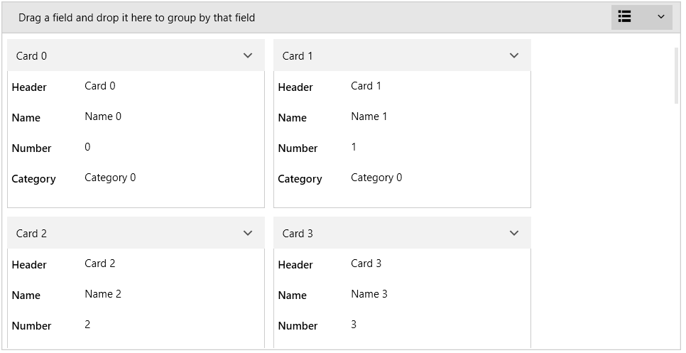
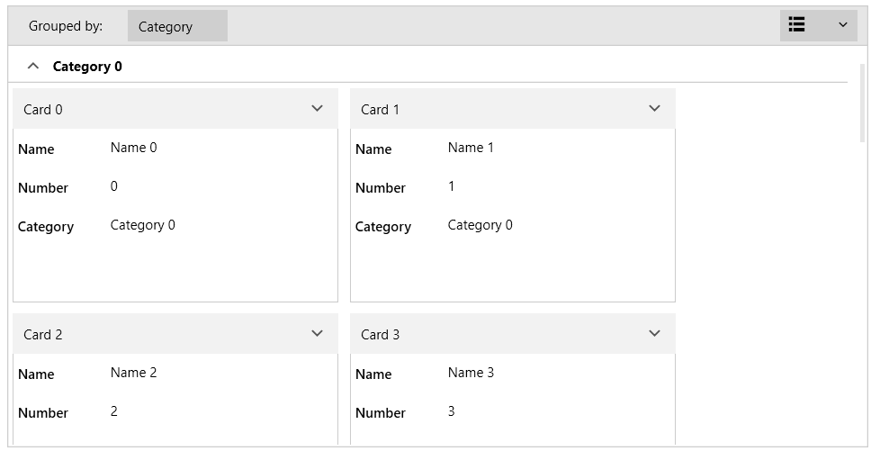

# Data Binding

RadCardView is populated with cards via its ItemsSource property.

This article shows how to prepare and set the ItemsSource, and data bind the cards' properties to the underlying data items.

For each public property in the underlying objects of the ItemsSource a data field is auto-generated in the card.

The control internally works with a QueryableCollectionView which handles the sorting, grouping and filtering operations. This said, the IEnumerable set as ItemsSource will get wrapped into QueryableCollectionView object.

#### __[C#] Example 1: Defining the model__
{{region radcardview-populating-with-data-data-binding-0}}
	public class CardInfo
    {
        public string Header { get; set; }
        public string Name { get; set; }
        public int Number { get; set; }
        public string Category { get; set; }
    }
	
	public class MainViewModel
    {
        public ObservableCollection<CardInfo> Items { get; set; }
        public MainViewModel()
        {
            int counter = 0;
            Items = new ObservableCollection<CardInfo>();
            for (int g = 0; g < 3; g++)
            {
                for (int i = 0; i < 6; i++)
                {
                    Items.Add(new CardInfo()
                    {
                        Header = "Card " + counter,
                        Name = "Name " + counter,
                        Number = counter,
                        Category = "Category " + g
                    });
                    counter++;
                }
            }
        }
    }
{{endregion}}

#### __[C#] Example 2: Setting the data context__
{{region radcardview-populating-with-data-data-binding-1}}
	public MainWindow()
	{
		InitializeComponent();		
		this.DataContext = new MainViewModel();
	}
{{endregion}}

#### __[XAML] Example 3: Setting up the view__
{{region radcardview-populating-with-data-data-binding-2}}
	  <telerik:RadCardView x:Name="cardView" 
						   CardHeaderBinding="{Binding Header}" 
						   MinorLength="200"
						   ItemsSource="{Binding Items}"/>
{{endregion}}

#### Figure 1: RadCardView example

The data fields in the cards are automatically generated based on the public properties of the `CardInfo` class from __Example 1__. To change this behavior you can set the __AutoGenerateDataFieldDescriptors__ property of RadCardView to __False__ and then define the descriptors manually in the __DataFieldDescriptors__ collection of the control.

## Manual Data Field Generation

To disable the automatic data field descriptor generation, set the __AutoGenerateDataFieldDescriptors__ property to False. Then add __CardDataFieldDescriptor__ elements in the __DataFieldDescriptors__ collection of RadCardView.

#### __[XAML] Example 4: Defining CardDataFieldDescriptors__
{{region radcardview-populating-with-data-data-binding-3}}
	<telerik:RadCardView x:Name="cardView" 
						 ItemsSource="{Binding Items}"
					     CardHeaderBinding="{Binding Header}"
                         MinorLength="200"
                         AutoGenerateDataFieldDescriptors="False">
		<telerik:RadCardView.DataFieldDescriptors>
			<telerik:CardDataFieldDescriptor Header="Name" DataMemberBinding="{Binding Name}" />
			<telerik:CardDataFieldDescriptor Header="Number" DataMemberBinding="{Binding Number}" />
			<telerik:CardDataFieldDescriptor Header="Category" DataMemberBinding="{Binding Category}" />
		</telerik:RadCardView.DataFieldDescriptors>
	</telerik:RadCardView>
{{endregion}}

#### Figure 2: RadCardView example

>tip Read more about the data field descriptor's settings in the [Data Field Descriptor]() article.

## Binding to CollectionView

In order to easily control the sorting, filtering and grouping, you can use `QueryableCollectionView` or `QueryableCollectionViewSource`.
 
#### __[C#] Example 5: Setting up QueryableCollectionViewSource__
{{region radcardview-populating-with-data-data-binding-4}}
	<Window.Resources>
        <local:MainViewModel x:Key="viewModel" />
        <telerik:QueryableCollectionViewSource x:Key="qcvSource" Source="{Binding Source={StaticResource viewModel}, Path=Items}">
            <telerik:QueryableCollectionViewSource.GroupDescriptors>
                <telerik:GroupDescriptor Member="Category" />
            </telerik:QueryableCollectionViewSource.GroupDescriptors>
        </telerik:QueryableCollectionViewSource>
    </Window.Resources>
    <Grid>
        <telerik:RadCardView x:Name="cardView" Margin="10" 
                             ItemsSource="{Binding Source={StaticResource qcvSource}, Path=View}"
                             CardHeaderBinding="{Binding Header}"
                             MinorLength="200"
                             AutoGenerateDataFieldDescriptors="False">
            <telerik:RadCardView.DataFieldDescriptors>
                <telerik:CardDataFieldDescriptor Header="Name" DataMemberBinding="{Binding Name}" />
                <telerik:CardDataFieldDescriptor Header="Number" DataMemberBinding="{Binding Number}" />
                <telerik:CardDataFieldDescriptor Header="Category" DataMemberBinding="{Binding Category}" />
            </telerik:RadCardView.DataFieldDescriptors>
        </telerik:RadCardView>
    </Grid>
{{endregion}}

#### Figure 3: RadCardView grouping example

>tip Read more about the collection view descriptors in the [QueryableCollectionView or QueryableCollectionViewSource]() article.

## See Also
* [Getting Started]()
* [Events]()
* [Data Field Descriptor]()
* [Grouping]()