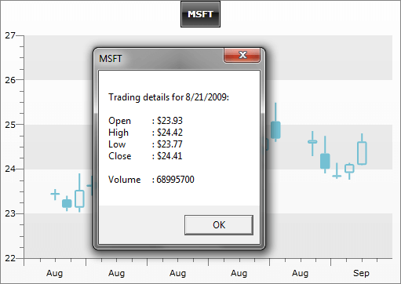

# Interactivity

The main purpose of the charts is to display data in a graphical form. However, __ChartArea__ control exposes numerous events, that allow you to make your charts more interactive. 

The main __ChartArea__ events that you can use to implement some kind of interactivity are:

* __ItemClick__ - occurs when the user clicks on a series item, for example a bar or a candle. 

* __ItemToolTipClosing__ and __ItemToolTipOpening__ - use to customize the __ToolTip__ behavior. For more, see [ToolTips]().

The example below shows a text box with some details when a candle is clicked. __ItemClick__ event is also used to implement [drill-down charts]().

#### __XAML__

{{region xaml-radchart-features-interactivity_0}}
	<telerik:ChartDefaultView.ChartArea>
	    <telerik:ChartArea ItemClick="ChartArea_ItemClick" />
	</telerik:ChartDefaultView.ChartArea>
{{endregion}}

#### __C#__

{{region cs-radchart-features-interactivity_1}}
	public Sample()
	{       
	    InitializeComponent();
	    radChart.DefaultView.ChartArea.ItemClick += new EventHandler<ChartItemClickEventArgs>( ChartArea_ItemClick );
	}
	
	private void ChartArea_ItemClick( object sender, ChartItemClickEventArgs e )
	{
	    TradeData td = e.DataPoint.DataItem as TradeData;
	    MessageBox.Show( string.Format( 
	        "Trading details for {0:d}:\n\nOpen\t: {1:c}\nHigh\t: {2:c}\nLow\t: {3:c}\nClose\t: {4:c}\n\nVolume\t: {5}",
	        td.FromDate, td.Open, td.High, td.Low, td.Close, td.Volume ), td.Emission, MessageBoxButton.OK );
	}
{{endregion}}

#### __VB.NET__

{{region vb-radchart-features-interactivity_2}}
	      
	Private Sub ChartArea_ItemClick(ByVal sender As Object, ByVal e As ChartItemClickEventArgs)
	    Dim td As TradeData = TryCast(e.DataPoint.DataItem, TradeData)
	    MessageBox.Show(String.Format("Trading details for {0:d}:" & vbLf & vbLf & "Open" & vbTab & ": {1:c}" & vbLf & "High" & vbTab & ": {2:c}" & vbLf & "Low" & vbTab & ": {3:c}" & vbLf & "Close" & vbTab & ": {4:c}" & vbLf & vbLf & "Volume" & vbTab & ": {5}", td.FromDate, td.Open, td.High, td.Low, td.Close, _
	     td.Volume), td.Emission, MessageBoxButton.OK)
	End Sub
{{endregion}}

On the snapshot below you can see the __MessageBox__ shown when the user has clicked on a candle. The formatted text message takes detailed information from the underlying business object, which is accessible through the __ChartItemClickEventArgs.DataPoint.DataItem__.

## Programmatically select items in ChartArea

The latest version of the Chart control includes an enhancement of the Selection mechanism. It allows the developer to programmatically select items in the control. The following code snippet demonstrates one such scenario:

#### __C#__

{{region cs-radchart-features-interactivity_3}}
	private void Button_Click(object sender, RoutedEventArgs e)
	{
	    foreach (DataPoint dataPoint1 in this.radChart.DefaultView.ChartArea.DataSeries[0])
	    {
	        if (dataPoint1.YValue == 154.0)
	            this.radChart.DefaultView.ChartArea.SelectItem(dataPoint1);
	    }
	}
{{endregion}}

#### __VB.NET__

{{region vb-radchart-features-interactivity_4}}
	Private Sub Button_Click(sender As Object, e As RoutedEventArgs)
	    For Each dataPoint1 As DataPoint In Chart1.DefaultView.ChartArea.DataSeries(0)
	        If dataPoint1.YValue = 154.0 Then
	            Chart1.DefaultView.ChartArea.SelectItem(dataPoint1)
	        End If
	    Next
	End Sub
{{endregion}}

There are two main methods, which handle the selection. The first one is: 
__Chart1.DefaultView.ChartArea.SelectItem__ - this method has a few overloads, but in general accepts a datapoint, or an index pointing to a specific datapoint in the chart series.
The __Chart1.DefaultView.ChartArea.SelectItems__ method allows the selection of multiple datapoints, which are specified through the parameters.

## See Also

 * [ToolTips]()

 * [Chart Area]()

 * [Chart Point-marks]()
