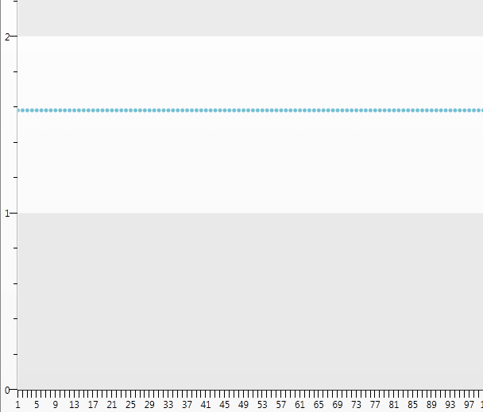

# Sampling

>__Sampling__ is __available__ in data binding scenarios __only__. __Sampling__ is also __not applicable__ when plotting data for properties of non-CLS compliant types, like __uint__.

When the chart is populated by thousands of items, the visual representation might not be that clear. It is possible that there are two or more __DataPoints__ shown with a very close Y and X values. This is when sampling comes in handy. The chart combines the items, so that the __DataPoints__ are limited to a certain number (__200__ by default). The sampling engine does not detect/determine whether the datapoints will be on similar pixel coordinates. Instead, it visualizes a subset of the original data. For example, if you have 1000 points, 95% of which are clustered together, and you choose a sampling threshold of 300 points, 95% of these 300 points will be clustered as well. In such a scenario, one possible option is to use [Zooming and Scrolling](). 

Determining the number of __DataPoints__ to be displayed is done by setting the __SamplingTh reshold__ property of the __SamplingSettings__:

#### __XAML__

{{region xaml-radchart-features-sampling_0}}
	<telerik:RadChart x:Name="radChart">
	    <telerik:RadChart.SamplingSettings>
	        <telerik:SamplingSettings SamplingThreshold="100" />
	    </telerik:RadChart.SamplingSettings>
	</telerik:RadChart>
{{endregion}}

>tipSet the __SamplingThreshold__ to __0__ to disable the feature.

The way in which __RadChart__ combines the __DataPoints__ depends on the value of the __SamplingFunction__ property of the SamplingSettings. 

>When binding without series mappings, the value of the __RadChart.SamplingSettings.SamplingFunction__ determines the pattern. When binding with series mappings, the value of the pattern is determined by the value of the __ItemMapping.SamplingFunction__.

The __SamplingFunction__ property has the following values.

* __Average__ - takes the average value of the sampled points.

* __KeepExtremes__ - shows the minimum or the maximum point. The one that is farthest from the sample average is shown.

* __Min__ - shows the minimum point.

* __Max__ - shows the maximum point.

* __Sum__ - shows the sum point of the points.

* __First__ - shows the point with the smallest index in the series area that is to be sampled.

* __Last__ - shows the point with the highest index in the series area that is to be sampled.

Here is an example:

#### __XAML__

{{region xaml-radchart-features-sampling_1}}
	<telerik:RadChart x:Name="radChart">
	    <telerik:RadChart.SamplingSettings>
	        <telerik:SamplingSettings SamplingFunction="Average"
	                                  SamplingThreshold="100" />
	</telerik:RadChart.SamplingSettings>
	k:RadChart>
{{endregion}}

## Custom Sampling Functions

>tipCustom sampling functions are implemented in the same manner as [GridView's custom aggregating functions](https://demos.telerik.com/silverlight/#GridView/CustomAggregates). 

The following sample code will demonstrate how to create a standard deviation function for the Range of numbers 0 - 1000 and creates ScatterSeriesDefinition with the result from this function. 

The standard deviation is calculated as follows:

1. Calculate the average of the values.

2. Subtract each value from the average.

3. Take the result to the second power.

4. Sum-up the result of steps 1-3 over all of the values.

5. Divides the sum by the number of values.

6. Takes the square root of the result.

These steps are made by the static class Statistics:

#### __C#__

{{region cs-radchart-features-sampling_2}}
	public static class Statistics
	{
	    public static double StdDev<TSource>(IEnumerable<TSource> source, Func<TSource, MyClass> selector)
	    {
	        return StdDev<TSource, MyClass>(source, selector);
	    }
	
	    public static double StdDev<TSource, TResult>(IEnumerable<TSource> source, Func<TSource, TResult> selector)
	        where TResult : MyClass
	    {
	        int itemCount = source.Count();
	        if (itemCount > 1)
	        {
	            IEnumerable<double> values = from i in source select Convert.ToDouble(selector(i).Y);
	
	            double sum = SumAvg(values);
	
	            return Math.Sqrt(sum / (itemCount - 1));
	        }
	
	        return 0;
	    }
	
	    private static double SumAvg(IEnumerable<double> values)
	    {
	        double average = values.Average();
	        double sum = 0;
	
	        foreach (double item in values)
	        {
	            sum += Math.Pow(item - average, 2);
	        }
	
	        return sum;
	    }
	}
{{endregion}}

#### __VB.NET__

{{region vb-radchart-features-sampling_3}}
	Public NotInheritable Class Statistics
	    Private Sub New()
	    End Sub
	    Public Shared Function StdDev(Of TSource)(ByVal source As IEnumerable(Of TSource), ByVal selector As Func(Of TSource, [MyClass])) As Double
	        Return StdDev(Of TSource, [MyClass])(source, selector)
	    End Function
	
	    Public Shared Function StdDev(Of TSource, TResult As [MyClass])(ByVal source As IEnumerable(Of TSource), ByVal selector As Func(Of TSource, TResult)) As Double
	        Dim itemCount As Integer = source.Count()
	        If itemCount > 1 Then
	            Dim values As IEnumerable(Of Double) = From i In source
	                                                   Select Convert.ToDouble(selector(i).Y)
	
	            Dim sum As Double = SumAvg(values)
	
	            Return Math.Sqrt(sum / (itemCount - 1))
	        End If
	
	        Return 0
	    End Function
	
	    Private Shared Function SumAvg(ByVal values As IEnumerable(Of Double)) As Double
	        Dim average As Double = values.Average()
	        Dim sum As Double = 0
	
	        For Each item As Double In values
	            sum += Math.Pow(item - average, 2)
	        Next item
	
	        Return sum
	    End Function
	End Class
{{endregion}}

The real standard deviation function inherits *Telerik.Windows.Data.EnumerableSelectorAggregateFunction* class that uses aggregate extension methods provided in *System.Linq.Enumerable*:

#### __C#__

{{region cs-radchart-features-sampling_4}}
	public class StandardDeviationFunction : EnumerableSelectorAggregateFunction
	{
	    protected override string AggregateMethodName
	    {
	        get
	        {
	            return "StdDev";
	        }
	    }
	
	    protected override Type ExtensionMethodsType
	    {
	        get
	        {
	            return typeof(Statistics);
	        }
	    }
	}
{{endregion}}

#### __VB.NET__

{{region vb-radchart-features-sampling_5}}
	Public Class StandardDeviationFunction
	    Inherits EnumerableSelectorAggregateFunction
	    Protected Overrides ReadOnly Property AggregateMethodName() As String
	        Get
	            Return "StdDev"
	        End Get
	    End Property
	
	    Protected Overrides ReadOnly Property ExtensionMethodsType() As Type
	        Get
	            Return GetType(Statistics)
	        End Get
	    End Property
	End Class
{{endregion}}

The Chart itself is populated by [List of Business Object]():

#### __C#__

{{region cs-radchart-features-sampling_6}}
	public Sample ()
	{      
	    InitializeComponent();
	    radChart.DefaultView.ChartArea.AxisX.LabelStep = 4;
	    List<MyClass> data = new List<MyClass>();
	
	    for (int i = 0; i < 1000; i++)
	    {
	        data.Add(new MyClass()
	        {
	            Y  = i
	        });
	    }
	
	    radChart.ItemsSource = data;
		    }
	
	public class MyClass
	{
	    public double Y { get; set; }
	}
{{endregion}}

#### __VB.NET__

{{region vb-radchart-features-sampling_7}}
	Private Sub New()
	    InitializeComponent()
	    RadChar1.DefaultView.ChartArea.AxisX.LabelStep = 4
	    Dim data As New List(Of [MyClass])()
	    For i As Integer = 0 To 999
	        data.Add(New [MyClass]() With {.Y = i})
	    Next i
	    RadChar1.ItemsSource = data
	End Sub
	
	Public Class [MyClass]
	    Public Property Y() As Double
	End Class
{{endregion}}

The LabelStep of the AxisX is set to 4 for better readability.

Finally the XAML:

#### __XAML__

{{region xaml-radchart-features-sampling_8}}
	<telerik:RadChart Name="RadChar1">
	            <telerik:RadChart.DefaultSeriesDefinition>
	                <telerik:ScatterSeriesDefinition ShowItemLabels="False" ShowItemToolTips="False" />
	            </telerik:RadChart.DefaultSeriesDefinition>
	            <telerik:RadChart.SeriesMappings>
	                <telerik:SeriesMapping>
	                    <telerik:SeriesMapping.ItemMappings>
	                        <telerik:ItemMapping DataPointMember="YValue" FieldName="Y">
	                            <telerik:ItemMapping.CustomSamplingFunction>
	                                <local:StandardDeviationFunction />
	                            </telerik:ItemMapping.CustomSamplingFunction>
	                        </telerik:ItemMapping>
	                    </telerik:SeriesMapping.ItemMappings>
	                </telerik:SeriesMapping>
	            </telerik:RadChart.SeriesMappings>
	        </telerik:RadChart>
{{endregion}}

The result:

