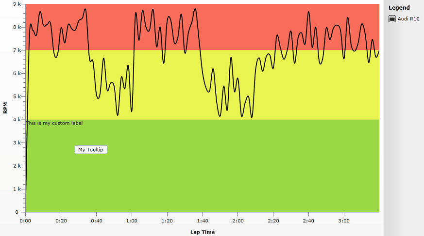

# Display Labels And Tooltips For Annotations

Annotations like [MarkedZone]() or [CustomGridLine]() allows you to customize their appearance using the *Background*, *Stroke* or *StrokeThickness* properties. However it is common scenario that you would like to have __Label__ or __Tooltip__ for your annotations and this is what this help topic will demonstrate.

>The article demonstrates how to set Tooltip and Label for MarkedZone but the approach is the same for the other Annotations. __Adding Tooltip__

##### 1. To be able to see the Tooltips for MarkedZones you should re-template the Chart Area and put the Annotations Layer within the Zoom Layer. Then by using *TooltipService.ToolTip* property of the MarkedZone you can set custom tooltip:

#### __XAML__

{{region radchart-howto-display-labels-and-tooltips-for-annotations3_0}}
	
	{{endregion}}

##### 2. Set the re-templated ChartArea Style to the RadChart. Then create new __MarkedZone__ and set custom string for it's *TooltipService.ToolTip* property:

#### __XAML__

{{region radchart-howto-display-labels-and-tooltips-for-annotations3_1}}
	<telerik:RadChart x:Name="RadChart1" ItemsSource="{Binding Data}" BorderThickness="1,0,1,1" BorderBrush="Black">
	            <telerik:RadChart.PaletteBrushes>
	                <SolidColorBrush Color="Black" />
	            </telerik:RadChart.PaletteBrushes>
	            <telerik:RadChart.SeriesMappings>
	                <telerik:SeriesMapping LegendLabel="Audi R10">
	                    <telerik:SeriesMapping.SeriesDefinition>
	                        <telerik:SplineSeriesDefinition ShowItemLabels="False" ShowPointMarks="False" ShowItemToolTips="True" />
	                    </telerik:SeriesMapping.SeriesDefinition>
	                    <telerik:SeriesMapping.ItemMappings>
	                        <telerik:ItemMapping FieldName="Time" DataPointMember="XValue"/>
	                        <telerik:ItemMapping FieldName="RPM" DataPointMember="YValue"/>
	                    </telerik:SeriesMapping.ItemMappings>
	                </telerik:SeriesMapping>
	            </telerik:RadChart.SeriesMappings>
	            <telerik:RadChart.DefaultView>
	                <telerik:ChartDefaultView>
	                    <telerik:ChartDefaultView.ChartArea>
	                        <telerik:ChartArea LegendName="CustomLegend" Style="{StaticResource ChartAreaStyle}">
	                            <telerik:ChartArea.Annotations>
	                                <telerik:MarkedZone StartY="0" EndY="4000" Background="#FF9AD846" ToolTipService.ToolTip="My Tooltip"  />
	                                <telerik:MarkedZone StartY="4000" EndY="7000" Background="#FFEAF451" />
	                                <telerik:MarkedZone StartY="7000" EndY="9000" Background="#FFF86D5A" />
	                            </telerik:ChartArea.Annotations>
	                            <telerik:ChartArea.AxisX>
	                                <telerik:AxisX Title="Lap Time"
	                                               DefaultLabelFormat="#VAL{m:ss}" />
	                            </telerik:ChartArea.AxisX>
	                            <telerik:ChartArea.AxisY>
	                                <telerik:AxisY MajorGridLinesVisibility="Visible"
	                                               MinorTicksVisibility="Visible"
	                                               Title="RPM"
	                                               AutoRange="False"
	                                               MinValue="0"
	                                               MaxValue="9000"
	                                               Step="1000">
	                                </telerik:AxisY>
	                            </telerik:ChartArea.AxisY>
	                        </telerik:ChartArea>
	                    </telerik:ChartDefaultView.ChartArea>
	                    <telerik:ChartDefaultView.ChartLegend>
	                        <telerik:ChartLegend x:Name="CustomLegend" UseAutoGeneratedItems="True" BorderThickness="1,0,0,0" />
	                    </telerik:ChartDefaultView.ChartLegend>
	                </telerik:ChartDefaultView>
	            </telerik:RadChart.DefaultView>
	        </telerik:RadChart>
	{{endregion}}

## Adding Label

##### 1.  You can show any text in annotation zone by re-templating it and adding *TextBlock* in it's *ControlTemplate*. For this purpose the Rectangle and the newly added *TextBlock* are placed in a Grid. *The retemplated MarkedZone's Style* is as follows*:

#### __XAML__

{{region radchart-howto-display-labels-and-tooltips-for-annotations3_2}}
	
	{{endregion}}

Additionally the __TextWrapping__ property of the MarkedZone's Text Block is set to __Wrap__ - this way the overflowed text does not clips.

##### 2. Set the newly created Style to your MarkedZone and provide Label's content using the DataContext property:

#### __XAML__

{{region radchart-howto-display-labels-and-tooltips-for-annotations3_3}}
	<telerik:MarkedZone StartY="0" EndY="4000" Style="{StaticResource NewMarkedZones}" DataContext="This is my custom label" Background="#FF9AD846" />
	{{endregion}}

The result image shows the tooltip and the label:

The same can be achieved with __CustomGridLines__ like this:

#### __XAML__

{{region radchart-howto-display-labels-and-tooltips-for-annotations3_4}}
	     <SolidColorBrush x:Key="AxisStroke" Color="#FF000000" />
	
	        
	{{endregion}}

Note that the position of the TextBlock is controlled via X1 and Y1 properties (the starting point of the GridLine) as taken using TemplateBinding. The result can be seen below:

