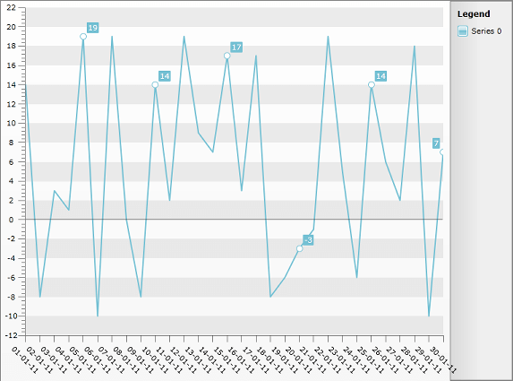

# Display PointMarks and Labels for Specific points only 

## 

This help article will show you how to show PointMarks and Labels for specific points of Line Chart due to some condition - on every fifth day (assuming that on XAxis you have days of the month displayed). 

>To learn more about showing DateTime values on XAxis please read the [DateTime support]() section.

* Create a new class named __Data__, which implements the __INotifyPropertyChanged__ interface. It will be used as an __ItemsSource__ for the chart control. The class has three properties:

- __Date__ - will be displayed on the X axis. 

- __YValue__ - will be displayed on the Y axis.

- __PointMarkVisibility__ - will be applied to the PointMark Style (Visibility property).

#### __C#__

{{region cs-radchart-howto-pointmarks-and-labels-for-specific-points-only_0}}
	public class Data : INotifyPropertyChanged
	{
	  private DateTime _date;
	  private Visibility _pointMarkVisibility;
	  private int _yvalue;
	  public Data(DateTime date, int yvalue)
	  {
	   this._date = date;
	   this._yvalue = yvalue;
	   this.UpdatePointMarkVisibility();
	  }
	  public event PropertyChangedEventHandler PropertyChanged;
	  public DateTime Date
	  {
	   get
	   {
	     return _date;
	   }
	   set
	   {
	    if (this._date == value)
	    return;
	    this._date = value;
	    this.OnPropertyChanged("Date");
	   }
	 }
	   public int YValue
	   {
	     get
	      {
	       return _yvalue;
	       }
	    set
	     {
	      if (this._yvalue == value)
	      return;
	      this._yvalue = value;
	      this.OnPropertyChanged("YValue");
	     }
	   }
	   public Visibility PointMarkVisibility
	   {
	    get
	     {
	      return _pointMarkVisibility;
	     }
	    private set
	     {
	      if (object.Equals(this._pointMarkVisibility, value))
	      return;
	      this._pointMarkVisibility = value;
	      this.OnPropertyChanged("PointMarkVisibility");
	     }
	  }
	   protected virtual void OnPropertyChanged(string propertyName)
	   {
	     if (this.PropertyChanged != null)
	     this.PropertyChanged(this, new PropertyChangedEventArgs(propertyName));
	   }
	   private void UpdatePointMarkVisibility()
	   {
	     if (this.Date.Day%5 != 0)
	     this.PointMarkVisibility = Visibility.Collapsed;
	     else
	     this.PointMarkVisibility = Visibility.Visible;
	   }
	}
{{endregion}}

#### __VB.NET__

{{region vb-radchart-howto-pointmarks-and-labels-for-specific-points-only_1}}
	Public Class Data
	    Implements INotifyPropertyChanged
	    Private _date As Date
	    Private _pointMarkVisibility As Visibility
	    Private _yvalue As Integer
	    Public Sub New(ByVal [date] As Date, ByVal yvalue As Integer)
	        Me._date = [date]
	        Me._yvalue = yvalue
	        Me.UpdatePointMarkVisibility()
	    End Sub
	    Public Property [Date]() As Date
	        Get
	            Return _date
	        End Get
	        Set(ByVal value As Date)
	            If Me._date = value Then
	                Return
	            End If
	            Me._date = value
	            Me.OnPropertyChanged("Date")
	        End Set
	    End Property
	    Public Property YValue() As Integer
	        Get
	            Return _yvalue
	        End Get
	        Set(ByVal value As Integer)
	            If Me._yvalue = value Then
	                Return
	            End If
	            Me._yvalue = value
	            Me.OnPropertyChanged("YValue")
	        End Set
	    End Property
	    Public Property PointMarkVisibility() As Visibility
	        Get
	            Return _pointMarkVisibility
	        End Get
	        Private Set(ByVal value As Visibility)
	            If Object.Equals(Me._pointMarkVisibility, value) Then
	                Return
	            End If
	            Me._pointMarkVisibility = value
	            Me.OnPropertyChanged("PointMarkVisibility")
	        End Set
	    End Property
	    Protected Overridable Sub OnPropertyChanged(ByVal propertyName As String)
	        If Me.PropertyChangedEvent IsNot Nothing Then
	            RaiseEvent PropertyChanged(Me, New PropertyChangedEventArgs(propertyName))
	        End If
	    End Sub
	    Private Sub UpdatePointMarkVisibility()
	        If Me.Date.Day Mod 5 <> 0 Then
	            Me.PointMarkVisibility = Visibility.Collapsed
	        Else
	            Me.PointMarkVisibility = Visibility.Visible
	        End If
	    End Sub
	
	    Public Event PropertyChanged(sender As Object, e As PropertyChangedEventArgs) Implements INotifyPropertyChanged.PropertyChanged
	End Class
{{endregion}}

Note the *UpdatePointMarkVisibility *method called in the constructor of the class which sets *PointMarkVisibility* property to visible only if the Day is dividable by 5, which is our condition to show Point Marks.

Add a new chart declaration to your XAML:

#### __XAML__

{{region xaml-radchart-howto-pointmarks-and-labels-for-specific-points-only_4}}
	<telerik:RadChart x:Name="chart"/>
{{endregion}}

* Add the PointMark Style between the UserControl starting and ending tag. Add *Visibility *Property databound to *DataItem.PointMarksVisibility* property of the class. Here is how the Style should look like:

#### __XAML__

{{region xaml-radchart-howto-pointmarks-and-labels-for-specific-points-only_5}}
	
{{endregion}}

* The chart will be built in the code-behind and White Space String will be assigned to every point's Label if it's Day is not dividable by 5:

#### __C#__

{{region cs-radchart-howto-pointmarks-and-labels-for-specific-points-only_2}}
	List<Data> exportData = new List<Data>();
	DateTime baseDate = new DateTime(2011, 1, 1);
	Random r = new Random();
	for (int i = 0; i < 30; i++)
	{
	    exportData.Add(new Data(baseDate.AddDays(i), r.Next(-10, 20)));
	}
	
	SeriesMapping mapping = new SeriesMapping();
	mapping.ItemMappings.Add(new ItemMapping("YValue", DataPointMember.YValue));
	mapping.ItemMappings.Add(new ItemMapping("Date", DataPointMember.XCategory));
	chart.ItemsSource = exportData;
	chart.SeriesMappings.Add(mapping);
	chart.DefaultView.ChartArea.AxisX.IsDateTime = true;
	
	chart.DefaultView.ChartArea.AxisX.LabelRotationAngle = 45;
	chart.DefaultView.ChartArea.AxisX.DefaultLabelFormat = "dd-MM-yy";
	
	LineSeriesDefinition line = new LineSeriesDefinition();
	chart.DefaultSeriesDefinition = line;
	line.ShowPointMarks = true;
	line.ShowItemLabels = true;
	chart.DefaultSeriesDefinition.PointMarkItemStyle = this.Resources["MyPointMark_Style"] as Style;
	chart.DataBound += (o, e) =>
	{
	    var dataSeries = chart.DefaultView.ChartArea.DataSeries.FirstOrDefault();
	    if (dataSeries != null)
	    {
	        foreach (var point in dataSeries.ToList())
	        {
	            DateTime myDate = DateTime.Parse(point.XCategory);
	            if (myDate.Day % 5 != 0)
	            {
	                point.Label = " ";
	            }
	        }
	    }
	};
{{endregion}}

#### __VB.NET__

{{region vb-radchart-howto-pointmarks-and-labels-for-specific-points-only_3}}
	Dim exportData As New List(Of Data)()
	Dim baseDate As New Date(2011, 1, 1)
	Dim r As New Random()
	For i As Integer = 0 To 29
	    exportData.Add(New Data(baseDate.AddDays(i), r.Next(-10, 20)))
	Next i
	
	Dim mapping As New SeriesMapping()
	mapping.ItemMappings.Add(New ItemMapping("YValue", DataPointMember.YValue))
	mapping.ItemMappings.Add(New ItemMapping("Date", DataPointMember.XCategory))
	chart.ItemsSource = exportData
	chart.SeriesMappings.Add(mapping)
	chart.DefaultView.ChartArea.AxisX.IsDateTime = True
	
	chart.DefaultView.ChartArea.AxisX.LabelRotationAngle = 45
	chart.DefaultView.ChartArea.AxisX.DefaultLabelFormat = "dd-MM-yy"
	
	Dim line As New LineSeriesDefinition()
	chart.DefaultSeriesDefinition = line
	line.ShowPointMarks = True
	line.ShowItemLabels = True
	chart.DefaultSeriesDefinition.PointMarkItemStyle = TryCast(Me.Resources("MyPointMark_Style"), Style)
	AddHandler chart.DataBound, Sub(o, e)
	                                Dim dataSeries = chart.DefaultView.ChartArea.DataSeries.FirstOrDefault()
	                                If dataSeries IsNot Nothing Then
	                                    For Each point In dataSeries.ToList()
	                                        Dim myDate As Date = Date.Parse(point.XCategory)
	                                        If myDate.Day Mod 5 <> 0 Then
	                                            point.Label = " "
	                                        End If
	                                    Next point
	                                End If
	                            End Sub
{{endregion}}

The result can be seen on the image below:

