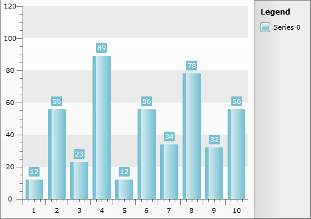
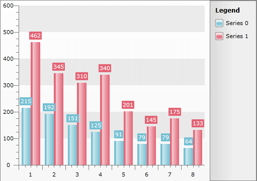

# Data Binding with Automatic Series Mappings

One of the features of the __RadChart__ is the automatic series mapping. With automatic series mapping, you can easily create a chart by simply setting the __RadChart.ItemsSource__ to the data source you have. __RadChart__ will create a chart series for every numeric field in the data source by mapping the numeric value to the __DataPointMember.YValue__ field for each respective series. The type of the chart depends on the __RadChart.DefaultSeriesDefinition__ property and by default it is set to __BarSeriesDefinition__.

>Note that SeriesDefinition set through the __RadChart.DefaultSeriesDefinition__ property does not support change notifications i.e. if you try to change a __RadChart.DefaultSeriesDefinition__ property after the control is databound, it will not have any effect till the next rebind operation. The recommended approach in this scenario would be to use unique __SeriesMapping.SeriesDefinition__ or alternatively you can access the generated DataSeries directly (i.e. RadChart.DefaultView.ChartArea.DataSeries[i]) and update its __DataSeries.Definition__ properties.

The purpose of this tutorial is to show you how to use __RadChart__ with __Automatic Series Mappings__. The following cases will be examined:

* [Binding to an array of integers](#Binding_to_an_Array_of_Integers)

* [Binding to a list of business objects](#Binding_to_a_List_of_Business_Objects)

>The automatic mapping mode will not work for chart series that require multiple data fields for its correct operation (e.g. the __CandleStick__ type).

## Binding to an Array of Integers

Take a look at this simple array declaration:

#### __C#__

{{region cs-radchart-populating-with-data-data-binding-with-automatic-series-binding_0}}
	int[] dataArray = new int[] { 12, 56, 23, 89, 12, 56, 34, 78, 32, 56 };
{{endregion}}

#### __VB.NET__

{{region vb-radchart-populating-with-data-data-binding-with-automatic-series-binding_1}}
	Dim dataArray As Integer() = New Integer() {12, 56, 23, 89, 12, 56, 34, 78, 32, 56}
{{endregion}}

If you set it to the __ItemsSource__ property of the __RadChart__ control, you will have the following result:

#### __C#__

{{region cs-radchart-populating-with-data-data-binding-with-automatic-series-binding_2}}
	radChart.ItemsSource = dataArray;
{{endregion}}

#### __VB.NET__

{{region vb-radchart-populating-with-data-data-binding-with-automatic-series-binding_3}}
	radChart.ItemsSource = dataArray
{{endregion}}

## Binding to a List of Business Objects

If you have a list of business objects and you set it to the __ItemsSource__ property of the __RadChart__ control, the result will be one chart series per numeric property:

#### __C#__

{{region cs-radchart-populating-with-data-data-binding-with-automatic-series-binding_4}}
	List<Manufacturer> data = new List<Manufacturer>();
	data.Add(new Manufacturer("Toyota", 215, 462));
	data.Add(new Manufacturer("General Motors", 192, 345));
	data.Add(new Manufacturer("Volkswagen", 151, 310));
	data.Add(new Manufacturer("Ford", 125, 340));
	data.Add(new Manufacturer("Honda", 91, 201));
	data.Add(new Manufacturer("Nissan", 79, 145));
	data.Add(new Manufacturer("PSA", 79, 175));
	data.Add(new Manufacturer("Hyundai", 64, 133));
	
	this.telerkChart.ItemsSource = data;
{{endregion}}

#### __VB.NET__

{{region vb-radchart-populating-with-data-data-binding-with-automatic-series-binding_5}}
	Dim data As New List(Of Manufacturer)()
	data.Add(New Manufacturer("Toyota", 215, 462))
	data.Add(New Manufacturer("General Motors", 192, 345))
	data.Add(New Manufacturer("Volkswagen", 151, 310))
	data.Add(New Manufacturer("Ford", 125, 340))
	data.Add(New Manufacturer("Honda", 91, 201))
	data.Add(New Manufacturer("Nissan", 79, 145))
	data.Add(New Manufacturer("PSA", 79, 175))
	data.Add(New Manufacturer("Hyundai", 64, 133))
	
	Me.telerkChart.ItemsSource = data
{{endregion}}

Where the structure of the __Manufacturer__ class is:

#### __C#__

{{region cs-radchart-populating-with-data-data-binding-with-automatic-series-binding_6}}
	public class Manufacturer
	{
	    public Manufacturer( string name, int sales, int turnover )
	    {
	        this.Name = name;
	        this.Sales = sales;
	        this.Turnover = turnover;
	    }
	    public string Name
	    {
	        get;
	        set;
	    }
	    public int Sales
	    {
	        get;
	        set;
	    }
	    public int Turnover
	    {
	        get;
	        set;
	    }
	}
{{endregion}}

#### __VB.NET__

{{region vb-radchart-populating-with-data-data-binding-with-automatic-series-binding_7}}
	Public Class Manufacturer
	    Public Sub New(ByVal name As String, ByVal sales As Integer, ByVal turnover As Integer)
	        Me.Name = name
	        Me.Sales = sales
	        Me.Turnover = turnover
	    End Sub
	
	    Private _Name As String
	    Public Property Name() As String
	        Get
	            Return _Name
	        End Get
	        Set(ByVal value As String)
	            _Name = value
	        End Set
	    End Property
	
	    Private _Sales As Integer
	    Public Property Sales() As Integer
	        Get
	            Return _Sales
	        End Get
	        Set(ByVal value As Integer)
	            _Sales = value
	        End Set
	    End Property
	
	    Private _Turnover As Integer
	    Public Property Turnover() As Integer
	        Get
	            Return _Turnover
	        End Get
	        Set(ByVal value As Integer)
	            _Turnover = value
	        End Set
	    End Property
	End Class
{{endregion}}

The result is shown on the next figure.

As you can see, automatic series mapping can be useful for simple data. However, if you need more data binding options, take a look at the [Data Binding with Manual Series Mapping]() topic and the [Data Binding to Nested Collections]() topic.

## See Also

 * [Populating with Data Overview]()

 * [Data Binding Support Overview]()

 * [Data Binding with Manual Series Mapping]()

 * [Data Binding to Nested Collections]()

 * [Data Binding to Many Chart Areas]()

 * [Creating a Chart Declaratively]()

 * [Creating a Chart in Code-behind]()
