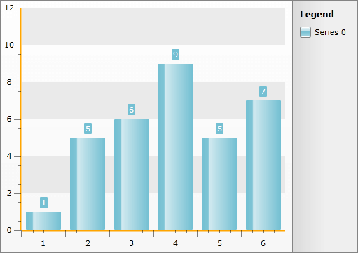
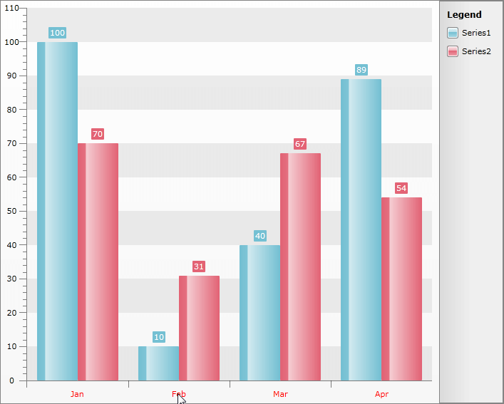

# Styling the Axis Line

>tipThe approach below allow you more completely to change the appearance of the axis lines, but if you want to change only the color of it, you can use the __AxisElementBrush__ property of the __RadChart.Note__ that the value of this property will get applied to all of the axes and all of the tick lines as well.

The axis line is part of the chart axis and is represented by the __Line__ control. To create a style for it in Expression Blend use a dummy control and after modifying it, set it to the __AxisStyles__ complex property of the __Axis__.

Open your __RadChart__ project in Expression Blend. To add the dummy __Line__ control you have to go to the XAML view. To do that select from the menu *View -> Active Document View -> XAML View*. Declare a __Line__ control in your XAML.

#### __XAML__

{{region xaml-radchart-styling-and-appearance-styling-axis-line_0}}
	<Grid x:Name="LayoutRoot"
	      Background="White">
	    <!--...-->
	    <Line />
	</Grid>
{{endregion}}

To go back to the design view select *View -> Active Document View -> Design View* from the menu. In the 'Objects and Timeline' pane select the newly created __Line__ control. And from the menu select *Object -> Edit Style -> Create Empty. *You will be prompted for the name of the style and where to be placed within your application.

>tipIf you choose to define the style in Application, it would be available for the entire application. This allows you to define a style only once and then reuse it where needed.

After clicking the OK button, a style with target type __Line__ will be created and the properties for this type will be loaded in the 'Properties' pane. Modify them until you get the desired appearance.

After finishing with the changes, it is time to set the style. It can be set only through the procedural code, which means that you have to go to the Visual Studio and modify the code-behind file of your UserControl.

#### __C#__

{{region cs-radchart-styling-and-appearance-styling-axis-line_1}}
	this.radChart.DefaultView.ChartArea.AxisX.AxisStyles.AxisLineStyle = this.Resources[ "AxisLineStyle" ] as Style;
	this.radChart.DefaultView.ChartArea.AxisY.AxisStyles.AxisLineStyle = this.Resources[ "AxisLineStyle" ] as Style;
{{endregion}}

#### __VB.NET__

{{region vb-radchart-styling-and-appearance-styling-axis-line_2}}
	Me.radChart.DefaultView.ChartArea.AxisX.AxisStyles.AxisLineStyle = TryCast(Me.Resources("AxisLineStyle"), Style)
	Me.radChart.DefaultView.ChartArea.AxisY.AxisStyles.AxisLineStyle = TryCast(Me.Resources("AxisLineStyle"), Style)
{{endregion}}

Here is a snapshot of the sample result.

Here is the final XAML generated by Expression Blend:

#### __XAML__

{{region xaml-radchart-styling-and-appearance-styling-axis-line_3}}
	
{{endregion}}

## Change Axis foreground color, when clicking on Axis Item Label

Sometimes, when clicking on the XAxis label, one may need to alter some of the appearance settings of the axis. One such setting is the foreground color. Let us assume, that the chart declaration looks like this:

#### __XAML__

{{region xaml-radchart-styling-and-appearance-styling-axis-line_4}}
	<telerik:RadChart x:Name="RadChart1">
	    <telerik:RadChart.DefaultView>
	        <telerik:ChartDefaultView>
	            <telerik:ChartDefaultView.ChartArea>
	                <telerik:ChartArea x:Name="Area" LegendName="legend">
	                    <telerik:ChartArea.DataSeries >
	                        <telerik:DataSeries LegendLabel="Series1" >
	                            <telerik:DataPoint XCategory="Jan" YValue="100"/>
	                            <telerik:DataPoint XCategory="Feb" YValue="10"/>
	                            <telerik:DataPoint XCategory="Mar" YValue="40"/>
	                            <telerik:DataPoint XCategory="Apr" YValue="89"/>
	                        </telerik:DataSeries>
	                        <telerik:DataSeries LegendLabel="Series2">
	                            <telerik:DataPoint XCategory="Jan" YValue="70"/>
	                            <telerik:DataPoint XCategory="Feb" YValue="31"/>
	                            <telerik:DataPoint XCategory="Mar" YValue="67"/>
	                            <telerik:DataPoint XCategory="Apr" YValue="54"/>
	                        </telerik:DataSeries>
	                    </telerik:ChartArea.DataSeries>
	                </telerik:ChartArea>
	            </telerik:ChartDefaultView.ChartArea>
	            <telerik:ChartDefaultView.ChartLegend>
	                <telerik:ChartLegend x:Name="legend"/>
	            </telerik:ChartDefaultView.ChartLegend>
	        </telerik:ChartDefaultView>
	    </telerik:RadChart.DefaultView>
	</telerik:RadChart>
{{endregion}}

The first step is to select a suitable event, where to handle this logic. One possible option, is the mouse down event handler. It is added when the application is initializing:

#### __C#__

{{region cs-radchart-styling-and-appearance-styling-axis-line_5}}
	RadChart1.AddHandler(MouseLeftButtonDownEvent, new MouseButtonEventHandler(MouseLeftButtonDownEventHandler), true);
{{endregion}}

#### __VB.NET__

{{region vb-radchart-styling-and-appearance-styling-axis-line_6}}
	RadChart1.[AddHandler](MouseLeftButtonDownEvent, New MouseButtonEventHandler(AddressOf MouseLeftButtonDownEventHandler), True)
{{endregion}}

The code, essential to the functionality at hand is listed below:

#### __C#__

{{region cs-radchart-styling-and-appearance-styling-axis-line_7}}
	public void MouseLeftButtonDownEventHandler(object sender, MouseButtonEventArgs e)
	{
	    TextBlock txtBlock = e.OriginalSource as TextBlock;
	    if (txtBlock == null)
	        return;
	
	    var axis = txtBlock.GetVisualParent<AxisX2D>();
	    if (axis != null)
	    {
	        axis.Foreground = new SolidColorBrush(Colors.Red);
	    }
	}
{{endregion}}

#### __VB.NET__

{{region vb-radchart-styling-and-appearance-styling-axis-line_8}}
	Public Sub MouseLeftButtonDownEventHandler(sender As Object, e As MouseButtonEventArgs)
		Dim txtBlock As TextBlock = TryCast(e.OriginalSource, TextBlock)
		If txtBlock Is Nothing Then
			Return
		End If
		Dim axis = txtBlock.GetVisualParent(Of AxisX2D)()
		If axis IsNot Nothing Then
			axis.Foreground = New SolidColorBrush(Colors.Red)
		End If
	End Sub
{{endregion}}

The approach uses the exposed property of the AxisX2D object, to directly alter the foreground of the XAxis, once the end user clicks on any of the text blocks along it.
The result:

## See Also

 * [Axes - Overview]()

 * [Styling the Axes - Overview]()

 * [Styling and Appearance - Overview]()

 * [Styling the Axis Tick]()
