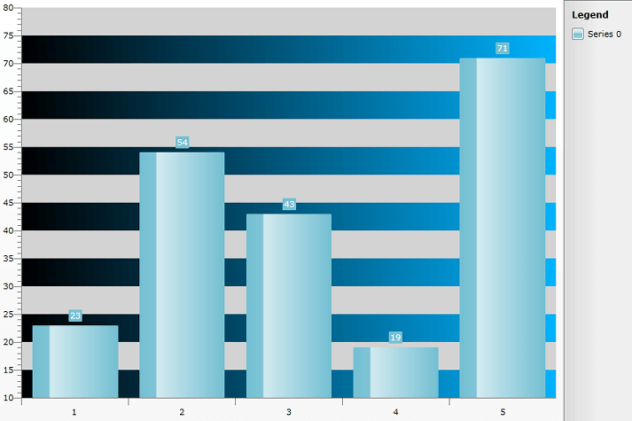

# Styling the StripLine

## 

The axis strip lines are part of the chart axis and are represented by the __Rectangle__ control. There are two types of strip lines - Horizontal and Vertical. Each of them contains alternating Lines - one with Gray color by default (called __AlternateStripLine__ ) and the other is Transparent (called just __StripLine__).
To create a style for them in Expression Blend use a dummy control and after modifying it, 
 it to the __AxisStyles__ complex property of the __Axis__.

Open your __RadChart__ project in Expression Blend. To add the dummy __Rectangle__ control you have to go to the XAML view. To do that select *View -> Active Document View -> XAML View* from the menu. Declare a __Rectangle__ control in your XAML.

#### __XAML__

{{region xaml-radchart-styling-and-appearance-styling-stripline_0}}
	<Grid x:Name="LayoutRoot" Background="White">
	    <!--  ...  -->
	    <Rectangle />
	</Grid>
{{endregion}}

To go back to the design view select *View -> Active Document View -> Design View* from the menu. In the 'Objects and Timeline' pane select the newly created __Rectangle__ control. And select *Object -> Edit Style -> Create Empty* from the menu*. *You will be prompted for the name of the style and where to be placed within your application.

>tipIf you choose to define the style in Application, it would be available for the entire application. This allows you to define a style only once and then reuse it where needed.

After clicking the OK button, a style with target type __Rectangle__ will be created and the properties for this type will be loaded in the 'Properties' pane. Modify them until you get the desired appearance.

After finishing with the changes it is time to set the style. It can be set only through the procedural code, which means that you have to go to the Visual Studio and modify the code-behind file of your UserControl.

#### __C#__

{{region cs-radchart-styling-and-appearance-styling-stripline_1}}
	RadChart1.DefaultView.ChartArea.AxisY.AxisStyles.AlternateStripLineStyle = this.Resources["HorizontalAlternateStripLineStyle"] as Style;
	RadChart1.DefaultView.ChartArea.AxisY.AxisStyles.StripLineStyle = this.Resources["HorizontalStripLineStyle"] as Style;
{{endregion}}

#### __VB.NET__

{{region vb-radchart-styling-and-appearance-styling-stripline_2}}
	RadChart1.DefaultView.ChartArea.AxisY.AxisStyles.AlternateStripLineStyle = TryCast(Me.Resources("HorizontalAlternateStripLineStyle"), Style)
	RadChart1.DefaultView.ChartArea.AxisY.AxisStyles.StripLineStyle = TryCast(Me.Resources("HorizontalStripLineStyle"), Style)
{{endregion}}

>tipTo show the strip lines for a particular axis you have to set its __StripLinesVisibility__ property to __Visible__. Read more about strip lines [here]().

Here is a snapshot of the sample result:

Here is the final XAML for the __Styles__ used:

#### __XAML__

{{region xaml-radchart-styling-and-appearance-styling-stripline_3}}
	
{{endregion}}

#### __XAML__

{{region xaml-radchart-styling-and-appearance-styling-stripline_4}}
	
{{endregion}}