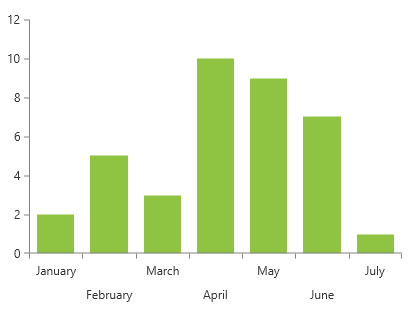
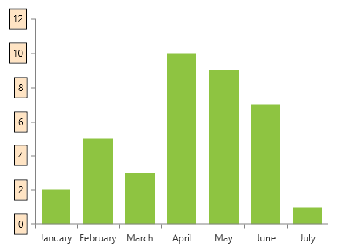

# Customizing Axis Labels

The axis labels are automatically generated based on the plotted data and the axis range. The chart allows you to customize their appearance.

## Hiding Labels 

To hide the axis labels, set the `ShowLabels` property to `False`.

#### __[XAML] Setting ShowLabels__
{{region radchartview-axes-labels-0}}
	<telerik:RadCartesianChart.VerticalAxis>
		<telerik:LinearAxis ShowLabels="False" />
	</telerik:RadCartesianChart.VerticalAxis>
{{endregion}}

__Vertical axis with hidden labels__  

## Label Interval

The axis labels are positioned on each tick plotted on the axis. To change this, set the `LabelInterval` property of the associated axis.

#### __[XAML] Setting LabelInterval__
{{region radchartview-axes-labels-1}}
	<telerik:RadCartesianChart.VerticalAxis>
		<telerik:LinearAxis LabelInterval="2" />
	</telerik:RadCartesianChart.VerticalAxis>
{{endregion}}

__Vertical axis with label interval set to 2__  

## String Format 

To adjust the string format of the labels, set the `LabelFormat` property.

#### __[XAML] Setting LabelFormat__
{{region radchartview-axes-labels-2}}
	<telerik:RadCartesianChart.VerticalAxis>
		<telerik:LinearAxis LabelFormat="C" />
	</telerik:RadCartesianChart.VerticalAxis>
{{endregion}}

__Vertical axis labels formatted using the currency format C__  

## Rotation

To rotate the axis labels, set the `LabelFitMode` property to `Rotate`. This will rotate to labels to a predefined angle. To change the angle, set the `LabelRotationAngle` property. 

In order for the `LabelRotationAngle` property to take effect, the `LabelFitMode` should be set to `Rotate`.

#### __[XAML] Setting LabelFitMode to Rotate__
{{region radchartview-axes-labels-3}}
	<telerik:RadCartesianChart.HorizontalAxis>
		<telerik:CategoricalAxis LabelFitMode="Rotate" LabelRotationAngle="-90"/>
	</telerik:RadCartesianChart.HorizontalAxis>
{{endregion}}

__Horizontal axis labels rotated by 90 degrees__  

## Multi-line Mode

To arrange the labels on different vertical positions that mimics multi-line layout, set the `LabelFitMode` property to `MultiLine`. 

#### __[XAML] Setting LabelFitMode to MultiLine__
{{region radchartview-axes-labels-4}}
	<telerik:RadCartesianChart.HorizontalAxis>
		<telerik:CategoricalAxis LabelFitMode="MultiLine" />
	</telerik:RadCartesianChart.HorizontalAxis>
{{endregion}}

__Horizontal axis with multi-line labels__  

## Smart Labels

The axis smart labels feature allows you to avoid situations where the axis has too many labels and they start to overlap one another. The smart mode will try to auto-calculate such label interval that no labels overlap. To enable it, set the `SmartLabelsMode` property of the axis. Read more in the [Axis Smart Labels] article.

## Label Style

The default visual element of the axis labels is `TextBlock`. To customize its appearance, set the axis' `LabelStyle` property. The `TargetType` of the `Style` object should target the `TextBlock` class.

#### __[XAML] Setting LabelStyle__
{{region radchartview-axes-labels-5}}
	<telerik:RadCartesianChart.VerticalAxis>
		<telerik:LinearAxis>
			<telerik:LinearAxis.LabelStyle>
				
			</telerik:LinearAxis.LabelStyle>
		</telerik:LinearAxis>
	</telerik:RadCartesianChart.VerticalAxis>
{{endregion}}

__Vertical axis with custom label style__  

## Label Template

To replace the default visual element of the axis labels, set the axis' `LabelTemplate` property.

#### __[XAML] Setting LabelTemplate__
{{region radchartview-axes-labels-6}}
	<telerik:RadCartesianChart.VerticalAxis>
		<telerik:LinearAxis>
			<telerik:LinearAxis.LabelTemplate>
				<DataTemplate>
					<Border BorderBrush="Black" BorderThickness="1" Background="Bisque" Margin="0 0 5 0">                               
						<TextBlock Padding="4" Text="{Binding}"/>
					</Border>
				</DataTemplate>
			</telerik:LinearAxis.LabelTemplate>
		</telerik:LinearAxis>
	</telerik:RadCartesianChart.VerticalAxis>
{{endregion}}

__Vertical axis with custom label template__  

## Label Template Selector

To replace the default visual element of the axis labels with different elements based on a condition, use the `LabelTemplateSelector` property of the axis. The following example shows how to define a [DataTemplateSelector](https://docs.microsoft.com/en-us/dotnet/api/system.windows.controls.datatemplateselector?view=windowsdesktop-6.0) and use it to choose between two different DataTemplates.

#### __[XAML] Defining the view__
{{region radchartview-axes-labels-7}}
	<Grid.Resources>
	   <DataTemplate x:Key="GrayTemplate">
	       <Border BorderThickness="2"
	               BorderBrush="Gray">
	           <TextBlock Text="{Binding}"/>
	       </Border>
	   </DataTemplate>
	   <DataTemplate x:Key="WhiteTemplate">
	       <Border BorderThickness="2"
	               BorderBrush="White">
	           <TextBlock Text="{Binding}"/>
	       </Border>
	   </DataTemplate>
	
	   <local:BinaryTemplateSelector x:Key="Selector"
	                                 Template1="{StaticResource GrayTemplate}"
	                                 Template2="{StaticResource WhiteTemplate}"/>
	</Grid.Resources>
	
	<telerik:RadCartesianChart x:Name="chart">
	    <telerik:RadCartesianChart.HorizontalAxis>
	         <telerik:LinearAxis Maximum="100"
	                           LineStroke="Gray"
	                           LineDashArray="5, 10, 15"
	                           TickThickness="5"
	                           LabelTemplateSelector="{StaticResource Selector}">
	            <telerik:LinearAxis.MajorTickTemplate>
	                <DataTemplate>
	                    <Ellipse Fill="White"/>
	                </DataTemplate>
	            </telerik:LinearAxis.MajorTickTemplate>
	         </telerik:LinearAxis>
	    </telerik:RadCartesianChart.HorizontalAxis>
	
	    <telerik:RadCartesianChart.VerticalAxis>
	        <telerik:LinearAxis Maximum="100"/>
	    </telerik:RadCartesianChart.VerticalAxis>
	</telerik:RadCartesianChart>
{{endregion}}

#### __[XAML] Defining the template selector__
{{region radchartview-axes-labels-8}}
	public class BinaryTemplateSelector : DataTemplateSelector
	{
	    public DataTemplate Template1
	    {
	        get;
	        set;
	    }
	    public DataTemplate Template2
	    {
	        get;
	        set;
	    }
	    public override DataTemplate SelectTemplate(object item, DependencyObject container)
	    {
	        DataTemplate tmp = this.Template1;
	        this.Template1 = this.Template2;
	        this.Template2 = tmp;
	        return tmp;
	    }
	}
{{endregion}}

__Horizontal axis with customized labels and ticks__  

## See Also
* [Getting Started]()
* [Events]()
* [Create Data-Bound Chart]()
