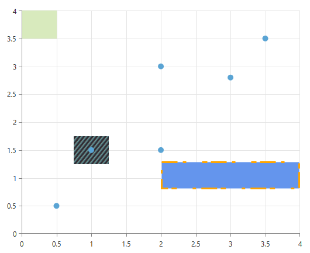
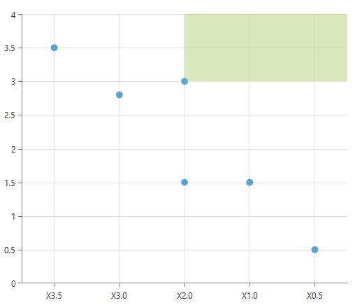

# MarkedZone Annotations

The __CartesianMarkedzoneAnnotation__ is a rectangle defined by the __HorizontalFrom/To__ and __VerticalFrom/To__ properties.

 

## Properties

Besides the __HorizontalFrom/To__ and __VerticalFrom/To__ properties that are used for defining the rectangle, the __CartesianMarkedzoneAnnotation__ exposes the following properties:        

* __HorizontalAxis__ and __VerticalAxis__ Used for assosiating the annotation with the chart axes.            

>By default the annotation is associated with the __RadCartesianChart.HorizontalAxis__ and __RadCartesianChart.VerticalAxis__ axes, so it is not necessary to  specify these properties. They are usually used in a multiple axis scenarios.              

* __Fill__ Specifies the fill of the marked zone.            

* __DashArray__ A collection of System.Double values that indicate the pattern of dashes and gaps that is used to outline the border of the marked zone.            

* __Stroke__ Specifies the stroke of the marked zone.            

* __StrokeThickness__ Specifies the stroke thickness of the marked zone.            

## Examples

A __CartesianMarkedZoneAnnotation__ is defined like this:        

#### __XAML__

{{region radchartview_annotations_markedzone_0}}
	<telerik:CartesianMarkedZoneAnnotation HorizontalFrom="0.0" HorizontalTo="0.5"
	                                       VerticalFrom="3.5" VerticalTo="4"/>
	                
	<telerik:CartesianMarkedZoneAnnotation HorizontalFrom="2" HorizontalTo="4"
	                                       VerticalFrom="0.8" VerticalTo="1.3"
	                                       Fill="CornflowerBlue"
	                                       Stroke="Orange"
	                                       StrokeThickness="3"
	                                       DashArray="9 3 2"/>
	
	<telerik:CartesianMarkedZoneAnnotation HorizontalFrom="0.75" HorizontalTo="1.25"
	                                       VerticalFrom="1.25" VerticalTo="1.75"
	                                       ZIndex="-200">
	    <telerik:CartesianMarkedZoneAnnotation.Fill>
	        <LinearGradientBrush StartPoint="0,0" EndPoint="1,1" SpreadMethod="Repeat">
	            <GradientStop Offset="0" Color="#466375"/>
	            <GradientStop Offset="0.25" Color="#466375"/>
	            <GradientStop Offset="0.25" Color="#2b2a2a"/>
	            <GradientStop Offset="0.5" Color="#2b2a2a"/>
	            <GradientStop Offset="0.5" Color="#3f3742"/>
	            <GradientStop Offset="0.75" Color="#3f3742"/>
	            <GradientStop Offset="0.75" Color="#6c968a"/>
	            <GradientStop Offset="1" Color="#6c968a"/>
	
	            <LinearGradientBrush.RelativeTransform>
	                <ScaleTransform ScaleX="0.075" ScaleY="0.075"/>
	            </LinearGradientBrush.RelativeTransform>
	        </LinearGradientBrush>
	    </telerik:CartesianMarkedZoneAnnotation.Fill>
	</telerik:CartesianMarkedZoneAnnotation>
{{endregion}}

By default, the __Fill__ of the MarkedZone is *#598EC441* and the __Stroke__ is not set. You can see this in the first CartesianMarkedZoneAnnotation declaration.        

The second declaration shows that you can use the __DashArray__ property to create an interesting Stroke pattern.        

The last example in the above code snippet shows that you can use the __ZIndex__ property to place an annotation behind the ChartSeries (by default annotations are placed in front of the ChartSeries). 

The flexible design of the MarkedZone annotation allows the user to omit one (or more) of the four Horizontal/VerticalFrom/To properties. The following table details relationship between the specified properties and the occupied interval on the axis: 

#### __XAML__

{{region radchartview_annotations_markedzone_1}}
	<telerik:CartesianMarkedZoneAnnotation HorizontalTo="2.75"
	                                       VerticalFrom="0.5" VerticalTo="1"/>
{{endregion}}

In this example the MarkedZone takes the space between 0.5 and 1 on the vertical axis and between -infinity and 2.75 on the horizontal axis.

In addition to the possibility of not specifying one (or more) the four properties, the annotation also supports inverse axes. The combination of these factors produces 64 possible scenarios!
        

#### __XAML__

{{region radchartview_annotations_markedzone_2}}
	<telerik:RadCartesianChart x:Name="chart">
	    <telerik:RadCartesianChart.VerticalAxis>
	        <telerik:LinearAxis/>
	    </telerik:RadCartesianChart.VerticalAxis>
	
	    <telerik:RadCartesianChart.HorizontalAxis>
	        <telerik:CategoricalAxis IsInverse="True"/>
	    </telerik:RadCartesianChart.HorizontalAxis>
	
	    <telerik:PointSeries>
	        <telerik:PointSeries.DataPoints>
	            <telerik:CategoricalDataPoint Category="X0.5" Value="0.5"/>
	            <telerik:CategoricalDataPoint Category="X1.0" Value="1.5"/>
	            <telerik:CategoricalDataPoint Category="X2.0" Value="1.5"/>
	            <telerik:CategoricalDataPoint Category="X2.0" Value="3.0"/>
	            <telerik:CategoricalDataPoint Category="X3.0" Value="2.8"/>
	            <telerik:CategoricalDataPoint Category="X3.5" Value="3.5"/>
	        </telerik:PointSeries.DataPoints>
	        <telerik:PointSeries.DefaultVisualStyle>
	            
	        </telerik:PointSeries.DefaultVisualStyle>
	    </telerik:PointSeries>
	
	    <telerik:RadCartesianChart.Annotations>
	        <telerik:CartesianMarkedZoneAnnotation VerticalFrom="3.0"
	                                               HorizontalTo="X2.0"/>
	    </telerik:RadCartesianChart.Annotations>
	
	    <telerik:RadCartesianChart.Grid>
	        <telerik:CartesianChartGrid MajorLinesVisibility="XY"/>
	    </telerik:RadCartesianChart.Grid>
	</telerik:RadCartesianChart>
{{endregion}}

In this example last you can see that Cateogrical axes are also supported, adding to the versatile feature set of __CartesianMarkedzoneAnnotation__.
  