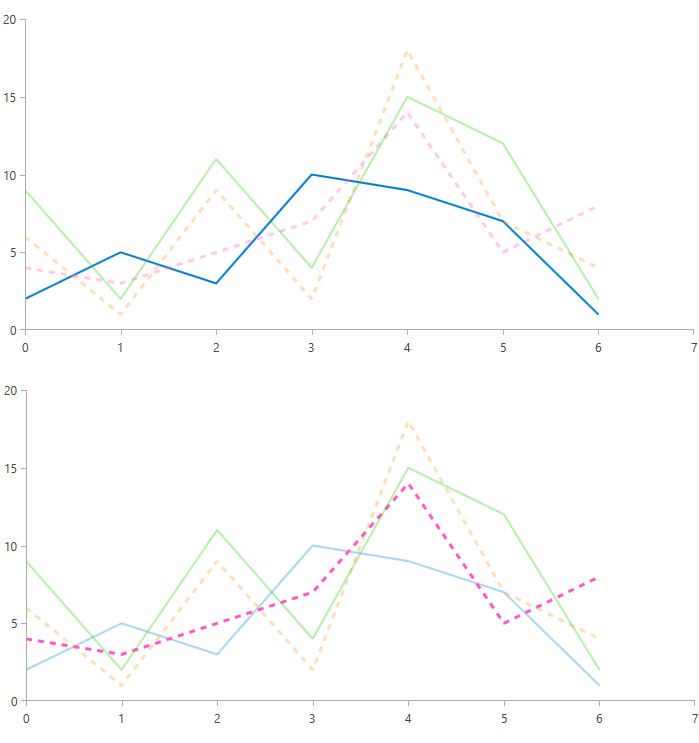

# HoverMode

The different charts from the RadChartView suite expose a property called **HoverMode** which controls whether the rest of the series will fade out when a certain series is hovered. It is useful in situations with many overlapping series and has two possible values: **FadeOtherSeries** and **None**. The default value is **None**. This article will demonstrate this property with a RadCartesianChart.

The following example demonstrates how to set up a RadCartesianChart and set its HoverMode.
        
#### __[XAML] Example 1: Define the RadCartesianChart with HoverMode__

{{region radchartview-features-hovermode_0}}
	 <telerik:RadCartesianChart x:Name="chart" HoverMode="FadeOtherSeries">
            <telerik:RadCartesianChart.VerticalAxis>
                <telerik:LinearAxis />
            </telerik:RadCartesianChart.VerticalAxis>
            <telerik:RadCartesianChart.HorizontalAxis>
                <telerik:LinearAxis  />
            </telerik:RadCartesianChart.HorizontalAxis>
            <telerik:RadCartesianChart.Series>
                <telerik:ScatterLineSeries  Stroke="#007ACC">
                    <telerik:ScatterLineSeries.DataPoints>
                        <telerik:ScatterDataPoint XValue="0" YValue="2" />
                        <telerik:ScatterDataPoint XValue="1" YValue="5" />
                        <telerik:ScatterDataPoint XValue="2" YValue="3" />
                        <telerik:ScatterDataPoint XValue="3" YValue="10" />
                        <telerik:ScatterDataPoint XValue="4" YValue="9" />
                        <telerik:ScatterDataPoint XValue="5" YValue="7" />
                        <telerik:ScatterDataPoint XValue="6" YValue="1" />
                    </telerik:ScatterLineSeries.DataPoints>
                </telerik:ScatterLineSeries>
                <telerik:ScatterLineSeries  Stroke="#FF5AC3"
                                            StrokeThickness="3"
                                            DashArray="2 2">
                    <telerik:ScatterLineSeries.DataPoints>
                        <telerik:ScatterDataPoint XValue="0" YValue="4" />
                        <telerik:ScatterDataPoint XValue="1" YValue="3" />
                        <telerik:ScatterDataPoint XValue="2" YValue="5" />
                        <telerik:ScatterDataPoint XValue="3" YValue="7" />
                        <telerik:ScatterDataPoint XValue="4" YValue="14" />
                        <telerik:ScatterDataPoint XValue="5" YValue="5" />
                        <telerik:ScatterDataPoint XValue="6" YValue="8" />
                    </telerik:ScatterLineSeries.DataPoints>
                </telerik:ScatterLineSeries>
                <telerik:ScatterLineSeries Stroke="#FF9C33"
                                    StrokeThickness="3"
                                    DashArray="2 2">
                    <telerik:ScatterLineSeries.DataPoints>
                        <telerik:ScatterDataPoint XValue="0" YValue="6" />
                        <telerik:ScatterDataPoint XValue="1" YValue="1" />
                        <telerik:ScatterDataPoint XValue="2" YValue="9" />
                        <telerik:ScatterDataPoint XValue="3" YValue="2" />
                        <telerik:ScatterDataPoint XValue="4" YValue="18" />
                        <telerik:ScatterDataPoint XValue="5" YValue="7" />
                        <telerik:ScatterDataPoint XValue="6" YValue="4" />
                    </telerik:ScatterLineSeries.DataPoints>
                </telerik:ScatterLineSeries>
                <telerik:ScatterLineSeries Stroke="#27C106">
                    <telerik:ScatterLineSeries.DataPoints>
                        <telerik:ScatterDataPoint XValue="0" YValue="9" />
                        <telerik:ScatterDataPoint XValue="1" YValue="2" />
                        <telerik:ScatterDataPoint XValue="2" YValue="11" />
                        <telerik:ScatterDataPoint XValue="3" YValue="4" />
                        <telerik:ScatterDataPoint XValue="4" YValue="15" />
                        <telerik:ScatterDataPoint XValue="5" YValue="12" />
                        <telerik:ScatterDataPoint XValue="6" YValue="2" />
                    </telerik:ScatterLineSeries.DataPoints>
                </telerik:ScatterLineSeries>
            </telerik:RadCartesianChart.Series>
        </telerik:RadCartesianChart>
{{endregion}}

#### Figure 1: Result from Example 1 comparing hovering over different series

> In the case of the RadPieChart, when the HoverMode property is set, all of the slices fade out except the hovered one.

## See also

* [Getting Started]()
* [Chart Types]()