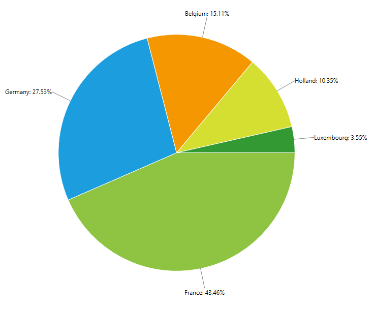
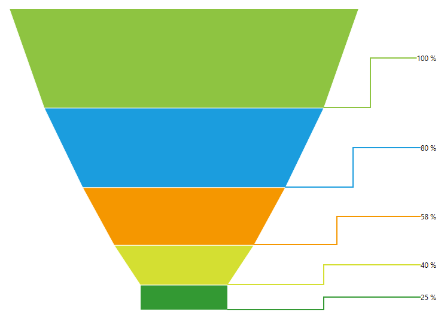

# Label Connectors

RadChartView supports drawing of connector lines between the series' data points and their labels. In order to enable this feature you can set the chart series' __LabelConnectorsSettings__ property. The property accepts an object of type __ChartSeriesLabelConnectorsSettings__ which exposes the following properties:
* __FadeOpacity__: Gets or sets the opacity that is applied to the label connectors when the series is faded by the chart's hover interactivity.
* __MinLengthThreshold__: Gets or sets the min length threshold. If a label connector is shorter than this threshold, the label connector is not drawn.
* __Style__: Gets or sets the connectors' style. The property accepts a Style targeting a Path element.

#### __[XAML] Example 1: Setting LabelConnectorsSettings in XAML__
{{region xaml-radchartview-features-labels-label-connectors_0}}
	<telerik:RadPieChart Palette="Windows8">
		<telerik:PieSeries ShowLabels="True" RadiusFactor="0.6">
			<telerik:PieSeries.DataPoints>
				<telerik:PieDataPoint Value="43.46" Label="France: 43.46%"/>
				<telerik:PieDataPoint Value="27.53" Label="Germany: 27.53%" />
				<telerik:PieDataPoint Value="15.11" Label="Belgium: 15.11%" />
				<telerik:PieDataPoint Value="10.35" Label="Holland: 10.35%" />
				<telerik:PieDataPoint Value="3.55" Label="Luxembourg: 3.55%" />
			</telerik:PieSeries.DataPoints>

			<telerik:PieSeries.LabelDefinitions>
				<telerik:ChartSeriesLabelDefinition Margin="-40,0,0,0" />
			</telerik:PieSeries.LabelDefinitions>

			<telerik:PieSeries.LabelConnectorsSettings>
				<telerik:ChartSeriesLabelConnectorsSettings />
			</telerik:PieSeries.LabelConnectorsSettings>
		</telerik:PieSeries>            
	</telerik:RadPieChart>
{{endregion}}

#### __Figure 1: Label connectors visual appearance__

## Customizing labels connectors points

With the __R3 2017__ release of UI for WPF controls you can customize the labels connectors position. This can be achieve by overriding the __GetLabelConnector()__ method of the series. This method accepts an object of type __ChartSeriesLabelPositionInfo__ which contains information about the label. 

* __DataPoint__: Gets the DataPoint associated with the label.
* __DefaultLayoutSlot__: Gets the initially calculated layout slot for the label.
* __FinalLayoutSlot__: Gets or sets the final layout in which the label will be arranged.

In the following example we will demonstrate how to customize the connectors appearance by adding additional points. First we will create custom class which derives from __FunnelSeries__ and override the __GetLabelConnector()__ method. In this method we will create new points which the framework will used to draw the connector across them.

#### __[C#] Example 2: Overriding GetLabelConnector() method__
{{region radchartview-features-labels-label-connectors_1}}
	public class CustomFunnelSeries : FunnelSeries
    {
        protected override List<Point> GetLabelConnector(ChartSeriesLabelPositionInfo info)
        {
            var newPoints = new List<Point>();          
            var dataPoint = info.DataPoint as FunnelDataPoint;
            var funnelBottomRightPoint = dataPoint.Points[2];

            var middlePoint = new Point(info.DefaultLayoutSlot.X, funnelBottomRightPoint.Y);
            var bottomCenterPoint = GetCenterPoint(middlePoint, funnelBottomRightPoint);

            var funnelMiddleCenter = GetCenterPoint(dataPoint.Points[2], dataPoint.Points[1]);
            var lastPoint = new Point(info.DefaultLayoutSlot.X, info.DefaultLayoutSlot.Center.Y);

            newPoints.Add(new Point(funnelBottomRightPoint.X, funnelBottomRightPoint.Y-1));
            newPoints.Add(bottomCenterPoint);
            newPoints.Add(new Point(bottomCenterPoint.X, funnelMiddleCenter.Y));
            newPoints.Add(lastPoint);

            return newPoints;
        }

        private Point GetCenterPoint(Point pointOne, Point pointTwo)
        {
            var result = new List<Point>();
            double x = (Math.Max(pointOne.X, pointTwo.X) - Math.Min(pointOne.X, pointTwo.X)) / 2 + Math.Min(pointOne.X, pointTwo.X);
            double y = (Math.Max(pointOne.Y, pointTwo.Y) - Math.Min(pointOne.Y, pointTwo.Y)) / 2 + Math.Min(pointOne.Y, pointTwo.Y);
            var middlePoint = new Point(x, y);
            return middlePoint;
        }
    }
{{endregion}}

Next we will create custom __IValueConverter__ class to change the __Stroke__ of every connector.

#### __[C#] Example 3: Specifying CustomFunnelSeries in XAML__
{{region radchartview-features-labels-label-connectors_1}}
	public class DataPointToBrushConverter : IValueConverter
	{
		public object Convert(object value, System.Type targetType, object parameter, System.Globalization.CultureInfo culture)
		{
			Telerik.Charting.DataPoint dp = value as Telerik.Charting.DataPoint;
			if (dp == null)
			{
				return null;
			}
			var series = (Telerik.Windows.Controls.ChartView.ChartSeries)dp.Presenter;
			return series.Chart.Palette.GlobalEntries[dp.Index].Fill;
		}

		public object ConvertBack(object value, System.Type targetType, object parameter, System.Globalization.CultureInfo culture)
		{
			throw new System.NotImplementedException();
		}
	}
{{endregion}}

Now we can add the custom funnel series into the view.

#### __[C#] Example 4: Specifying CustomFunnelSeries in XAML__
{{region radchartview-features-labels-label-connectors_2}}
	<Grid>
        <Grid.Resources>
            <local:DataPointToBrushConverter x:Key="dataPointToBrushConverter"/>
            
        </Grid.Resources>
        <telerik:RadFunnelChart Palette="Windows8"  Margin="50 50 140 50" ClipToBounds="False">
            <local:CustomFunnelSeries ShowLabels="True" ClipToPlotArea="False"   IsDynamicSlope="True"> 
                <local:CustomFunnelSeries.DataPoints>
                    <telerik:FunnelDataPoint Value="100" Label="100 %"/>
                    <telerik:FunnelDataPoint Value="80" Label="80 %"/>
                    <telerik:FunnelDataPoint Value="58" Label="58 %"/>
                    <telerik:FunnelDataPoint Value="40" Label="40 %"/>
                    <telerik:FunnelDataPoint Value="25" Label="25 %"/>
                </local:CustomFunnelSeries.DataPoints>
                <local:CustomFunnelSeries.LabelDefinitions>
                    <telerik:ChartSeriesLabelDefinition HorizontalAlignment="Right" VerticalAlignment="Center" Margin="140 0 10 0" />
                </local:CustomFunnelSeries.LabelDefinitions>
                <local:CustomFunnelSeries.LabelConnectorsSettings>
                    <telerik:ChartSeriesLabelConnectorsSettings  Style="{StaticResource connectorStyle}"/>
                </local:CustomFunnelSeries.LabelConnectorsSettings>
            </local:CustomFunnelSeries>          
        </telerik:RadFunnelChart>
    </Grid>
{{endregion}}

#### __Figure 2: Customized connectors visual appereance__

## See Also
* [GettingStarted]()
* [LineSeries]()
* [Smart Labels]()
* [Label Definition]()
