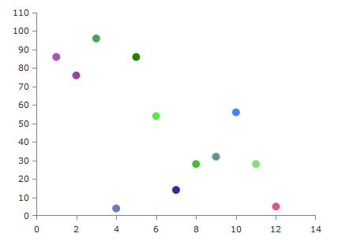
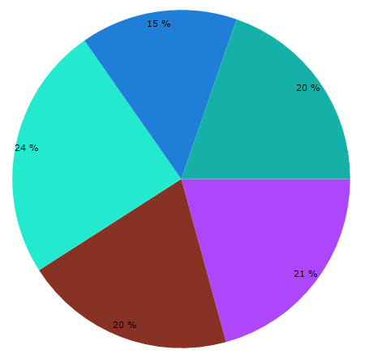

# Binding the Color of Series Items

This topic demonstrates how to create charts, where each individual item, has its color bound to a property of the underlying data object.

There are small differences in the approaches used with the different series types. For the sake of the example the following series will be used. They cover the possible approaches.

* [Bar Series](#bar-series)
* [Scatter Point Series](#scatter-point-series)
* [Pie Series](#pie-series)

## Example Data Model Definition

This section contains the data model used for the series examples in this article and also how to set it up.

#### __[C#] Example 1: Defining the data model__
{{region radchartview-populating-with-data-binding-the-color-of-series-items_0}}
	public class ChartData : INotifyPropertyChanged
	{
	    private int _category;
	    public int Category
	    {
	        get { return this._category; }
	        set { this._category = value; this.OnPropertyChanged("Category"); }
	    }
	
	    private double _value;
	    public double Value
	    {
	        get { return this._value; }
	        set { this._value = value; this.OnPropertyChanged("Value"); }
	    }
	
	    private Brush _color;
	    public Brush Color
	    {
	        get { return this._color; }
	        set { this._color = value; this.OnPropertyChanged("Color"); }
	    }
	
	    public event PropertyChangedEventHandler PropertyChanged;
	    private void OnPropertyChanged(string propertyName)
	    {
	        if (this.PropertyChanged != null)
	        {
	            this.PropertyChanged(this, new PropertyChangedEventArgs(propertyName));
	        }
	    }
	}
{{endregion}}

#### __[VB.NET] Example 1: Defining the data model__
{{region radchartview-populating-with-data-binding-the-color-of-series-items_0}}
	Public Class ChartData
		Implements INotifyPropertyChanged
		Private _category As String
		Public Property Category() As String
			Get
				Return Me._category
			End Get
			Set
				Me._category = value
				Me.OnPropertyChanged("Category")
			End Set
		End Property
	
		Private _value As Double
		Public Property Value() As Double
			Get
				Return Me._value
			End Get
			Set
				Me._value = value
				Me.OnPropertyChanged("Value")
			End Set
		End Property
	
		Private _color As Brush
		Public Property Color() As Brush
			Get
				Return Me._color
			End Get
			Set
				Me._color = value
				Me.OnPropertyChanged("Color")
			End Set
		End Property
	
		Public Event PropertyChanged As PropertyChangedEventHandler
		Private Sub OnPropertyChanged(propertyName As String)
			RaiseEvent PropertyChanged(Me, New PropertyChangedEventArgs(propertyName))
		End Sub
	End Class
{{endregion}}

Let's create some data so we can test the result.

#### __[C#] Example 2: Populating the data collection__
{{region radchartview-populating-with-data-binding-the-color-of-series-items_1}}
	public MainWindow()
	{
		InitializeComponent();
		DataContext = GetData(12);
	}
	
	public static List<ChartData> GetData(int dataSize)
	{
	    Random rnd = new Random();
	    var result = new List<ChartData>();
	         
	    for (int i = 0; i < dataSize; i++)
	    {
	        result.Add(new ChartData()
	        {
	            Category = i,
	            Value = rnd.Next(1, 100),
	            Color = new SolidColorBrush(
	                Color.FromArgb(255, (byte)rnd.Next(0, 256), (byte)rnd.Next(0, 256), (byte)rnd.Next(0, 256)))
	        });
	    }
	
	    return result;
	}
{{endregion}}

#### __[VB.NET] Example 2: Populating the data collection__
{{region radchartview-populating-with-data-binding-the-color-of-series-items_1}}
	Public Sub New()
		InitializeComponent()
		DataContext = GetData(12)
	End Sub
	
	Public Shared Function GetData(ByVal dataSize As Integer) As List(Of ChartData)
    Dim rnd As Random = New Random()
    Dim result = New List(Of ChartData)()

    For i As Integer = 0 To dataSize - 1
        result.Add(New ChartData() With {
            .Category = i,
            .Value = rnd.Next(1, 100),
            .Color = New SolidColorBrush(Color.FromArgb(255, CByte(rnd.Next(0, 256)), CByte(rnd.Next(0, 256)), CByte(rnd.Next(0, 256))))
        })
    Next

    Return result
End Function
{{endregion}}

## Bar Series      

Here is a sample chart with __BarSeries__ defined in Xaml.

#### __[XAML] Example 3: BarSeries definition__
{{region radchartview-populating-with-data-binding-the-color-of-series-items_0}}
	<telerik:RadCartesianChart x:Name="chart" Width="400" Height="300">
	    <telerik:RadCartesianChart.VerticalAxis>
	        <telerik:LinearAxis/>
	    </telerik:RadCartesianChart.VerticalAxis>
	    <telerik:RadCartesianChart.HorizontalAxis>
	        <telerik:CategoricalAxis/>
	    </telerik:RadCartesianChart.HorizontalAxis>
	    <telerik:RadCartesianChart.Series>
	        <telerik:BarSeries CategoryBinding="Category" ValueBinding="Value" ItemsSource="{Binding}" />            
	    </telerik:RadCartesianChart.Series>
	</telerik:RadCartesianChart>	
{{endregion}}

You can see the data model used for this example in the [Example Data Model Definition](#example-data-model-definition) section.

There are couple approaches which could be used to bind the color from the data object to the fill of the data point visual (the bar).
	
* __Use the DefaultVisualStyle property of the series.__ You can use this to target the default visual of the series and bind its properties to the data model object.
	
	Using the data model from this article's example you can bind the Color property from the ChartData class.

	#### __[XAML] Example 4: Setting BarSeries DefaultVisualStyle__
	{{region radchartview-populating-with-data-binding-the-color-of-series-items_5}}
		<telerik:BarSeries CategoryBinding="Category" ValueBinding="Value" ItemsSource="{Binding}">
			<telerik:BarSeries.DefaultVisualStyle>
				
			</telerik:BarSeries.DefaultVisualStyle>
		</telerik:BarSeries>
	{{endregion}}
	
* __Use the PointTemplate property of the series.__ In this case you can define a DataTemplate containing a custom visual element for the data points and bind its color property (Background or Fill for example) to the property from the data model. 
	
	Using the data model from this article's example you can bind the Color property from the ChartData class.

	#### __[XAML] Example 5: Setting BarSeries PointTemplate__
	{{region radchartview-populating-with-data-binding-the-color-of-series-items_1}}
		<telerik:BarSeries CategoryBinding="Category" ValueBinding="Value" ItemsSource="{Binding}">
			<telerik:BarSeries.PointTemplate>
				<DataTemplate>
					<Rectangle Fill="{Binding DataItem.Color}"/>
				</DataTemplate>
			</telerik:BarSeries.PointTemplate>
		</telerik:BarSeries>
	{{endregion}}
	
	The DataItem in the binding's path points to the custom ChartData model.

>tip The __recommended__ approach for binding the color is to use the __DefaultVisualStyle__. This is because the PointTemplate creates an additional ContentPresenter for each data point visual which means a bit more rendering time for the framework. 

You can use those approaches with most series types of the chart.

#### __Figure 1: Different colored bars__

## Scatter Point Series      

Here is a sample chart with __ScatterPointSeries__ defined in XAML.

#### __[XAML] Example 3: ScatterPointSeries definition__
{{region radchartview-populating-with-data-binding-the-color-of-series-items_0}}
	<telerik:RadCartesianChart x:Name="chart" Width="400" Height="300">
	    <telerik:RadCartesianChart.VerticalAxis>
	        <telerik:LinearAxis/>
	    </telerik:RadCartesianChart.VerticalAxis>
	    <telerik:RadCartesianChart.HorizontalAxis>
	        <telerik:LinearAxis/>
	    </telerik:RadCartesianChart.HorizontalAxis>
	    <telerik:RadCartesianChart.Series>
	        <telerik:ScatterPointSeries XValueBinding="Category" YValueBinding="Value" ItemsSource="{Binding}" />            
	    </telerik:RadCartesianChart.Series>
	</telerik:RadCartesianChart>	
{{endregion}}

You can see the data model used for this example in the [Example Data Model Definition](#example-data-model-definition) section.

The ScatterPointSeries can be customized using the same manner as with the [BarSeries](#bar-series). There are two small differences which could be applied.

>As all scatter series, ScatterPointSeries requires the RadCartesianChart to define two LinearAxis as a vertical and horizontal axis.

* When using __DefaultVisualStyle__ you will need to target a different UI element - a Path in this case. And also you will need to define the size (Width and Height) of the Path.

	#### __[XAML] Example 6: Setting Point Series DefaultVisualStyle__
	{{region radchartview-populating-with-data-binding-the-color-of-series-items_5}}
		<telerik:ScatterPointSeries XValueBinding="Category" YValueBinding="Value" ItemsSource="{Binding}">
			<telerik:ScatterPointSeries.DefaultVisualStyle>
				
			</telerik:ScatterPointSeries.DefaultVisualStyle>
		</telerik:ScatterPointSeries>
	{{endregion}}
	
	> The data context passed in the DefaultVisualStyle of the ScatterPointSeries (and several other series) is not the DataPoint object, but the context of the series. In this case the DataPoint is stored in the Tag property of the Path.

* When using __PointTemplate__ the most common shape you will use is an ellipse so you can define an Ellipse element in the template. 
	
	#### __[XAML] Example 7: Setting Point Series PointTemplate__
	{{region radchartview-populating-with-data-binding-the-color-of-series-items_2}}
		<telerik:ScatterPointSeries XValueBinding="Category" YValueBinding="Value" ItemsSource="{Binding}">
			<telerik:ScatterPointSeries.PointTemplate>
				<DataTemplate>
					<Ellipse Width="10" Height="10" Fill="{Binding DataItem.Color}"/>
				</DataTemplate>
			</telerik:ScatterPointSeries.PointTemplate>
		</telerik:ScatterPointSeries>
	{{endregion}}

You can see the data model used for this example in the [Example Data Model Definition](#example-data-model-definition) section.
	
#### __Figure 2: Different colored points__

## Pie Series      

Similar to the [BarSeries](#bar-series) the PieSeries uses a default visual style to customize the appearance of the pie slices. The Style should target a Path element and it is applied to the __DefaultSliceStyle__ property of the series.

#### __[XAML] Example 8: Setting Pie Series default visual style__
{{region radchartview-populating-with-data-binding-the-color-of-series-items_4}}
	<telerik:RadPieChart x:Name="chart">
	    <telerik:PieSeries ValueBinding="Value" ItemsSource="{Binding}">
			<telerik:PieSeries.DefaultSliceStyle>
				
			</telerik:PieSeries.DefaultSliceStyle>
		</telerik:PieSeries>
	</telerik:RadPieChart>
{{endregion}}

You can see the data model used for this example in the [Example Data Model Definition](#example-data-model-definition) section.

#### __Figure 3: Different colored pie slices__

		
## See Also
 * [Create Data-Bound Chart]()
 * [Customizing CartesianChart Series]()
