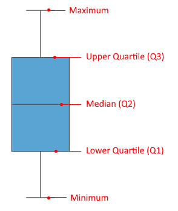
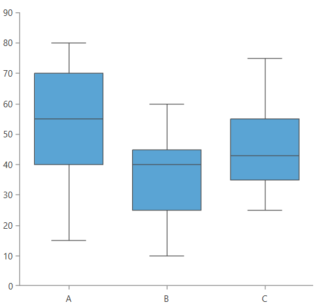
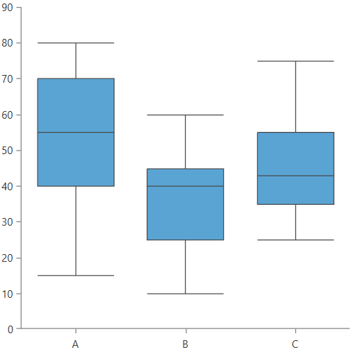

# BoxPlotSeries

This type of series visualizes its data points using box plot shapes. An alternative name for this visualiztion is box and whiskers. 

The box plot shape allows you to display a summarized information containing five values - minimum, maximum, lower quartile (Q1), upper quartile (Q3) and median - plotted on the numeric axis of the chart.

#### Figure 1: Box Plot Visual Structure

BoxPlotSeries works with one CategoricalAxis (or DateTime axis) as horizontal axis and one numeric axis (LinearAxis or LogarithmicAxis) as vertical axis. Any other combination of axes is unsupported.

To start using the series, add it in the Series collection of the chart and populate its __DataPoints__ collection (or the [ItemsSource](#data-binding)).

#### __[XAML] Example 1: Defining BoxPlotSeries in XAML__
{{region radchartview-series-boxplotseries-0}}
	 <telerik:RadCartesianChart>
		<telerik:RadCartesianChart.VerticalAxis>
			<telerik:LinearAxis />
		</telerik:RadCartesianChart.VerticalAxis>
		<telerik:RadCartesianChart.HorizontalAxis>
			<telerik:CategoricalAxis/>
		</telerik:RadCartesianChart.HorizontalAxis>
		<telerik:RadCartesianChart.Series>
			<telerik:BoxPlotSeries>
				<telerik:BoxPlotSeries.DataPoints>
					<telerik:BoxPlotDataPoint Category="A" Minimum="15" Maximum="80" LowerQuartile="40" UpperQuartile="70" Median="55"/>                        
					<telerik:BoxPlotDataPoint Category="B" Minimum="10" Maximum="60" LowerQuartile="25" UpperQuartile="45" Median="40"/>
					<telerik:BoxPlotDataPoint Category="C" Minimum="25" Maximum="75" LowerQuartile="35" UpperQuartile="55" Median="43"/>
				</telerik:BoxPlotSeries.DataPoints>
			</telerik:BoxPlotSeries>
		</telerik:RadCartesianChart.Series>
	</telerik:RadCartesianChart>
{{endregion}}

#### Figure 2: BoxPlotSeries example

>tip The box plot data points do not implement automatic coercion of the input values. This means that the provided values must be correct in order to display a proper visual element. Minimum must be smaller than Maximum and the interquartile range (between Q1 and Q3) must be within the Minimum/Maximum range.

## Data Binding

The BoxPlotSeries works with data point objects of type BoxPlotDataPoint. In a data binding scenario a [BoxPlotDataPoint]() will be created for each data item in the __ItemsSource__ collection of the series. To map the properties of the business objects from the ItemsSource to the properties of the data point object, use the binding properties of the series:

* __CategoryBinding__
* __MinimumBinding__
* __MaximumBinding__
* __LowerQuartileBinding__
* __UpperQuartileBinding__
* __MedianBinding__

The following example shows how to create a simple object describing a box plot and populate the series with a sample collection.

#### __[C#] Example 2: Defining the model__
{{region radchartview-series-boxplotseries-1}}
	public class BoxPlotInfo
    {
        public string Category { get; set; }
        public double Min { get; set; }
        public double Max { get; set; }
        public double Q1Value { get; set; }
        public double Q3Value { get; set; }
        public double Median { get; set; }
    }
{{endregion}}	

#### __[C#] Example 3: Populating the data__
{{region radchartview-series-boxplotseries-2}}
	public MyUserControl()
	{
		InitializeComponent(); 
		
		var source = new ObservableCollection<BoxPlotInfo>()
		{
			new BoxPlotInfo() { Category = "C1", Min = 5, Max = 30, Q1Value = 10, Q3Value = 15, Median = 13 },
			new BoxPlotInfo() { Category = "C2", Min = 10, Max = 40, Q1Value = 15, Q3Value = 20, Median = 16 },
			new BoxPlotInfo() { Category = "C3", Min = 15, Max = 35, Q1Value = 20, Q3Value = 30, Median = 27 },
			new BoxPlotInfo() { Category = "C4", Min = 5, Max = 25, Q1Value = 10, Q3Value = 18, Median = 15 },
			new BoxPlotInfo() { Category = "C5", Min = 10, Max = 40, Q1Value = 15, Q3Value = 20, Median = 19 },
			new BoxPlotInfo() { Category = "C6", Min = 9, Max = 35, Q1Value = 20, Q3Value = 30, Median = 25 },
			new BoxPlotInfo() { Category = "C7", Min = 5, Max = 25, Q1Value = 10, Q3Value = 15, Median = 12 },
			new BoxPlotInfo() { Category = "C8", Min = 7, Max = 30, Q1Value = 15, Q3Value = 25, Median = 21 },
		};
		this.boxPlotSeries.ItemsSource = source;
	}
{{endregion}}	

#### __[XAML] Example 4: Defining BoxPlotSeries in data binding scenario__
{{region radchartview-series-boxplotseries-3}}	
	<telerik:RadCartesianChart>
		<telerik:RadCartesianChart.VerticalAxis>
			<telerik:LinearAxis />
		</telerik:RadCartesianChart.VerticalAxis>
		<telerik:RadCartesianChart.HorizontalAxis>
			<telerik:CategoricalAxis/>
		</telerik:RadCartesianChart.HorizontalAxis>
		<telerik:RadCartesianChart.Series>
			<telerik:BoxPlotSeries x:Name="boxPlotSeries" 
								   CategoryBinding="Category"
								   MinimumBinding="Min"
								   MaximumBinding="Max"
								   LowerQuartileBinding="Q1Value"
								   UpperQuartileBinding="Q3Value"
								   MedianBinding="Median"/>
		</telerik:RadCartesianChart.Series>
	</telerik:RadCartesianChart>
{{endregion}}

#### Figure 3: BoxPlotSeries data binding example

Read more about the data binding support in the [Create Data-Bound Chart]() article.

## Legend Settings

The chart series allows you to auto-generate LegendItem objects containing a title and color which can be used with the [RadLegend]() control. To enable this, set the __LegendSettings__ property of the series element.

#### __[XAML] Example 5: Using SeriesLegendSettings__
{{region radchartview-series-boxplotseries-4}}	
	 <Grid>
        <Grid.ColumnDefinitions>
            <ColumnDefinition />
            <ColumnDefinition Width="Auto"/>
        </Grid.ColumnDefinitions>
        <telerik:RadCartesianChart x:Name="chart" Palette="Fluent">
            <telerik:RadCartesianChart.VerticalAxis>
                <telerik:LinearAxis />
            </telerik:RadCartesianChart.VerticalAxis>
            <telerik:RadCartesianChart.HorizontalAxis>
                <telerik:CategoricalAxis />
            </telerik:RadCartesianChart.HorizontalAxis>
            <telerik:RadCartesianChart.Series>
                <telerik:BoxPlotSeries>
                    <telerik:BoxPlotSeries.DataPoints>
                        <telerik:BoxPlotDataPoint Category="A" Minimum="15" Maximum="80" LowerQuartile="40" UpperQuartile="70" Median="55"/>                        
                        <telerik:BoxPlotDataPoint Category="B" Minimum="10" Maximum="60" LowerQuartile="25" UpperQuartile="45" Median="40"/>
                        <telerik:BoxPlotDataPoint Category="C" Minimum="25" Maximum="75" LowerQuartile="35" UpperQuartile="55" Median="43"/>
                    </telerik:BoxPlotSeries.DataPoints>
                    <telerik:BoxPlotSeries.LegendSettings>
                        <telerik:SeriesLegendSettings Title="First Series" />
                    </telerik:BoxPlotSeries.LegendSettings>
                </telerik:BoxPlotSeries>
                <telerik:BoxPlotSeries>
                    <telerik:BoxPlotSeries.DataPoints>
                        <telerik:BoxPlotDataPoint Category="A" Minimum="10" Maximum="60" LowerQuartile="25" UpperQuartile="45" Median="40"/>
                        <telerik:BoxPlotDataPoint Category="B" Minimum="25" Maximum="75" LowerQuartile="35" UpperQuartile="55" Median="43"/>
                        <telerik:BoxPlotDataPoint Category="C" Minimum="15" Maximum="80" LowerQuartile="40" UpperQuartile="70" Median="55"/>
                    </telerik:BoxPlotSeries.DataPoints>
                    <telerik:BoxPlotSeries.LegendSettings>
                        <telerik:SeriesLegendSettings Title="Second Series" />
                    </telerik:BoxPlotSeries.LegendSettings>
                </telerik:BoxPlotSeries>
            </telerik:RadCartesianChart.Series>
        </telerik:RadCartesianChart>
        <telerik:RadLegend Items="{Binding ElementName=chart, Path=LegendItems}" Grid.Column="1" Margin="10"/>
    </Grid>
{{endregion}}

#### Figure 4: Chart legend 

Read more about the chart's legend settings in the [RadLegend Support]() article.

## Appearance

The appearance of the box plot visual can be modified using several properties. Read more in the [BoxPlot section]() of the Customizing CartesianChart Series help article.

Additionally, the __Palette__ property of the chart to change the colors of the BoxPlotSeries on a global scale. Read more in the [Palettes]() articles.

To change the length of the lines representing the minimum and maximum values of the box plot visual, set the __LimitersLength__ property of the series. The property works with relative units between 0 and 1, where 1 means 100% of the layout slot's width. The __default value is 0.5__, which is 50% of the box plot's width.

#### __[XAML] Example 3: Specify a BarSeries in XAML__
{{region radchartview-series-barseries_2}}		 
	<telerik:BoxPlotSeries LimitersLength="1" />
{{endregion}}

#### Figure 4: Minimum and maximum lines matching the box plot's width

## See Also
 * [Getting Started]()
 * [Chart Series Overview]()
 * [Create Data-Bound Chart]()
