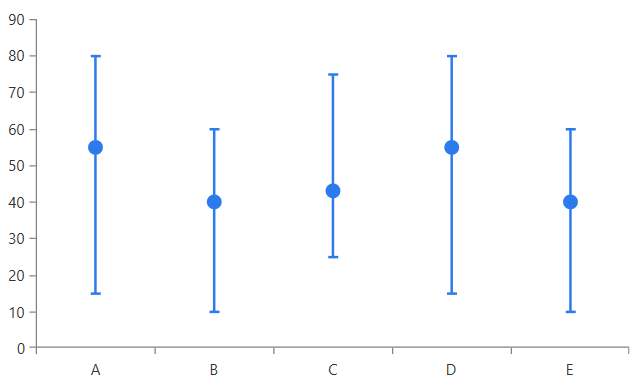
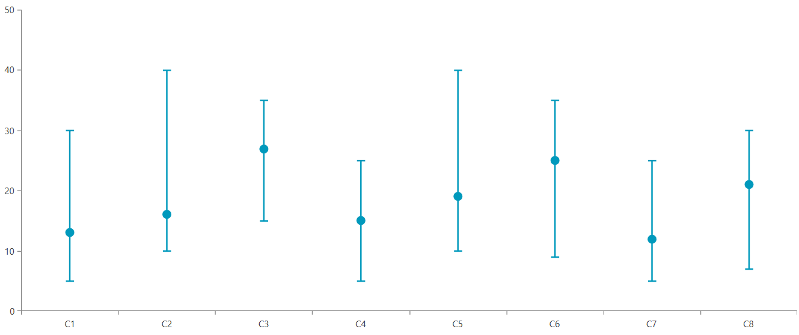

# ErrorBarSeries

This type of series visualizes its data points using error bar shapes. 

The error bar shape allows you to display a error or uncertainty in the plotted data. The shape consists of a single line with caps at the two ends. An additional marker that shows the expected measure can be displayed too.

To start using the series, add it in the `Series` collection of the chart and populate its `DataPoints` collection (or the [ItemsSource](#data-binding)).

#### __[XAML] Defining ErrorBarSeries in XAML__
{{region radchartview-series-errorbarseries-0}}
	<telerik:RadCartesianChart>
		<telerik:RadCartesianChart.VerticalAxis>
			<telerik:LinearAxis />
		</telerik:RadCartesianChart.VerticalAxis>
		<telerik:RadCartesianChart.HorizontalAxis>
			<telerik:CategoricalAxis/>
		</telerik:RadCartesianChart.HorizontalAxis>
		<telerik:RadCartesianChart.Series>
			<telerik:ErrorBarSeries>
				<telerik:ErrorBarSeries.DataPoints>
					<telerik:ErrorBarDataPoint Category="A" Low="15" High="80" />
					<telerik:ErrorBarDataPoint Category="B" Low="10" High="60" />
					<telerik:ErrorBarDataPoint Category="C" Low="25" High="75" />
					<telerik:ErrorBarDataPoint Category="D" Low="15" High="80" />
					<telerik:ErrorBarDataPoint Category="E" Low="10" High="60" />
				</telerik:ErrorBarSeries.DataPoints>
			</telerik:ErrorBarSeries>
		</telerik:RadCartesianChart.Series>
	</telerik:RadCartesianChart>
{{endregion}}

__ErrorBarSeries example__  

>tip The error bar data points do not implement automatic coercion of the input values. This means that the provided values must be correct in order to display a proper visual element. Low must be smaller than High and the Value must be between low and high.

## Showing Value Marker

The series allows you to display an additional marker that shows the expected measure of the data point. To enable this, set the `ShowMarker` property of the `ErrorBarShape` element and the Value property of the `ErrorBarDataPoint` (or `ValueBinding` when using the [ItemsSource](#data-binding).

#### __[XAML] Showing ErrorBarSeries markers__
{{region radchartview-series-errorbarseries-1}}
	<telerik:RadCartesianChart>
		<telerik:RadCartesianChart.VerticalAxis>
			<telerik:LinearAxis />
		</telerik:RadCartesianChart.VerticalAxis>
		<telerik:RadCartesianChart.HorizontalAxis>
			<telerik:CategoricalAxis/>
		</telerik:RadCartesianChart.HorizontalAxis>
		<telerik:RadCartesianChart.Series>
			<telerik:ErrorBarSeries>
				<telerik:ErrorBarSeries.DataPoints>
					<telerik:ErrorBarDataPoint Category="A" Low="15" High="80" Value="55"/>
					<telerik:ErrorBarDataPoint Category="B" Low="10" High="60" Value="40"/>
					<telerik:ErrorBarDataPoint Category="C" Low="25" High="75" Value="43"/>
					<telerik:ErrorBarDataPoint Category="D" Low="15" High="80" Value="55"/>
					<telerik:ErrorBarDataPoint Category="E" Low="10" High="60" Value="40"/>
				</telerik:ErrorBarSeries.DataPoints>
				<telerik:ErrorBarSeries.DefaultVisualStyle>
					
				</telerik:ErrorBarSeries.DefaultVisualStyle>
			</telerik:ErrorBarSeries>
		</telerik:RadCartesianChart.Series>
	</telerik:RadCartesianChart>
{{endregion}}

__ErrorBar markers__  

## Data Binding

The ErrorBarSeries works with data point objects of type ErrorBarDataPoint. In a data binding scenario a [ErrorBarDataPoint]() will be created for each data item in the __ItemsSource__ collection of the series. To map the properties of the business objects from the ItemsSource to the properties of the data point object, use the binding properties of the series:

* __CategoryBinding__
* __LowBinding__
* __HighBinding__
* __ValueBinding__

The following example shows how to create a simple object describing the error bar and populate the series with a sample collection.

#### __[C#] Defining the model__
{{region radchartview-series-errorbarseries-1}}
	public class ErrorBarInfo
    {
        public string Category { get; set; }
        public double Low { get; set; }
        public double High { get; set; }
        public double Value { get; set; }
    }
{{endregion}}	

#### __[C#] Populating the data__
{{region radchartview-series-errorbarseries-2}}
	public MyUserControl()
	{
		InitializeComponent(); 
		
		var source = new ObservableCollection<ErrorBarInfo>()
		{
			new ErrorBarInfo() { Category = "C1", Low = 5, High = 30, Value = 13 },
			new ErrorBarInfo() { Category = "C2", Low = 10, High = 40, Value = 16 },
			new ErrorBarInfo() { Category = "C3", Low = 15, High = 35, Value = 27 },
			new ErrorBarInfo() { Category = "C4", Low = 5, High = 25, Value = 15 },
			new ErrorBarInfo() { Category = "C5", Low = 10, High = 40, Value = 19 },
			new ErrorBarInfo() { Category = "C6", Low = 9, High = 35, Value = 25 },
			new ErrorBarInfo() { Category = "C7", Low = 5, High = 25, Value = 12 },
			new ErrorBarInfo() { Category = "C8", Low = 7, High = 30, Value = 21 },
		};
		this.errorBarSeries.ItemsSource = source;
	}
{{endregion}}	

#### __[XAML] Defining ErrorBarSeries in data binding scenario__
{{region radchartview-series-errorbarseries-3}}	
	<telerik:RadCartesianChart Palette="Fluent">
		<telerik:RadCartesianChart.VerticalAxis>
			<telerik:LinearAxis />
		</telerik:RadCartesianChart.VerticalAxis>
		<telerik:RadCartesianChart.HorizontalAxis>
			<telerik:CategoricalAxis/>
		</telerik:RadCartesianChart.HorizontalAxis>
		<telerik:RadCartesianChart.Series>
			<telerik:ErrorBarSeries x:Name="errorBarSeries" 
									CategoryBinding="Category"
									LowBinding="Low"
									HighBinding="High"
									ValueBinding="Value">
				<telerik:ErrorBarSeries.DefaultVisualStyle>
					
				</telerik:ErrorBarSeries.DefaultVisualStyle>
			</telerik:ErrorBarSeries>
		</telerik:RadCartesianChart.Series>
	</telerik:RadCartesianChart>
{{endregion}}

__ErrorBarSeries data binding example__  

Read more about the data binding support in the [Create Data-Bound Chart]() article.

## Customizing the Appearance

The appearance of the error bar visual can be modified using the `DefaultVisualStyle` property of the series. The style should target the `ErrorBarShape` element. Read more in the [ErrorBar section](#customizing-error-bar-series) of the Customizing CartesianChart Series help article.

## See Also
 * [Getting Started]()
 * [Chart Series Overview]()
 * [Create Data-Bound Chart]()
