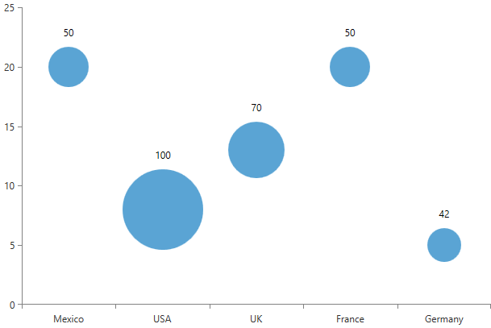
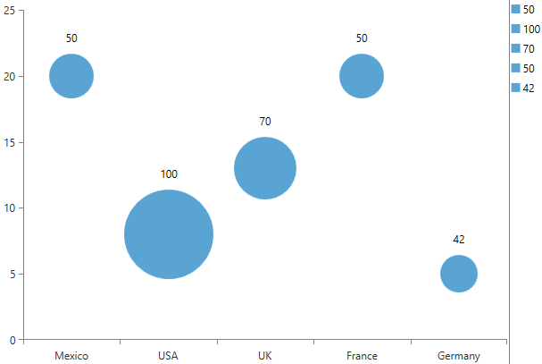
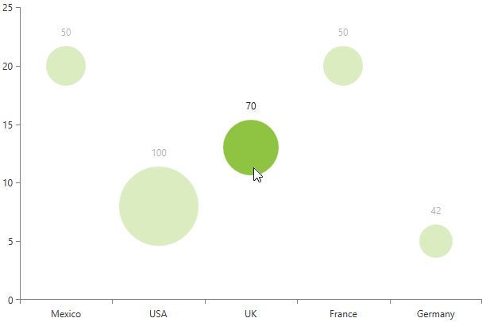

# BubbleSeries

The bubble series is used to visualize three dimensional data. Each entity in the data set is represented by a bubble shape. Two of the data's dimensions determine the bubble's position and the third determines its size.

## Declaratively defined series

You can use the following definition to display a simple BubbleSeries:

#### __XAML__
{{region radchartview-series-bubbleseries-0}}
	<telerik:RadCartesianChart>
		<telerik:RadCartesianChart.HorizontalAxis>
			<telerik:CategoricalAxis />
		</telerik:RadCartesianChart.HorizontalAxis>
		<telerik:RadCartesianChart.VerticalAxis>
			<telerik:LinearAxis />
		</telerik:RadCartesianChart.VerticalAxis>
		<telerik:RadCartesianChart.Series>
			<telerik:BubbleSeries ShowLabels="True">
				<telerik:BubbleSeries.DataPoints>
					<telerik:BubbleDataPoint BubbleSize="50" Category="Mexico" Value="20" />
					<telerik:BubbleDataPoint BubbleSize="100" Category="USA" Value="8" />
					<telerik:BubbleDataPoint BubbleSize="70" Category="UK" Value="13" />
					<telerik:BubbleDataPoint BubbleSize="50" Category="France" Value="20" />
					<telerik:BubbleDataPoint BubbleSize="42" Category="Germany" Value="5" />
				</telerik:BubbleSeries.DataPoints>
			</telerik:BubbleSeries>
		</telerik:RadCartesianChart.Series>
	</telerik:RadCartesianChart>
{{endregion}}

The following image demonstrates the end result:

## Data bound series

You can use the ValueBinding, CategoryBinding and the BubbleSizeBinding properties of the BubbleSeries to bind the DataPoints’ properties to the properties from your view models.

#### __C#__
{{region radchartview-series-bubbleseries-1}}
	public class PlotInfo
	{
		public string XCat { get; set; }
		public int YVal { get; set; }
		public double Size { get; set; }
	}

	//.......
	this.DataContext = new ObservableCollection<PlotInfo>
	{
		new PlotInfo { XCat = "France", YVal = 20, Size = 50, },
		//....
	};
{{endregion}}
	
#### __XAML__
{{region radchartview-series-bubbleseries-2}}
	<telerik:BubbleSeries ValueBinding="YVal"  CategoryBinding="XCat" BubbleSizeBinding="Size" ItemsSource="{Binding}"/>
{{endregion}}

>See the [Create Data-Bound Chart]() for more information on data binding in the RadChartView suite

## Features

The series supports all standard features exposed by all other categorical series. However, the specification of the series brings few additional functionalities which are listed below:

* __DataPointLegendSettings__ - the series supports two types of legend settings, the first one is the common SeriesLegendSettings which can be used with all types of series and it maps each legend item to a series. The series supports an additional DataPointLegendSettings which maps the legend items per data point. 

	#### __XAML__
	{{region radchartview-series-bubbleseries-3}}
		<telerik:BubbleSeries.LegendSettings>
			<telerik:DataPointLegendSettings/>
		</telerik:BubbleSeries.LegendSettings>
	{{endregion}}
	
	
	
* __PaletteMode__ – the BubbleSeries supports two modes that determine whether the applied palette should be applied per series or per data point. The mode can be controlled through the PalleteMode property. The modes are called Series and DataPoint.

	The following image demonstrates the DataPoint PaletteMode with the Windows8 palette applied:  
	

	Setting the PaletteMode to Series will apply different color for each series defined in the chart.

* __Hover interactivity__ – RadCartesianChart exposes a property called HoverMode. This property can be used only by the bubble and bar series. If it is set to “FadeOtherSeries”, when you mouse over a data point, the bubbles from all other series will fade out. The default value of the property is “None”.

	#### __XAML__
	{{region radchartview-series-bubbleseries-4}}
		<telerik:RadCartesianChart HoverMode="FadeOtherSeries">
	{{endregion}}
	
	
	
* __BubbleSizeSelector__ – this feature allows you to customize the size of each bubble. The BubbleSeries exposes a __BubbleSizeSelector__ property that accepts a property of type __ChartBubbleSizeSelector__. 

	The size of the bubbles is always determined by the BubbleSizeSelector. By default the series uses the __AbsoluteBubbleSizeSelector__ which returns the BubbleSize value of the data point. There are two built-in size selectors – the __AbsoluteBubbleSizeSelector__ and the __RelativeBubbleSizeSelector__. The absolute selector is simple and it always returns the __BubbleSize__ value. If your business items contain the size in pixels, you can use the default selector. 

	On the other hand the relative size selector is more complex and it takes into account several factors when calculating the bubble size. The selector chooses a size that is relative to the maximum value in the associated series and the maximum allowed size. The maximum size of a bubble depends on the size of the chart and the MaximumSizePercent property of the selector.  By default the value of this property set to 0.2 and the maximum bubble size is 20% of the chart's size. You can adjust the RelativeBubbleSizeSelector by manually set its __MinimumValue__, __MaximumValue__, __MinimumSize__, __MaximumSize__. You can use the __BubbleSizeFunction__ property to specify whether how the value should be mapped - with a __linear function, square root function, logarithmic function or a cubic function__.

## Create a custom bubble size selector

You can customize the BubbleSize of each DataPoint by creating a custom bubble size selector. The selector should derive from the abstract __ChartBubbleSizeSelector__ class which exposes a single abstract method called __SelectBubbleSize__. The method accepts an object of type __IBubbleDataPoint__ and it return the size of the bubble. You can calculate the new size based on the information in the data point object.

The following code snippet demonstrates an example implementation of a bubble size selector:

#### __C#__
{{region radchartview-series-bubbleseries-5}}
    public class CustomBubbleSizeSelector : ChartBubbleSizeSelector
    {
        public static double SelectBubbleSize(double bubbleSize)
        {
            return Math.Abs(bubbleSize) / 1000;
        }

        public override RadSize SelectBubbleSize(IBubbleDataPoint dataPoint)
        {    
            double size = SelectBubbleSize(dataPoint.BubbleSize.Value);                        
            return new RadSize(size, size);
        }
    }
{{endregion}}

#### __XAML__
{{region radchartview-series-bubbleseries-6}}
	<FrameworkElement.Resources>
		<local:CustomBubbleSizeSelector x:Key="CustomBubbleSizeSelector" />
    </FrameworkElement.Resources>
	..........
    <telerik:BubbleSeries BubbleSizeSelector="{StaticResource selector}" >
{{endregion}}

>tip You can find a runnable project demonstrating the BubbleSeries in our [GitHub SDK repository](https://github.com/telerik/xaml-sdk), after navigating to __ChartView/BubbleSeriesAndNegativeValues__

## See Also
 * [Chart Series Overview]()
 * [Create Data-Bound Chart]()
 * [Palettes]() 
 * [RadLegend Support]()
