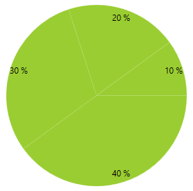
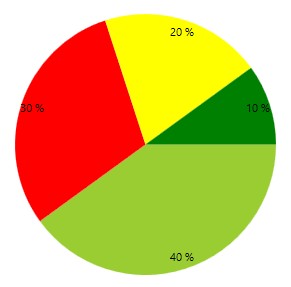
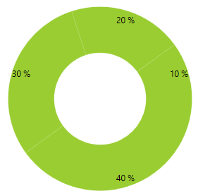
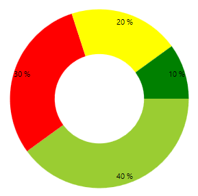

# Customizing PieChart Series

This article demonstrates how you can change the default look of the __RadPieChart__ series.
      

## Customizing Pie Series

### DefaultSliceStyle

This series expose the __DefaultSliceStyle__ property. It is of type __Style__ and determines the appearance of the [Path](http://msdn.microsoft.com/en-us/library/system.windows.shapes.path(v=vs.110).aspx) element used to visualize the __PieSeries__. Your custom style should target the native __Path__ component. You can set the property like this:

#### __XAML__

{{region xaml-radchartview-styles-and-templates-customizing-piechart-series}}
    <telerik:PieSeries.DefaultSliceStyle>
      
    </telerik:PieSeries.DefaultSliceStyle>
{{endregion}}

### SliceStyles

This series also expose the __SliceStyles__ property. It is of type __ObservableCollection
        
        
        
    </telerik:PieSeries.SliceStyles>
{{endregion}}

## Customizing Doughnut Series

### DefaultSliceStyle

This series expose the __DefaultSliceStyle__ property. It is of type __Style__ and determines the appearance of the [Path](http://msdn.microsoft.com/en-us/library/system.windows.shapes.path(v=vs.110).aspx) element used to visualize the __DoughnutSeries__. Your custom style should target the native __Path__ component. You can set the property like this:
            
#### __XAML__

{{region xaml-radchartview-styles-and-templates-customizing-piechart-series}}
    <telerik:DoughnutSeries.DefaultSliceStyle>
      
    </telerik:DoughnutSeries.DefaultSliceStyle>
{{endregion}}

### SliceStyles

This series also expose the __SliceStyles__ property. It is of type __ObservableCollection
      
      
      
    </telerik:DoughnutSeries.SliceStyles>
{{endregion}}

## See Also

 * [Customizing CartesianChart Series]()

 * [Customizing PolarChart Series]()
