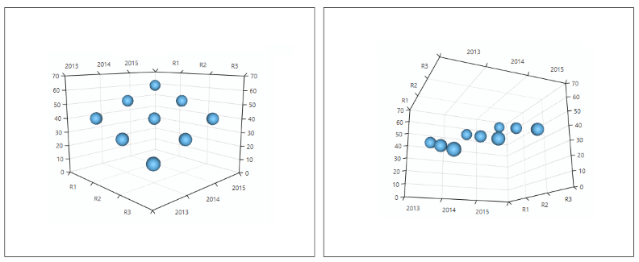
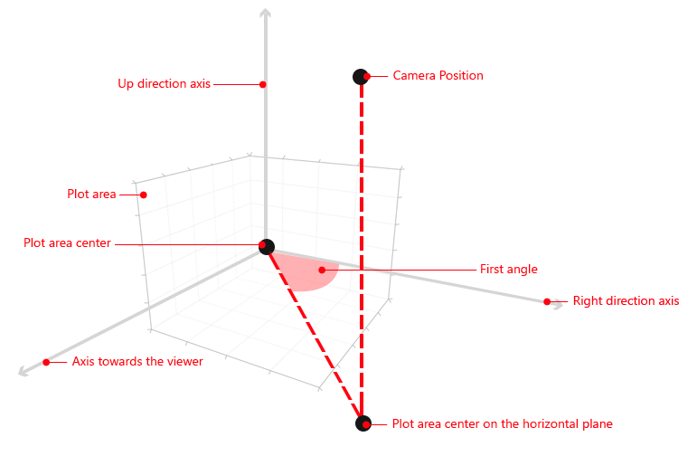
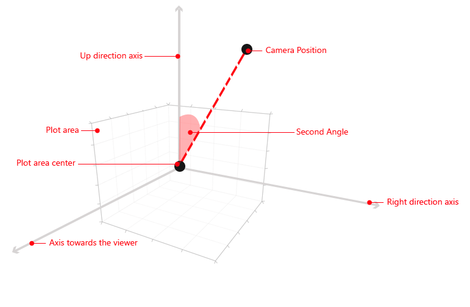
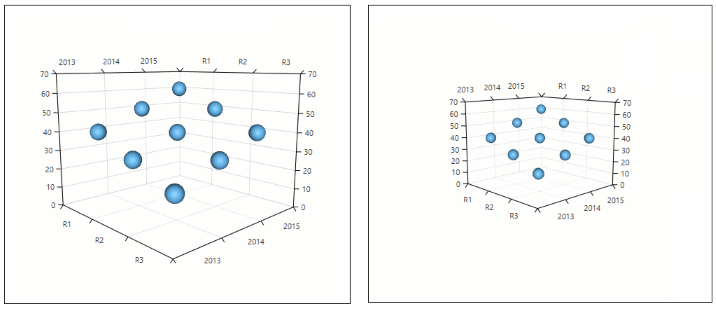
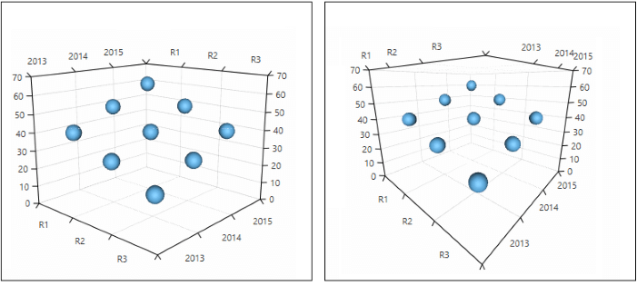

# Camera Behavior

The camera behavior allows you to control the point of view using the input device (mouse or touch). To enable the behavior you can add a __Chart3DCameraBehavior__ object in the __Behaviors__ collection of the __RadCartesianChart3D__ control.

#### __[XAML] Example 1: Defining camera behavior__
{{region radchartview3d-behaviors-camera-0}}
	<telerik:RadCartesianChart3D>
		<telerik:RadCartesianChart3D.Behaviors>
			<telerik:Chart3DCameraBehavior/>
		</telerik:RadCartesianChart3D.Behaviors>	
	</telerik:RadCartesianChart3D>
{{endregion}}

Additionally, you can control the camera manually through the properties of the behavior.
	
* [Rotating the camera](#rotation-the-camera)
* [Changing the camera distance](#changing-the-camera-distance)
* [Changing the field of view angle](#changing-the-field-of-view-angle)
* [Restricting the camera](#restricting-the-camera)

## Rotating the camera

The camera is rotated when you mouse down on the chart and move the mouse. You can use the behavior's __FirstAngle__ and __SecondAngle__ properties to rotate the camera manually.

#### __Figure 1: Rotating the camera__

#### __[XAML] Example 2: Setting the camera angles__
{{region radchartview3d-behaviors-camera-1}}
	<telerik:Chart3DCameraBehavior FirstAngle="300" SecondAngle="80" />
{{endregion}}

__FirstAngle__ is the angle between the axis to the right and the projection of the line between the camera position and the plot area center onto the horizontal plane. The axis to the right is considered to be the one that goes to the right when one axis goes up and another goes toward the viewer. The horizontal plane is considered to be the plane that is defined by the right axis and the axis that goes towards the viewer.

#### __Figure 2: FirstAngle example__

__SecondAngle__ is the angle between the __UpDirection__ axis and the line between the camera position and plot area center.

#### __Figure 3: SecondAngle example__

The camera behavior allows you to define custom key combinations that activate the rotation while dragging. You can do that via the __DragToRotateKeyCombinations__ collection.

#### __[C#] Example 3: Defining drag-to-rotate key combination__
{{region radchartview3d-behaviors-camera-2}}
	ChartKeyCombination keyCombination = new ChartKeyCombination();
	keyCombination.Keys.Add(Key.LeftCtrl);
	keyCombination.MouseButtons.Add(MouseButton.Right);
	cameraBehavior.DragToRotateKeyCombinations.Add(keyCombination);
{{endregion}}

__Example 3__ shows how to set the LeftCtrl and the right mouse button as the key combination that allows rotating the camera. Pressing the LeftCtrl and the mouse right button while moving the mouse will change the rotation angles.

## Changing the camera distance

To change the distance you can use the mouse wheel. You can use the __Distance__ property to control it manually. 

#### __Figure 4: Changing the camera distance__

#### __[XAML] Example 4: Changing the distance__
{{region radchartview3d-behaviors-camera-3}}
	<telerik:Chart3DCameraBehavior Distance="2300" >
{{endregion}}

>The distance has different meaning for different cameras. When a __PerspectiveCamera__ is in use the distance is the radius of the sphere that the camera is positioned on. When an __OrthographicCamera__ is in use the distance is the width of the camera.

## Changing the field of view angle

To change the field of view you can use the combination between the __Shift__ key and __mouse wheel__. You can use the __FieldOfView__ property to change the field of view manually.

>The field of view angle is available only with a __PerspectiveCamera__.

#### __Figure 5: Changing the camera distance__

#### __[XAML] Example 5: Manually setting the field of view__
{{region radchartview3d-behaviors-camera-4}}
	<telerik:Chart3DCameraBehavior FieldOfView="45" >
{{endregion}}
	
The camera behavior allows you to define custom modifier keys that activate the field of view updating on mouse wheel. You can do that via the __FieldOfViewModifierKeys__ collection. The field of view will be updated when at least one of these keys is pressed.

#### __[C#] Example 6: Defining field of view modifier key__
{{region radchartview3d-behaviors-camera-5}}
	cameraBehavior.FieldOfViewModifierKeys.Add(Key.F);
{{endregion}}

__Example 6__ shows how to define the F key as a field of view modifier key. Pressing F and scrolling the mouse wheel will change the field of view angle. 

## Restricting the camera

You can use the __MaxDistance__, __MinDistance__, __MinSecondAngle__, __MaxSecondAngle__ properties to restrict the area that can be observed by the camera.

#### __[XAML] Example 7: Restricting the camera__
{{region radchartview3d-behaviors-camera-6}}
	<telerik:Chart3DCameraBehavior MinDistance="400"
								   MaxDistance="4000"
                                   MinSecondAngle="20"                                               
							       MaxSecondAngle="130" />
{{endregion}}

## Up direction

The up direction of the camera is defined by the __UpDirection__ property which is a __3D Vector__. The default up direction is the Z axis.

## Lights

When the camera behavior is enabled the lights direction is determined by the camera position. So, when you rotate the camera the lights will also be rotated accordingly to the camera. This behavior can be toggled via the __CameraBehavior3D.IsRotationEnabled__ attached property. Its default value is __True__. To avoid rotating the light you can set it to __False__. This is useful when you want to have static lights that illuminate the scene.

#### __[XAML] Example 8: Disabling the automatic rotation of a light in XAML__
{{region xaml-radchartview-behaviors-camera-7}}
	<telerik:RadCartesianChart3D.Lights>
		<DirectionalLight telerik:Chart3DCameraBehavior.IsRotationEnabled="False" />
	</telerik:RadCartesianChart3D.Lights>
{{endregion}}

#### __[C#] Example 9: Disabling the automatic rotation of a light in code__
{{region cs-radchartview-behaviors-camera-8}}
	Chart3DCameraBehavior.SetIsRotationEnabled(light, false);	
{{endregion}}

## See Also

* [Getting Started]()
* [Tooltip Behavior]()
* [Camera]()