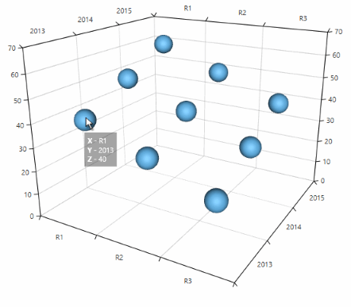

# Tooltip Behavior

The tooltip behavior visualizes arbitrary information related to a data point. When the behavior is enabled, a tooltip is displayed on mouse over a data point. The tooltip contains information about the hovered data point.

To enable the tooltip behavior you can add a __Chart3DTooltipBehavior__ object in the __Behaviors__ collection of the __RadCartesianChart3D__ control.

#### __[XAML] Example 1: Defining tooltip behavior__
{{region radchartview3d-behaviors-tooltip-0}}
	<telerik:RadCartesianChart3D>
		<telerik:RadCartesianChart3D.Behaviors>
			<telerik:Chart3DTooltipBehavior/>
		</telerik:RadCartesianChart3D.Behaviors>	
	</telerik:RadCartesianChart3D>
{{endregion}}
	
#### __Figure 1: Tooltip__

## Customizing the tooltip

You can customize the appearance of the tooltip via the __ToolTipTemplate__ property. Both the chart and the series have this property.

You can use the ToolTipTemplate property of the chart to define a global template for all series. To define a template specific for a series you can use the series' ToolTipTemplate property.

>In the context of the series the ToolTipTemplate property of the series has bigger priority than the chart’s ToolTipTemplate.

#### __[XAML] Example 2: Defining tooltip template__
{{region radchartview3d-behaviors-tooltip-1}}
	<telerik:PointSeries3D>
		<telerik:PointSeries3D.TooltipTemplate>
			<DataTemplate>
				<Border Background="#5A000000" Padding="5" TextElement.Foreground="White">      
					<StackPanel>
						<StackPanel Orientation="Horizontal">        
							<TextBlock Text="X - " FontWeight="Bold" />
							<TextBlock Text="{Binding XValue}"  />
						</StackPanel>
						<StackPanel Orientation="Horizontal">
							<TextBlock Text="Y - " FontWeight="Bold" />
							<TextBlock Text="{Binding YValue}"  />
						</StackPanel>
						<StackPanel Orientation="Horizontal">
							<TextBlock Text="Z - " FontWeight="Bold" />
							<TextBlock Text="{Binding ZValue}"  />
						</StackPanel>
					</StackPanel>
				</Border>                            
			</DataTemplate>
		</telerik:PointSeries3D.TooltipTemplate>
	</telerik:PointSeries3D>
{{endregion}}

#### __Figure 2: Tooltip template__

	
The data context passed in the template is an object of type __XyzDataPoint3D__. The object contains information about the data point positioned under the mouse. You can use the XyzDataPoint3D's __DataItem__ property to get the view model of the data point and display custom information about it. 
	
The behavior gives you additional control over the displayed tooltip via several properties:

* __ShowDuration__
* __InitialShowDelay__
* __Placement__ 
* __PlacementRectangle__
* __PlacementTarget__ 
* __HorizontalOffset__ 
* __VerticalOffset__

## See Also

* [Getting Started]()
* [Camera Behavior]()
* [Axes]()