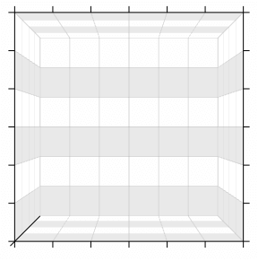
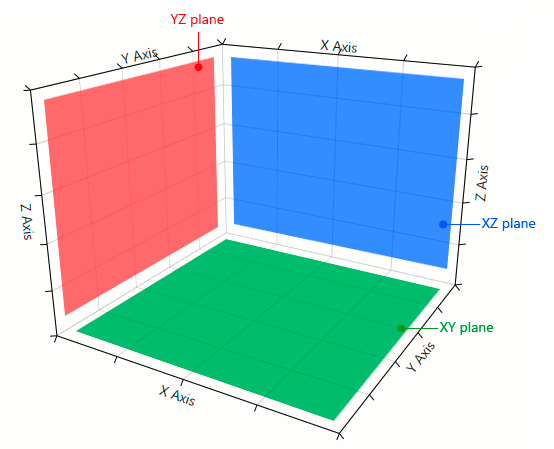
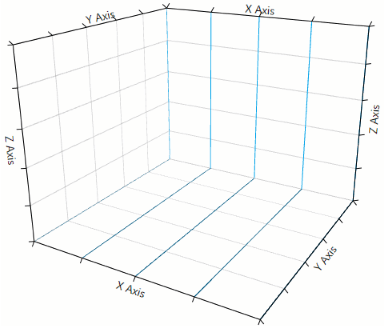
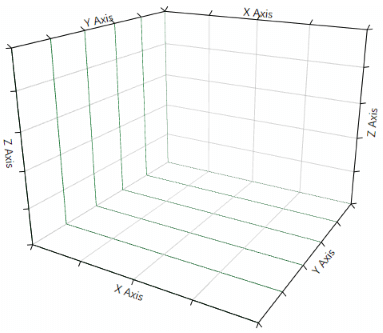
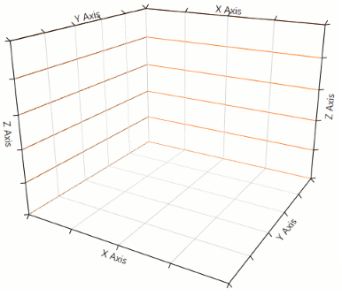

# CartesianChart3DGrid

__CartesianChart3DGrid__ is used to decorate the 3D Cartesian chart with grid lines and strip lines placed over the planes (sides) of the plot area.

#### __Figure 1: CartesianChart3DGrid__

## Setting up the grid

To enable the grid, set the __Grid__ property of the __RadCartesianChart3D__ control to an instance of the __CartesianChart3DGrid__ class (see __Example 1__). 

#### __[XAML] Example 1: Setting up the grid__  
{{region xaml-radchartview-3d-chartgrid-0}}
	<telerik:RadCartesianChart3D.Grid>
		<telerik:CartesianChart3DGrid/>
	</telerik:RadCartesianChart3D.Grid>
{{endregion}}

#### __Figure 2: Grid lines__

> By default only the grid lines of the plot area planes are displayed. The strip lines are not shown. 

## Setting up the grid and strip lines

__CartesianChart3DGrid__ allows you to specify the visibility of the grid lines and strip lines of each plane. You can also set their materials and the stroke thickness of the grid lines.

#### __Figure 3: Plot area planes__

To set the visibility of the grid and strip lines you can use the following properties.

* __XYGridLinesVisibility__ and __XYStripLinesVisibility__ for the lines in the XY plane.
* __XZGridLinesVisibility__ and __XZStripLinesVisibility__ for the lines in the XZ plane.
* __YZGridLinesVisibility__ and __YZStripLinesVisibility__ for the lines in the YZ plane.

#### __[XAML] Example 2: Setting lines visibility__  
{{region xaml-radchartview-3d-chartgrid-1}}
		<telerik:CartesianChart3DGrid XZGridLinesVisibility="All" 
									  YZGridLinesVisibility="All"
									  XYGridLinesVisibility="All"
									  XYStripLinesVisibility="All"
									  XZStripLinesVisibility="All"
									  YZStripLinesVisibility="All">
{{endregion}}

## Customizing the grid and strip lines

__CartesianChart3DGrid__ allows you to define custom materials for the grid and strip lines. Also, you can set the stroke thickness of the grid lines.

To set the stroke thickness of the grid lines you can use the __GridLineThickness__ property.

#### __[XAML] Example 3: Setting line stroke thickness__  
{{region xaml-radchartview-3d-chartgrid-3}}
	<telerik:CartesianChart3DGrid GridLineThickness="5" />
{{endregion}}

You can set the material (brush) of the the lines using the following properties.

* __XGridLinesMaterials__ and __XStripLinesMaterials__ for the lines that originate from the X axis.
* __YGridLinesMaterials__ and __YStripLinesMaterials__ for the lines that originate from the Y axis.
* __ZGridLinesMaterials__ and __ZStripLinesMaterials__ for the lines that originate from the Z axis.

#### __[XAML] Example 4: Setting X grid lines material__
{{region xaml-radchartview-3d-chartgrid-2}}
	<telerik:CartesianChart3DGrid>
		<telerik:CartesianChart3DGrid.XGridLinesMaterials>
			<MaterialCollection>
				<DiffuseMaterial Brush="#00A2E8" />
			 </MaterialCollection>
		</telerik:CartesianChart3DGrid.XGridLinesMaterials>			
	</telerik:CartesianChart3DGrid>
{{endregion}}

#### __Figure 4: Colored grid lines__

#### __[XAML] Example 5: Setting Y grid lines material__
{{region xaml-radchartview-3d-chartgrid-3}}
	<telerik:CartesianChart3DGrid>			
		<telerik:CartesianChart3DGrid.YGridLinesMaterials>
			<MaterialCollection>
				<DiffuseMaterial Brush="#22B14C" />
			</MaterialCollection>
		</telerik:CartesianChart3DGrid.YGridLinesMaterials>
	</telerik:CartesianChart3DGrid>
{{endregion}}

#### __Figure 5: Colored grid lines__

#### __[XAML] Example 6: Setting Z grid lines material__
{{region xaml-radchartview-3d-chartgrid-4}}
	<telerik:CartesianChart3DGrid>			
		<telerik:CartesianChart3DGrid.ZGridLinesMaterials>
			<MaterialCollection>
				<DiffuseMaterial Brush="#FF7F27" />
			 </MaterialCollection>
		</telerik:CartesianChart3DGrid.ZGridLinesMaterials>
	</telerik:CartesianChart3DGrid>
{{endregion}}

#### __Figure 6: Colored grid lines__

> The strip lines materials are set up using the same manner as in __Examples from 4 to 6__.

## See Also

* [Getting Started]()
* [Camera Behavior]()
* [Axes]()