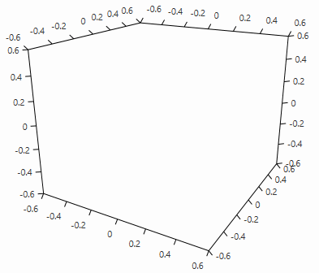
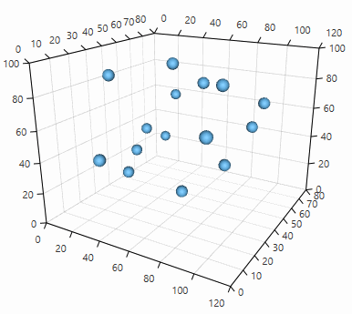

## Getting Started with {{ site.framework_name }} ChartView3D

This article will walk you through the creation of a sample application that contains a __RadCartesianChart3D__ component.

* [Assembly References](#assembly-references)
* [Defining chart and axes](#defining-chart-and-axes)
* [Data binding](#data-binding)
* [Setting chart size](#setting-chart-size)
* [Camera behavior](#camera-behavior)

## Assembly References

In order to use __RadCartesianChart3D__, you will need to add references to the following assemblies:
* __Telerik.Windows.Controls__
* __Telerik.Windows.Controls.Chart__
* __Telerik.Windows.Data__

You can find the required assemblies for each control from the UI for WPF suite in [Controls Dependencies]() help article.

## Defining chart and axes

To display the __RadCartesianChart3D__ you will need to define it along with its axes (see __Example 1__). You can find more information about the chart's axes in the [Axes]() help article.

#### __[XAML] Example 1: Empty RadCartesianChart3D__
{{region radchartview3d-getting-started-0}}
	<telerik:RadCartesianChart3D>
		<telerik:RadCartesianChart3D.XAxis>
			<telerik:LinearAxis3D />
		</telerik:RadCartesianChart3D.XAxis>
		<telerik:RadCartesianChart3D.ZAxis>
			<telerik:LinearAxis3D />
		</telerik:RadCartesianChart3D.ZAxis>
		<telerik:RadCartesianChart3D.YAxis>
			<telerik:LinearAxis3D />
		</telerik:RadCartesianChart3D.YAxis>
	</telerik:RadCartesianChart3D>	
{{endregion}}
	
At this point the viewport of the chart is rendered.

#### __Figure 1: Empty chart__

## Defining chart series

The data in the chart is presented with the chart series objects. You can find more information about this in the [Series]() section of the help documentation.

#### __[XAML] Example 2: Defining series__
{{region radchartview3d-getting-started-1}}
	<telerik:RadCartesianChart3D>
		<telerik:RadCartesianChart3D.XAxis>
			<telerik:LinearAxis3D />
		</telerik:RadCartesianChart3D.XAxis>
		<telerik:RadCartesianChart3D.ZAxis>
			<telerik:LinearAxis3D />
		</telerik:RadCartesianChart3D.ZAxis>
		<telerik:RadCartesianChart3D.YAxis>
			<telerik:LinearAxis3D />
		</telerik:RadCartesianChart3D.YAxis>
		<telerik:RadCartesianChart3D.Series>
			<telerik:PointSeries3D PointSize="60 60 60">
				<telerik:PointSeries3D.DataPoints>
					<telerik:XyzDataPoint3D XValue="66" YValue="48" ZValue="81" />
					<telerik:XyzDataPoint3D XValue="94" YValue="15" ZValue="67" />
					<telerik:XyzDataPoint3D XValue="26" YValue="32" ZValue="21" />
					<telerik:XyzDataPoint3D XValue="25" YValue="72" ZValue="59" />
					<telerik:XyzDataPoint3D XValue="15" YValue="73" ZValue="24" />
					<telerik:XyzDataPoint3D XValue="65" YValue="32" ZValue="17" />
					<telerik:XyzDataPoint3D XValue="20" YValue="44" ZValue="29" />
					<telerik:XyzDataPoint3D XValue="31" YValue="10" ZValue="43" />
					<telerik:XyzDataPoint3D XValue="17" YValue="55" ZValue="39" />
					<telerik:XyzDataPoint3D XValue="52" YValue="40" ZValue="94" />
					<telerik:XyzDataPoint3D XValue="98" YValue="60" ZValue="68" />
					<telerik:XyzDataPoint3D XValue="87" YValue="40" ZValue="35" />
					<telerik:XyzDataPoint3D XValue="20" YValue="27" ZValue="87" />
					<telerik:XyzDataPoint3D XValue="88" YValue="35" ZValue="87" />
					<telerik:XyzDataPoint3D XValue="91" YValue="60" ZValue="51" />
				</telerik:PointSeries3D.DataPoints>
			</telerik:PointSeries3D>
		</telerik:RadCartesianChart3D.Series>
	</telerik:RadCartesianChart3D>
{{endregion}}

#### __Figure 2: PointSeries3D__
	

For precisely reading the elements in the 3D space you can enable the chart's grid. You can read more about this in the [Chart Grid]() help article.

#### __[XAML] Example 3: Adding chart grid__  
{{region radchartview3d-getting-started-2}}
	<telerik:RadCartesianChart3D.Grid>
		<telerik:CartesianChart3DGrid />                    
	</telerik:RadCartesianChart3D.Grid>
{{endregion}}

#### __Figure 3: Chart grid__

## Data binding

This section demonstrates how to setup the chart from __Example 1__, but in a data binding scenario. 

#### __[C#] Example 4: Define the data points model__  
{{region radchartview3d-getting-started-3}}
	public class PlotInfo
	{
		public double XValue { get; set; }
		public double YValue { get; set; }
		public double ZValue { get; set; }
	}
{{endregion}}

#### __[C#] Example 5: Set up the DataContext of the view__
{{region radchartview3d-getting-started-4}}  
	var source = new ObservableCollection<PlotInfo>()
	{
		new PlotInfo() { XValue = 66, YValue = 48, ZValue = 81 },
		new PlotInfo() { XValue = 94, YValue = 15, ZValue = 67 },
		new PlotInfo() { XValue = 26, YValue = 32, ZValue = 21 },
		new PlotInfo() { XValue = 25, YValue = 72, ZValue = 59 },
		new PlotInfo() { XValue = 15, YValue = 73, ZValue = 24 },
		new PlotInfo() { XValue = 65, YValue = 32, ZValue = 17 },
		new PlotInfo() { XValue = 20, YValue = 44, ZValue = 29 },
		new PlotInfo() { XValue = 31, YValue = 10, ZValue = 43 },
		new PlotInfo() { XValue = 17, YValue = 55, ZValue = 39 },
		new PlotInfo() { XValue = 52, YValue = 40, ZValue = 94 },
		new PlotInfo() { XValue = 98, YValue = 60, ZValue = 68 },
		new PlotInfo() { XValue = 87, YValue = 40, ZValue = 35 },
		new PlotInfo() { XValue = 20, YValue = 27, ZValue = 87 },
		new PlotInfo() { XValue = 88, YValue = 35, ZValue = 87 },
		new PlotInfo() { XValue = 91, YValue = 60, ZValue = 51 },
	};
	
	this.series.DataContext = source;
{{endregion}}

#### __[XAML] Example 6: Set up the view__  
{{region radchartview3d-getting-started-5}}
	<telerik:RadCartesianChart3D>
		<telerik:RadCartesianChart3D.XAxis>
			<telerik:LinearAxis3D />
		</telerik:RadCartesianChart3D.XAxis>
		<telerik:RadCartesianChart3D.ZAxis>
			<telerik:LinearAxis3D />
		</telerik:RadCartesianChart3D.ZAxis>
		<telerik:RadCartesianChart3D.YAxis>
			<telerik:LinearAxis3D />
		</telerik:RadCartesianChart3D.YAxis>		
		<telerik:RadCartesianChart3D.Grid>
			<telerik:CartesianChart3DGrid />                    
		</telerik:RadCartesianChart3D.Grid>		
		<telerik:RadCartesianChart3D.Series>                
			<telerik:PointSeries3D x:Name="series" 
								   PointSize="60 60 60"                                        
								   XValueBinding="XValue"
								   YValueBinding="YValue"
								   ZValueBinding="ZValue"
								   ItemsSource="{Binding}"/>
		</telerik:RadCartesianChart3D.Series>
	</telerik:RadCartesianChart3D>
{{endregion}}

## Setting chart size

The size of the chart's plot area can be changed via the __PlotAreaSize__ property of the chart. The property is of type System.Windows.Media.Media3D.__Size3D__, thus allowing you to set all 3 dimensions of the area. 

#### __[XAML] Example 7: Setting PlotAreaSize__  
{{region radchartview3d-getting-started-6}}
	<telerik:RadCartesianChart3D PlotAreaSize="500, 500, 500"/>
{{endregion}}

The default size is X=1000, Y=1000, Z=800

> The plot area is the space locked between the axes, where the series are drawn.

## Camera behavior

In order to interact with the chart's scene you can use the __Chart3DCameraBehavior__. You can find more information about this in the [Camera Behavior]() article.

#### __[XAML] Example 8: Defining camera behavior__  
{{region radchartview3d-getting-started-7}}
	<telerik:RadCartesianChart3D.Behaviors>
		<telerik:Chart3DCameraBehavior />
	</telerik:RadCartesianChart3D.Behaviors>
{{endregion}}

## See Also

* [Camera Behavior]()
* [Axes]()
* [3D Chart Grid]()
* [PointSeries3D]()
* [BarSeries3D]()
* [SurfaceSeries3D]()
