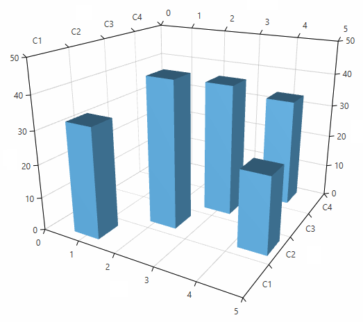

# Data Binding

This article explains how to bind a 3D chart series to a collection of business objects. To data bound the series you can use its __ItemsSource__ property. The property is of type __IEnumerable__ so you can use most collection types. 

The chart creates a __DataPoint3D__ model for each business object in the ItemsSource collection. To map the properties of the business object to the DataPoint3D you can use the series value binding properties.

* __XValueBinding__: The binding that will be used to fill the data point model XValue property.
* __YValueBinding__: The binding that will be used to fill the data point model YValue property.
* __ZValueBinding__: The binding that will be used to fill the data point model ZValue property.

The properties are of type __DataPointBinding__ which is an abstract class that has two implementations - __PropertyNameDataPointBinding__ and __GenericDataPointBinding__.

The __PropertyNameDataPointBinding__ expect a path (name) to a property in the business object of the data point. The binding class  obtains the property using reflection, gets the corresponding value and assigns it to the data point model. This type of binding is used when you set the value binding properties in XAML.

#### __[C#] Example 1: Using PropertyNameDataPointBinding__
{{region cs-radchartview3d-populating-data-databinding-0}}
	chartSeries3D.XValueBinding = new PropertyNameDataPointBinding("MyXValue");
{{endregion}}

#### __[XAML] Example 2: Setting PropertyNameDataPointBinding in XAML__
{{region xaml-radchartview3d-populating-data-databinding-1}}
	<telerik:BarSeries3D XValueBinding="MyXValue"/>
{{endregion}}

The __GenericDataPointBinding&lt;TElement, TResult&gt;__ expects a function that selects a value from the business object. Then it sets this value to the corresponding property of the data point model. This type of binding can be used only in code. 

#### __[C#] Example 3: Using GenericDataPointBinding__
{{region cs-radchartview3d-populating-data-databinding-2}}
	chartSeries3D.XValueBinding = new GenericDataPointBinding<MyBusinessObject, double>()
	{
		ValueSelector = x => x.MyXValue
	};
{{endregion}}
	
In summary, to bind data to a 3D chart series, you will need to set 4 properties - __YValueBinding, XValueBinding, ZValueBinding and ItemsSource__.

#### __[XAML] Example 4: Setting binding properties in XAML__
{{region xaml-radchartview3d-populating-data-databinding-3}}
	<telerik:BarSeries3D XValueBinding="MyXValue" 
                         YValueBinding="MyYValue" 
                         ZValueBinding="MyZValue" 
                         ItemsSource="{Binding MyBusinessObjects}"/>
{{endregion}}

## Complete Example

This section contains a complete data binding example.

#### __[C#] Step 1: Create the business object for the data point__
{{region cs-radchartview3d-populating-data-databinding-4}}
	public class MyBusinessObject
	{
		public double XValue { get; set; }
		public string YValue { get; set; }
		public double ZValue { get; set; }
	}
{{endregion}}

#### __[XAML] Step 2: Set up the chart in XAML__
{{region xaml-radchartview3d-populating-data-databinding-5}}
	<telerik:RadCartesianChart3D x:Name="chart">
		<telerik:RadCartesianChart3D.XAxis>
			<telerik:LinearAxis3D />
		</telerik:RadCartesianChart3D.XAxis>
		<telerik:RadCartesianChart3D.YAxis>
			<telerik:CategoricalAxis3D />
		</telerik:RadCartesianChart3D.YAxis>
		<telerik:RadCartesianChart3D.ZAxis>
			<telerik:LinearAxis3D />
		</telerik:RadCartesianChart3D.ZAxis>
		<telerik:RadCartesianChart3D.Grid>
			<telerik:CartesianChart3DGrid />
		</telerik:RadCartesianChart3D.Grid>
		
		<telerik:RadCartesianChart3D.Series>                
			<telerik:BarSeries3D XValueBinding="XValue" 
								 YValueBinding="YValue" 
								 ZValueBinding="ZValue" 
								 ItemsSource="{Binding}"/>
		</telerik:RadCartesianChart3D.Series>
	</telerik:RadCartesianChart3D>
{{endregion}}

#### __[C#] Step 3: Create a new collection and assing it to the DataContext of the chart__
{{region cs-radchartview3d-populating-data-databinding-6}}
	var source = new ObservableCollection<MyBusinessObject>();
	source.Add(new MyBusinessObject() { XValue = 1, YValue = "C1", ZValue = 33 });
	source.Add(new MyBusinessObject() { XValue = 2.23, YValue = "C2", ZValue = 44 });
	source.Add(new MyBusinessObject() { XValue = 3, YValue = "C3", ZValue = 40 });
	source.Add(new MyBusinessObject() { XValue = 4, YValue = "C4", ZValue = 33 });
	source.Add(new MyBusinessObject() { XValue = 4.5, YValue = "C2", ZValue = 23 });

	chart.DataContext = source;
{{endregion}}
	
#### __Figure 1: Data bound BarSeris3D__

	
## See Also

* [Getting Started]()
* [Sampling]()
* [Chart Grid]()
* [Camera Behavior]()
* [BarSeries3D]()
