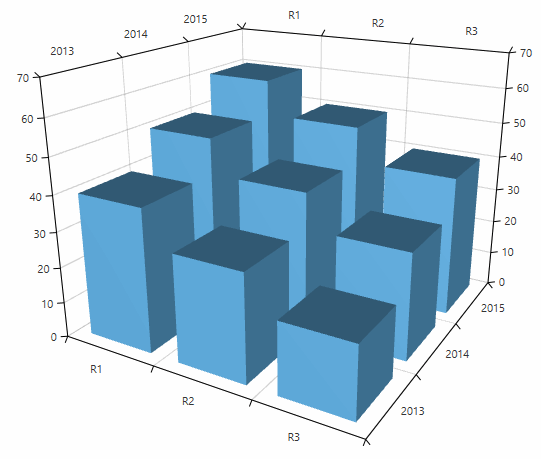

# BarSeries3D

The bar series visualizes three dimensional data represented by 3D bars. Each data point defines a bar that is constructed by X, Z and Y values determining its position in the plot area. 

* [Declaratively defined series](#declaratively-defined-series)
* [Data bound series](#data-bound-series)
* [Display direction](#display-direction)
* [Customizing the data point visuals](#customizing-the-data-point-visuals)

## Declaratively defined series

You can use the code from __Example 1__ to create a __BarSeries3D__. 

#### __[XAML] Example 1: Defining series in XAML__	
{{region radchartview3d-series-barseries3d-0}}
	<telerik:RadCartesianChart3D>
		<telerik:RadCartesianChart3D.XAxis>
			<telerik:CategoricalAxis3D />
		</telerik:RadCartesianChart3D.XAxis>
		<telerik:RadCartesianChart3D.YAxis>
			<telerik:CategoricalAxis3D />
		</telerik:RadCartesianChart3D.YAxis>
		<telerik:RadCartesianChart3D.ZAxis>
			<telerik:LinearAxis3D />
		</telerik:RadCartesianChart3D.ZAxis>
		<telerik:RadCartesianChart3D.Series>
			<telerik:BarSeries3D>
				<telerik:BarSeries3D.DataPoints>
					<telerik:XyzDataPoint3D XValue="R1" YValue="2013" ZValue="40" />
					<telerik:XyzDataPoint3D XValue="R1" YValue="2014" ZValue="50" />
					<telerik:XyzDataPoint3D XValue="R1" YValue="2015" ZValue="60" />
					<telerik:XyzDataPoint3D XValue="R2" YValue="2013" ZValue="30" />
					<telerik:XyzDataPoint3D XValue="R2" YValue="2014" ZValue="40" />
					<telerik:XyzDataPoint3D XValue="R2" YValue="2015" ZValue="50" />
					<telerik:XyzDataPoint3D XValue="R3" YValue="2013" ZValue="20" />
					<telerik:XyzDataPoint3D XValue="R3" YValue="2014" ZValue="30" />
					<telerik:XyzDataPoint3D XValue="R3" YValue="2015" ZValue="40" />
				</telerik:BarSeries3D.DataPoints>
			</telerik:BarSeries3D>
		</telerik:RadCartesianChart3D.Series>
		<telerik:RadCartesianChart3D.Grid>
			<telerik:CartesianChart3DGrid />
		</telerik:RadCartesianChart3D.Grid>
	</telerik:RadCartesianChart3D>
{{endregion}}
	
#### __Figure 1: BarSeries3D__

## Data bound series

You can use the __XValueBinding__, __YValueBinding__ and __ZValueBinding__ properties of __BarSeries3D__ to bind the __XyzDataPoints__’ properties to the properties of the view models. The __ItemsSource__ property is used to pass the data collection to the series.

#### __[C#] Example 2: Defining a model for the data points and setting up the data context__
{{region radchartview3d-series-barseries3d-1}}
	public class PlotInfo
	{
		public double XValue { get; set; }
		public double YValue { get; set; }
		public double ZValue { get; set; }
	}

	//.......
	this.DataContext = new ObservableCollection<PlotInfo>
	{
		new PlotInfo { XValue = 10, YValue = 20, ZValue = 150, },
		//....
	};
{{endregion}}

#### __[XAML] Example 3: Setting up the series__
{{region radchartview3d-series-barseries3d-2}}
	<telerik:BarSeries3D XValueBinding="XValue"  YValueBinding="YValue" ZValueBinding=”ZValue” ItemsSource="{Binding}"/>
{{endregion}}
	
## Display direction

The display direction of the series specifies which axis determines the start (origin) and end of the bars. The bar is drawn from the origin value to the value of the bar on the corresponding axis (the display direction). The direction is defined via the __DisplayDirection__ property which is of type __Axis3DType?__ and it accepts the following values – __X__, __Y__ and __Z__. The default display direction of BarSeries3D is __Z__.

You can use the __OriginValue__ property to define the origin of the bars on the corresponding axis determined by the __DisplayDirection__ property. The default origin value is __0__.

#### __[XAML] Example 4: Setting the origin value__
{{region radchartview3d-series-barseries3d-3}}
	<telerik:BarSeries3D OriginValue="15">
{{endregion}}

__Figure 2__ demonstrates the result from __Example 1__ but with its OriginValue set to 15.
	
#### __Figure 2: Origin value__

## Customizing the data point visuals

The visual elements that present the __BarSeries3D__ data points can be customized through the __DefaultVisualMaterial__ and __DefaultVisualGeometry__ properties of the series. Additionally, you can use the __DefaultVisualMaterialSelector__ and __DefaultVisualGeometrySelector__ to choose different materials and geometries based on a specific condition.
 
>For more information, see the [Customizing Cartesian Chart 3D Series]() help article.

## See Also

* [Getting Started]()
* [Camera Behavior]()
* [Axes]()
* [PointSeries3D]()
* [SurfaceSeries3D]()
* [Customizing 3D Series]()
