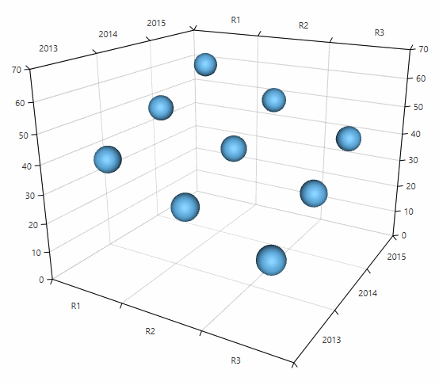

# PointSeries3D

The point series visualizes three dimensional data represented by ellipsoid shapes (spheres by default). Each data point is defined by X, Z and Y values which determines its position in the plot area. The size of the shapes is defined via the __PointSize__ property of the series.

## Declaratively defined series

You can use the code from __Example 1__ to create a __PointSeries3D__. 

#### __[XAML] Example 1: Defining series in XAML__	
{{region radchartview3d-series-pointseries3d-0}}
	<telerik:RadCartesianChart3D>
		<telerik:RadCartesianChart3D.XAxis>
			<telerik:CategoricalAxis3D />
		</telerik:RadCartesianChart3D.XAxis>
		<telerik:RadCartesianChart3D.YAxis>
			<telerik:CategoricalAxis3D />
		</telerik:RadCartesianChart3D.YAxis>
		<telerik:RadCartesianChart3D.ZAxis>
			<telerik:LinearAxis3D />
		</telerik:RadCartesianChart3D.ZAxis>
		<telerik:RadCartesianChart3D.Series>
			<telerik:PointSeries3D PointSize="100 100 100">
				<telerik:PointSeries3D.DataPoints>
					<telerik:XyzDataPoint3D XValue="R1" YValue="2013" ZValue="40" />
					<telerik:XyzDataPoint3D XValue="R1" YValue="2014" ZValue="50" />
					<telerik:XyzDataPoint3D XValue="R1" YValue="2015" ZValue="60" />
					<telerik:XyzDataPoint3D XValue="R2" YValue="2013" ZValue="30" />
					<telerik:XyzDataPoint3D XValue="R2" YValue="2014" ZValue="40" />
					<telerik:XyzDataPoint3D XValue="R2" YValue="2015" ZValue="50" />
					<telerik:XyzDataPoint3D XValue="R3" YValue="2013" ZValue="20" />
					<telerik:XyzDataPoint3D XValue="R3" YValue="2014" ZValue="30" />
					<telerik:XyzDataPoint3D XValue="R3" YValue="2015" ZValue="40" />
				</telerik:PointSeries3D.DataPoints>
			</telerik:PointSeries3D>
		</telerik:RadCartesianChart3D.Series>
		<telerik:RadCartesianChart3D.Grid>
			<telerik:CartesianChart3DGrid />
		</telerik:RadCartesianChart3D.Grid>
	</telerik:RadCartesianChart3D>
{{endregion}}
	
#### __Figure 1: PointSeries3D__

## Data bound series

You can use the __XValueBinding__, __YValueBinding__ and __ZValueBinding__ properties of __PointSeries3D__ to bind the __XyzDataPoints__’ properties to the properties of the view models. The __ItemsSource__ property is used to pass the data collection to the series.

#### __[C#] Example 2: Defining a model for the data points and setting up the data context__
{{region radchartview3d-series-pointseries3d-1}}
	public class PlotInfo
	{
		public double XValue { get; set; }
		public double YValue { get; set; }
		public double ZValue { get; set; }
	}

	//.......
	this.DataContext = new ObservableCollection<PlotInfo>
	{
		new PlotInfo { XValue = 10, YValue = 20, ZValue = 150, },
		//....
	};
{{endregion}}

#### __[XAML] Example 3: Setting up the series__
{{region radchartview3d-series-pointseries3d-2}}
	<telerik:PointSeries3D XValueBinding="XValue"  YValueBinding="YValue" ZValueBinding=”ZValue” ItemsSource="{Binding}"/>
{{endregion}}

## Customizing the data point visuals

You can change the size of the data points using the __PointSize__ property.

#### __[XAML] Example 4: Setting point size in XAML__  
{{region radchartview3d-series-pointseries3d-3}}
	<telerik:PointSeries3D PointSize="60 60 60">
{{endregion}}

#### __[C#] Example 5: Setting point size in code__  
{{region radchartview3d-series-pointseries3d-4}}
	pointSeries.PointSize = new Size3D(60, 60, 60);
{{endregion}}

The visual elements that represent the __PointSeries3D__ data points can be customized through the __DefaultVisualMaterial__ and __DefaultVisualGeometry__ properties of the series. Additionally, you can use the __DefaultVisualMaterialSelector__ and __DefaultVisualGeometrySelector__ to choose different materials and geometries based on a specific condition.
 
>For more information, see the [Customizing Cartesian Chart 3D Series]() help article.

## See Also

* [Getting Started]()
* [Camera Behavior]()
* [Axes]()
* [SurfaceSeries3D]()
* [BarSeries3D]()
* [Customizing 3D Series]()