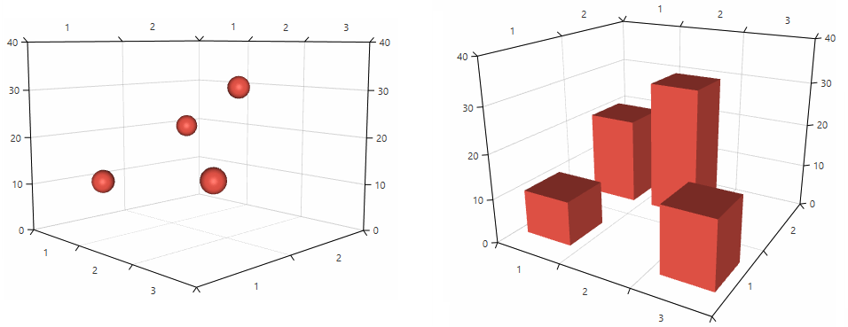
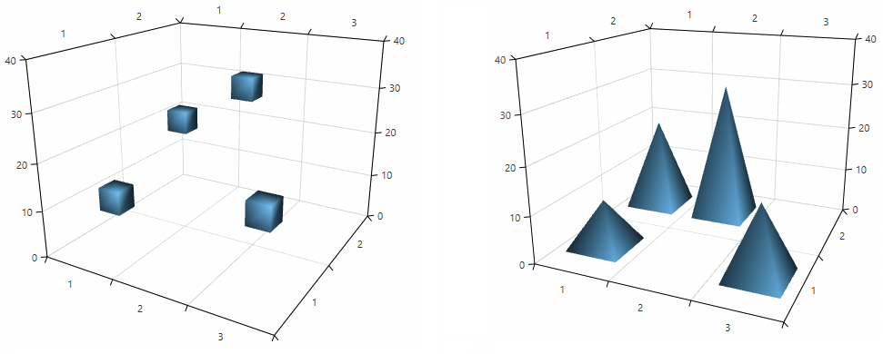

# Customizing Cartesian Chart 3D Series

The 3D series allows you to change the default appearance of their data point visuals. You can define a custom __Material__ (texture) or a custom shape that is described by a __MeshGeometry3D__ object.

>You can find more information about 3D materials and geometries in the [3D Graphics Overview](https://msdn.microsoft.com/en-us/library/ms747437(v=vs.110).aspx) MSDN article.

## Defining a custom material 

The material of a 3D object specifies the brush or the texture that will be applied to it. You can set the material of the series’ data points via the __DefaultVisualMaterial__ property which is of type __System.Windows.Media.Media3D.Material__. You can use any of the material types provided by the WPF framework. 

#### __[XAML] Example 1: Setting default visual material__
{{region radchartview3d-customizing-cartesian-series-0}}
	<telerik:RadCartesianChart3D>          
		<telerik:RadCartesianChart3D.Series>
			<telerik:BarSeries3D>
				<telerik:BarSeries3D.DefaultVisualMaterial>
					<MaterialGroup>
						<DiffuseMaterial Brush="#DD5044"/>
						<SpecularMaterial Brush="#BF444444" SpecularPower="30" />
					</MaterialGroup>
				</telerik:BarSeries3D.DefaultVisualMaterial>
			</telerik:BarSeries3D>
	</telerik:RadCartesianChart3D>
{{endregion}}

#### __Figure 1: BarSeries3D and PointSeries3D with custom material__

## Defining a custom geometry

The geometry of a 3D object describes its shape. You can define a geometry for the series’ data points via the __DefaultVisualGeometry__ property. The property is of type __System.Windows.Media.Media3D.Geometry3D__ and accepts an object of type __MeshGeometry3D__.

#### __[XAML] Example 2: Defining a geometry presenting a cube and applying it to a PointSeries3D__
{{region radchartview3d-customizing-cartesian-series-1}}
	<telerik:PointSeries3D>                    
		<telerik:PointSeries3D.DefaultVisualGeometry>                       
			<MeshGeometry3D Positions="0 0 0  0 0 1  0 1 1  0 1 0 
									   1 1 0  1 1 1  1 0 1  1 0 0"						
							TriangleIndices="0 1 2  0 2 3  
											 2 5 3  3 5 4  
											 4 5 7  7 5 6  
											 0 7 6  0 6 1  
											 0 3 7  3 4 7
											 2 1 6  5 2 6"/>
		</telerik:PointSeries3D.DefaultVisualGeometry> 
	</telerik:PointSeries3D> 
{{endregion}}
	
#### __[XAML] Example 3: Defining a geometry presenting a pyramid and applying it to a BarSeries3D__
{{region radchartview3d-customizing-cartesian-series-2}}
	<telerik:BarSeries3D.DefaultVisualGeometry>                      
		<MeshGeometry3D Positions="0 0 0  0 1 0  1 1 0  1 0 0  0.5 0.5 1"
						TriangleIndices="2 0 1  0 2 3
										 2 1 4  0 4 1  
										 0 3 4  2 4 3"/>
	</telerik:BarSeries3D.DefaultVisualGeometry>
{{endregion}}
	
> The __Positions__ are defined in relative units between 0 and 1, according to the bounds of the data point visual.

#### __Figure 2: BarSeries3D and PointSeries3D with custom geometries__

	
## Geometry and material selectors

The chart allows you to choose different geometries and materials for each data point based on its model.

You can use the __DefaultVisualMaterialSelector__ property to set a material selector and choose material dynamically.

#### __[C#] Example 4: Implementing material selector__
{{region radchartview3d-customizing-cartesian-series-3}}
	public class MyDefaultVisualMaterialSelector : MaterialSelector
	{
		public Material MaterialA { get; set; }
		public Material MaterialB { get; set; }

		public override Material SelectMaterial(object context)
		{
			if (context is ModelA)
			{
				return this.MaterialA;
			}
			else if (context is ModelB)
			{
				return this.MaterialB;
			}
			else
			{
				return base.SelectMaterial(context);
			}
		}
	}
{{endregion}}

#### __[XAML] Example 5: Defining material selector__	
{{region radchartview3d-customizing-cartesian-series-4}}
	<FrameworkElement.Resources>
        <local:MyDefaultVisualMaterialSelector x:Key="materialSelector">
            <local:MyDefaultVisualMaterialSelector.MaterialA>
                <DiffuseMaterial Brush="Green" />
            </local:MyDefaultVisualMaterialSelector.MaterialA>
            <local:MyDefaultVisualMaterialSelector.MaterialB>
                <DiffuseMaterial Brush="Orange" />
            </local:MyDefaultVisualMaterialSelector.MaterialB>
        </local:MyDefaultVisualMaterialSelector>
    </FrameworkElement.Resources>
{{endregion}}

> To improve the chart's performance, it is recommended to cache and reuse the Material objects instead of creating new ones for each model. You can find a runnable project demonstrating how to implement a material selector in our [GitHub SDK repository](https://github.com/telerik/xaml-sdk/tree/master/ChartView3D/WPF/DefaultVisualMaterialSelector). The project also demonstrates a simple material caching implementation.

You can use the __DefaultVisualGeometrySelector__ property to choose different geometry for each data point dynamically.	

#### __[C#] Example 6: Implementing geometry selector__
{{region radchartview3d-customizing-cartesian-series-5}}
	public class MyDefaultGeometry3DSelector : Geometry3DSelector
    {
        public Material GeometryA { get; set; }
        public Material GeometryB { get; set; }

        public override Geometry3D SelectGeometry(object context)
        {			
            if (context is ModelA)
            {
                return this.GeometryA;
            }
            else if (context is ModelB)
            {
                return this.GeometryB;
            }
            else
            {
                return base.SelectGeometry(context);
            }
        }
	}
{{endregion}}

#### __[XAML] Example 7: Defining geometry selector__	
{{region radchartview3d-customizing-cartesian-series-6}}
	<FrameworkElement.Resources>
		<local:DefaultVisualGeometrySelector  x:Key="geometrySelector">
			<local:DefaultVisualGeometrySelector.GeometryA >
				<!--Set up the geometry-->
				<MeshGeometry3D />
			</local:DefaultVisualGeometrySelector.GeometryA>
			<local:DefaultVisualGeometrySelector.GeometryA >
				<!--Set up the geometry-->
				<MeshGeometry3D />
			</local:DefaultVisualGeometrySelector.GeometryA>
		</local:DefaultVisualGeometrySelector>
	</FrameworkElement.Resources>
{{endregion}}
	
## See Also

* [Getting Started]()
* [Camera Behavior]()
* [Axes]()
* [3D Chart Grid]()
* [MeshGeometry3D](https://msdn.microsoft.com/en-us/library/system.windows.media.media3d.meshgeometry3d(v=vs.110).aspx)