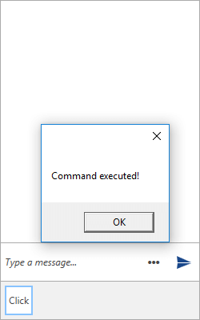

# ToolBar Commands

* [Adding a Command](#adding-a-command)
* [ToolBarCommandTemplateSelector](#toolbarcommandtemplateselector)

## Adding a Command

By default, the __ToolBar__ of __RadChat__ will not be visible. When a __ToolBarCommand__ is added to the __ToolBarCommands__ collection, the __ToggleButton__ for opening the __ToolBar__ will appear next to the __Send Button__. The __ToolBarCommand__ element exposes the following two properties.

* __Text__: The text Content that will be set to the generated __Button__.
* __Command__: The __ICommand__ that is to be executed when clicking the __Button__.

#### __[C#] Example 1: Defining a sample Command Action__ 
{{region radchat-messages-toolbarcommands_01}}
	 private void OnClickCommandExecute(object obj)
        {
            MessageBox.Show("Command executed!");
        }
{{endregion}}

#### __[C#] Example 2: Adding a ToolBarCommand__ 
{{region radchat-messages-toolbarcommands_02}}
	this.chat.ToolBarCommands.Add(new ToolBarCommand() { Text = "Click", Command = new DelegateCommand(OnClickCommandExecute) });
{{endregion}}

Adding such __ToolBarCommand__ will have the following visual appearance.

#### __Figure 1: Opening the ToolBar__

Clicking the generated __Button__ will execute the defined __ICommand__.

#### __Figure 2: Executing the defined Command__

## ToolBarCommandTemplateSelector

The __Conversational UI__ supports defining custom __DataTemplate__ for the elements generated in its __ToolBar__. This is done through the __ToolBarCommandTemplateSelector__. Its conditional logic can be implemented based on the given __ToolBarCommand__.

#### __[C#] Example 3: Defining a ToolBarCommandTemplateSelector__
{{region radchat-messages-toolbarcommands_03}} 
	public class ToolBarCommandTemplateSelector : DataTemplateSelector
    {
        public override DataTemplate SelectTemplate(object item, DependencyObject container)
        {
            var toolBarCommand = item as ToolBarCommand;
            if (toolBarCommand.Text == "Click")
            {
				return ClickTemplate;
            }
            return base.SelectTemplate(item, container);
        }

        public DataTemplate ClickTemplate { get; set; }
        
    }
{{endregion}}

After having the __ToolBarCommandTemplateSelector__ implemented, it can be defined in XAML as follows.

#### __[XAML] Example 4: Adding the ToolBarCommandTemplateSelector__
{{region radchat-messages-toolbarcommands_04}} 
	<Window.Resources>
        <my:ToolBarCommandTemplateSelector x:Key="ToolBarCommandTemplateSelector">
            <my:ToolBarCommandTemplateSelector.ClickTemplate>
                <DataTemplate>
                    <StackPanel Orientation="Horizontal" >
                        <Image Source="/Images/Hotelresidential.png" Width="70" Height="120"/>
                        <TextBlock Text="{Binding Text}" Margin="5"/>
                    </StackPanel>
                </DataTemplate>
            </my:ToolBarCommandTemplateSelector.ClickTemplate>
        </my:ToolBarCommandTemplateSelector>
    </Window.Resources>
{{endregion}}

Finally, the __ToolBarCommandTemplateSelector__ can be applied to __RadChat__.

#### __[XAML] Example 5: Applying the ToolBarCommandTemplateSelector__
{{region radchat-messages-toolbarcommands_05}} 
	<telerik:RadChat x:Name="chat" ToolBarCommandTemplateSelector="{StaticResource ToolBarCommandTemplateSelector}"/>
{{endregion}}

#### __Figure 3: Conversational UI with custom ToolBarCommandTemplateSelector__

## See Also

* [Overview]()

* [Getting Started]()

* [Messages Overview]()