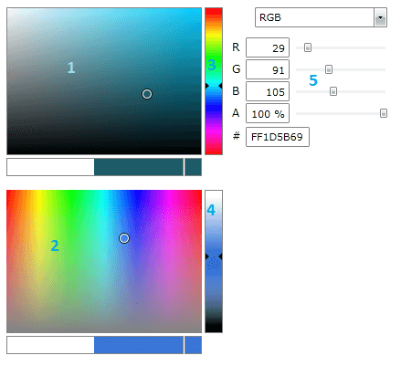
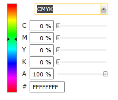
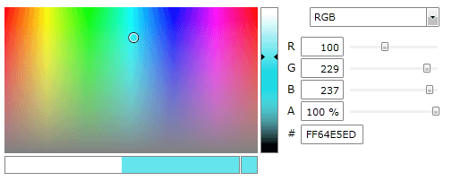

# Active Sections

The following article describes the __ActiveSections__ property / feature of the __RadColorEditor__. It gives you the ability to combine/remove different parts of the ColorEditor.

## ActiveSections

Since Q2 2012 SP, __RadColorEditor__ provides __ActiveSections__ property of type __ActiveSectionTypes__ which is a flag enum with the following possible values:        
			
* __SaturationValuePad [1]__

* __HueSaturationPad [2]__

* __HuePad [3]__

* __LuminancePad [4]__

* __ColorModesPanel [5]__

The default value of ActiveSections is SaturationValuePad | HuePad | ColorModesPanel.		

So How to use the ActiveSections property?		

In XAML , just list your ActiveSections with comma, for example like so:

#### __[XAML]__
{{region radcoloreditor-activesections-0}}
    <telerik:RadColorEditor  ActiveSections="HuePad, ColorModesPanel" />
{{endregion}}

This code produces the following result:

    
In code behind you have to use the bitwise or:

#### __[C#]__
{{region radcoloreditor-activesections-1}}
    this.colorEditor.ActiveSections = ActiveSectionTypes.HueSaturationPad | ActiveSectionTypes.LuminancePad | ActiveSectionTypes.ColorModesPanel;
{{endregion}}
		
#### __[VB.NET]__
{{region radcoloreditor-activesections-2}}
    Me.colorEditor.ActiveSections = ActiveSectionTypes.HueSaturationPad Or ActiveSectionTypes.LuminancePad Or ActiveSectionTypes.ColorModesPanel		
{{endregion}}

>An important note here is that you cannot use every combination of the 5 section types. The rule is: you can use one or none between [1,2] and/or one or none between[3, 4] and/or one or none of [5]. If you use both SaturationValuePad and HueSaturationPan __only the SaturationValuaPad will be visible__. If you use both HuePad and LuminancePad __only the HuePad will be visible__.