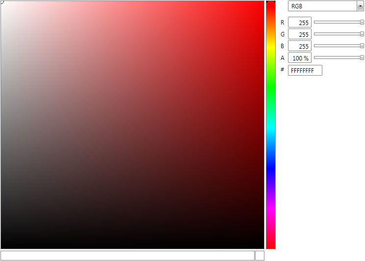

# Overview




Thank you for choosing Telerik's __RadColorEditor__ control! 

__RadColorEditor__ for SilverlightWPF  is a lightweight UI component that allows users to select a color from a custom palette of colors.

## Key Features:

* __Color Mode__: RadColorEditor control provides support for the most popular color models. [Read more]()

* __Color History__: The control provides a history of the previously selected colors. This way you can easily keep track of the last used colors. [Read more]()

* __Unified Color__: RadColorEditor’s UnifiedColor functionality represents an entity that exposes all the values of a color in the different color models. [Read more]()

* __Active Sections__: You can easly customize the __RadColorEditor__ control. Using the active sections functionality you can combine/remove different parts of the control. [Read more]()

>tip Get started with the control with its [Getting Started]() help article that shows how to use it in a basic scenario.

>Check out the online demos at [demos.telerik.com](https://demos.telerik.com/wpf/).

