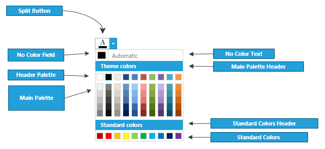
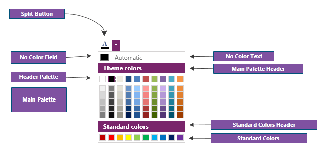

# Appearance

You can customize the appearance of a RadColorSelector by choosing which of the parts to be visible.
				

##### 1. You can set the __NoColorVisibility__ property to __Visibility.Visible__ to view the __NoColorField__, otherwise you should set it to false:						

#### __XAML__
{{region colorselector-appearance_1}}
	<telerik:RadColorSelector NoColorVisibility="Visible" />
{{endregion}}

#### __C#__
{{region colorselector-appearance_0}}
	RadColorSelector selector = new RadColorSelector();
	selector.NoColorVisibility = Visibility.Visible;
	// selector.NoColorVisibility= Visibility.Collapsed;
{{endregion}}

#### __VB.NET__
{{region colorselector-appearance_0}}
	Dim selector As New RadColorSelector()
	selector.NoColorVisibility = Visibility.Visible
	' selector.NoColorVisibility= Visibility.Collapsed '
{{endregion}}

##### 2. You can use __StandardPaletteVisibility__ and __HeaderPaletteVisibility__ in order to set the visibility of the corresponding palettes:						

* __StandardPaletteVisibility__

	#### __XAML__
	{{region colorselector-appearance_3}}
		<telerik:RadColorSelector StandardPaletteVisibility="Visible" />
	{{endregion}}

	#### __C#__
	{{region colorselector-appearance_2}}
		RadColorSelector selector = new RadColorSelector();
		selector.StandardPaletteVisibility = Visibility.Visible;
		// selector.StandardPaletteVisibility = Visibility.Collapsed;
	{{endregion}}

	#### __VB.NET__
	{{region colorselector-appearance_2}}
		Dim selector As New RadColorSelector()
		selector.StandardPaletteVisibility = Visibility.Visible
		' selector.StandardPaletteVisibility = Visibility.Collapsed '
	{{endregion}}

* __HeaderPaletteVisibility__

	#### __XAML__
	{{region colorselector-appearance_5}}
		<telerik:RadColorSelector HeaderPaletteVisibility="Visible" />
	{{endregion}}

	#### __C#__
	{{region colorselector-appearance_4}}
		RadColorSelector selector = new RadColorSelector();
		selector.HeaderPaletteVisibility = Visibility.Visible;
		// selector.HeaderPaletteVisibility = Visibility.Collapsed;
	{{endregion}}

	#### __VB.NET__
	{{region colorselector-appearance_4}}
		Dim selector As New RadColorSelector()
		selector.HeaderPaletteVisibility = Visibility.Visible
		' selector.HeaderPaletteVisibility =Visibility.Collapsed '
	{{endregion}}
		



##### 3. You can set different text for __StandardPalette__ header text , __MainPalette__ header text and __NoColorText__.

* StandardPaletteHeaderText
	
	#### __XAML__
	{{region colorselector-appearance_6}}
		<telerik:RadColorSelector StandardPaletteHeaderText="Header" />
	{{endregion}}
		
	#### __C#__
	{{region colorselector-appearance_7}}
		RadColorSelector selector = new RadColorSelector();
		selector.StandardPaletteHeaderText = "header";
	{{endregion}}
		
	#### __VB.NET__
	{{region colorselector-appearance_8}}
		Dim selector As New RadColorSelector()
		selector.StandardPaletteHeaderText = "header"
	{{endregion}}
	
* MainPaletteHeaderText
	
	#### __XAML__
	{{region colorselector-appearance_9}}
		<telerik:RadColorSelector MainPaletteHeaderText="Header" />
	{{endregion}}
	 
	#### __C#__
	{{region colorselector-appearance_10}}
		RadColorSelector selector = new RadColorSelector();
		selector.MainPaletteHeaderText = "header";
	{{endregion}}
		
	#### __VB.NET__
	{{region colorselector-appearance_11}}
		Dim selector As New RadColorSelector()
		selector.MainPaletteHeaderText = "header"
	{{endregion}}

* NoColorText
	
	#### __XAML__
	{{region colorselector-appearance_12}}
		<telerik:RadColorSelector NoColorText="No Color Text" />
	{{endregion}}
		
	#### __C#__
	{{region colorselector-appearance_13}}
		RadColorSelector selector = new RadColorSelector();
		selector.NoColorText = "No Color Text";
	{{endregion}}
		
	#### __VB.NET__
	{{region colorselector-appearance_14}}
		Dim selector As New RadColorSelector()
		selector.NoColorText = "No Color Text"
	{{endregion}}