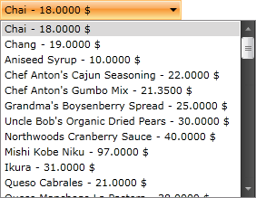

# Binding to WCF Service

The purpose of this tutorial is to show you how to populate a __RadComboBox__ with a data from a __WCF Service__ in two ways:

* [Using plain methods call in the code-behind](#using-plain-methods-call-in-the-code-behind)

* [Using MVVM approach](#using-mvvm-approach)

>This tutorial will use the __Northwind__ database, which can be downloaded from [here](http://www.microsoft.com/downloads/details.aspx?FamilyID=06616212-0356-46A0-8DA2-EEBC53A68034&displaylang=en).

Before proceeding further with this tutorial, you need to create a new application and a __RadComboBox__ declaration in your XAML.

#### __XAML__

{{region radcombobox-populating-with-data-binding-to-wcf_0}}
	<telerik:RadComboBox x:Name="radComboBox"/>
{{endregion}}

## Using Plain Methods Call in the Code-Behind

* Add a reference to your WCF Service.

* Switch to the code-behind and create a new instance of your WCF Service client.

#### __C#__

{{region radcombobox-populating-with-data-binding-to-wcf_1}}
	ComboBoxWcfServiceClient serviceClient = new ComboBoxWcfServiceClient();
{{endregion}}

#### __VB.NET__

{{region radcombobox-populating-with-data-binding-to-wcf_2}}
	Dim serviceClient As New ComboBoxWcfServiceClient()
{{endregion}}

>tipFor more information about how to add a reference to a WCF Service and how to create a new instance of a WCF Service client, take a look at the [Consuming WCF Service]() topic.

* The __ComboBox__ control will be populated with all __Products__ from the __Northwind__ database. In the drop-down list the __ProductName__ and the __UnitPrice__ properties will be displayed. Add the following code which will make the initial load of the objects.

#### __C#__

{{region radcombobox-populating-with-data-binding-to-wcf_3}}
	private void BeginRequest()
	{
	    serviceClient.GetProductsCompleted += new EventHandler<GetProductsCompletedEventArgs>( serviceClient_GetProductsCompleted );
	    serviceClient.GetProductsAsync();
	}
	private void serviceClient_GetProductsCompleted( object sender, GetProductsCompletedEventArgs e )
	{
	    radComboBox.ItemsSource = e.Result;
	}
{{endregion}}

#### __VB.NET__

{{region radcombobox-populating-with-data-binding-to-wcf_4}}
	Private Sub BeginRequest()
	    AddHandler serviceClient.GetProductsCompleted, AddressOf serviceClient_GetProductsCompleted
	    serviceClient.GetProductsAsync()
	End Sub
	Private Sub serviceClient_GetProductsCompleted(ByVal sender As Object, ByVal e As GetProductsCompletedEventArgs)
	    radComboBox.ItemsSource = e.Result
	End Sub
{{endregion}}

#### __C#__

{{region radcombobox-populating-with-data-binding-to-wcf_5}}
	private void BeginRequest()
	{
	    this.radComboBox.ItemsSource = serviceClient.GetProducts();
	}
{{endregion}}

#### __VB.NET__

{{region radcombobox-populating-with-data-binding-to-wcf_6}}
	Private Sub BeginRequest()
	    Me.radComboBox.ItemsSource = serviceClient.GetProducts()
	End Sub
{{endregion}}

* You need to declare a custom __DataTemplate__ to determine how the items in the drop-down will look like. Add the following __DataTemplate__ declaration in your XAML resources.

#### __XAML__

{{region radcombobox-populating-with-data-binding-to-wcf_7}}
	<UserControl.Resources>
	    <DataTemplate x:Key="CustomItemTemplate">
	        <StackPanel Orientation="Horizontal">
	            <TextBlock Text="{Binding ProductName}"/>
	            <TextBlock Text=" - "/>
	            <TextBlock Text="{Binding UnitPrice}"/>
	            <TextBlock Text=" $"/>
	        </StackPanel>
	    </DataTemplate>
	</UserControl.Resources>
{{endregion}}

Find your __RadComboBox__ declaration and set the declared __DataTemplate__ to its __ItemTemplate__ property.

#### __XAML__

{{region radcombobox-populating-with-data-binding-to-wcf_8}}
	<telerik:RadComboBox x:Name="radComboBox" ItemTemplate="{StaticResource CustomItemTemplate}"/>
{{endregion}}

Run your demo, the result can be seen on the next image:

## Using MVVM Approach

This section will show you how to populate your __RadComboBox__ control in a MVVM manner. The __RadComboBox__ will be bound to a data source object, that has a property __Products__. When the control is loaded, all products from the __Products__ table in the Northwind database are loaded asynchronously.

* Create a new class named __NorthwindDataSource__.

#### __C#__

{{region radcombobox-populating-with-data-binding-to-wcf_9}}
	public class NorthwindDataSource
	{
	}
{{endregion}}

#### __VB.NET__

{{region radcombobox-populating-with-data-binding-to-wcf_10}}
	Public Class NorthwindDataSource
	End Class
{{endregion}}

* Add a reference to your WCF Service

* In the __NorthwindDataSource__ class add a reference to an __ObservableCollection__ of __Products__.

* In the __NorthwindDataSource__ class add a reference to your WCF Service client:

#### __C#__

{{region radcombobox-populating-with-data-binding-to-wcf_11}}
	public class NorthwindDataSource
	{
	    private ComboBoxWcfServiceClient serviceClient;
	
	    public NorthwindDataSource()
	    {
	        this.Products = new ObservableCollection<Products>();
	        this.serviceClient = new ComboBoxWcfServiceClient();
	    }
	
	    public ObservableCollection<Products> Products
	    {
	        get;
	        protected set;
	    }
	}
{{endregion}}

#### __VB.NET__

{{region radcombobox-populating-with-data-binding-to-wcf_12}}
	Public Class NorthwindDataSource
	    Private serviceClient As ComboBoxWcfServiceClient
	
	    Public Sub New()
	        Me.Products = New ObservableCollection(Of Products)()
	        Me.serviceClient = New ComboBoxWcfServiceClient()
	    End Sub
	
	Private _Products As ObservableCollection(Of Products)
	    Public Property Products() As ObservableCollection(Of Products)
	        Get
	            Return _Products
	        End Get
	        Protected Set(ByVal value As ObservableCollection(Of Products))
	            _Products = value
	        End Set
	    End Property
	End Class
{{endregion}}

>tipFor more information about how to add a reference to a WCF Service and how to create a new instance of a WCF Service client, take a look at the [Consuming WCF Service]() topic.

* Add the following code in the __constructor__ of the __NorthwindDataSource__. It will make the initial load of all __Products__ from the database:

#### __C#__

{{region radcombobox-populating-with-data-binding-to-wcf_13}}
	this.serviceClient.GetProductsCompleted += new EventHandler<GetProductsCompletedEventArgs>( serviceClient_GetProductsCompleted );
	this.serviceClient.GetProductsAsync();
{{endregion}}

#### __VB.NET__

{{region radcombobox-populating-with-data-binding-to-wcf_14}}
	AddHandler Me.serviceClient.GetProductsCompleted, AddressOf serviceClient_GetProductsCompleted
	Me.serviceClient.GetProductsAsync()
{{endregion}}


And here is the code handling the __GetProductsCompleted__ event:


#### __C#__

{{region radcombobox-populating-with-data-binding-to-wcf_15}}
	private void serviceClient_GetProductsCompleted( object sender, GetProductsCompletedEventArgs e )
	{
	    foreach ( Products p in e.Result )
	    {
	        this.Products.Add( p );
	    }
	}
{{endregion}}

#### __VB.NET__

{{region radcombobox-populating-with-data-binding-to-wcf_16}}
	Private Sub serviceClient_GetProductsCompleted(ByVal sender As Object, ByVal e As GetProductsCompletedEventArgs)
	    For Each p As Products In e.Result
	        Me.Products.Add(p)
	    Next
	End Sub
{{endregion}}

#### __C#__

{{region radcombobox-populating-with-data-binding-to-wcf_17}}
	foreach ( Products p in serviceClient.GetProducts() )
	{
	    this.Products.Add( p );
	}
{{endregion}}

#### __VB.NET__

{{region radcombobox-populating-with-data-binding-to-wcf_18}}
	For Each p As Products In serviceClient.GetProducts()
	    Me.Products.Add(p)
	Next
{{endregion}}

* Declare the __NorthwindDataSource__ object as a resource in your application.

#### __XAML__

{{region radcombobox-populating-with-data-binding-to-wcf_19}}
	<UserControl.Resources>
	    <example:NorthwindDataSource x:Key="DataSource"/>   
	</UserControl.Resources>
{{endregion}}

* Declare a custom __DataTemplate__ to determine how the items in the drop-down will look like. Add the following __DataTemplate__ declaration in your XAML resources.

#### __XAML__

{{region radcombobox-populating-with-data-binding-to-wcf_20}}
	<UserControl.Resources>
	    <DataTemplate x:Key="CustomItemTemplate">
	        <StackPanel Orientation="Horizontal">
	            <TextBlock Text="{Binding ProductName}"/>
	            <TextBlock Text=" - "/>
	            <TextBlock Text="{Binding UnitPrice}"/>
	            <TextBlock Text=" $"/>
	        </StackPanel>
	    </DataTemplate>
	
	    <example:NorthwindDataSource x:Key="DataSource"/>
	</UserControl.Resources>
{{endregion}}

* Update your __RadComboBox__ declaration - set the __ItemsSource__ and __ItemTemplate__ properties.

#### __XAML__

{{region radcombobox-populating-with-data-binding-to-wcf_21}}
	<telerik:RadComboBox x:Name="radComboBox"
	    ItemsSource="{Binding Source={StaticResource DataSource}, Path=Products}"
	    ItemTemplate="{StaticResource CustomItemTemplate}"/>
{{endregion}}

Run your demo, the result can be seen on the snapshot below:

## See Also

 * [DataBinding Support Overview]()

 * [Binding to ADO.NET Data Service]()

 * [Binding to Object]()
